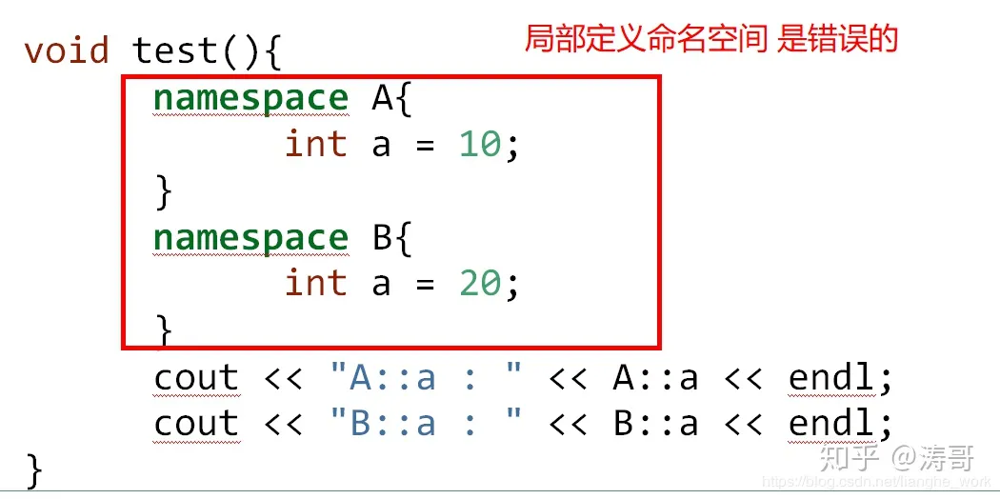

## **1、命名空间的概述**

在c++中，名称（name）可以是符号常量、变量、函数、结构、枚举、类和对象等等。工程越大，名称互相冲突性的可能性越大。另外使用多个厂商的类库时，也可能导致名称冲突。为了避免，在大规模程序的设计中，以及在程序员使用各种各样的C++库时，这些标识符的命名发生冲突，标准C++引入关键字namespace（命名空间/名字空间/名称空间），可以更好地控制标识符的作用域。

## **2、命名空间的定义**

```cpp
//定义一个名字为A的命名空间（变量、函数）
namespace A {
    int a = 100;
}
namespace B {
    int a = 200;
}
void test02()
{
    //A::a  a是属于A中
    cout<<"A中a = "<<A::a<<endl;//100
    cout<<"B中a = "<<B::a<<endl;//200
}
```


## **3、命名空间只能全局范围内定义（以下为错误写法）**





## **4、命名空间可以嵌套**

```cpp
namespace A {
    int a = 1000;
    namespace B {
        int a = 2000;
    }
}
void test03()
{
    cout<<"A中的a = "<<A::a<<endl; //1000
    cout<<"B中的a = "<<A::B::a<<endl; //2000
}
```


## **5、命名空间是开放的，即可以随时把新的成员加入已有的命名空间中(常用)**

```cpp
namespace A {
    int a = 100;
    int b = 200;
}
//将c添加到已有的命名空间A中
namespace A {
    int c = 300;
}
void test04()
{
    cout<<"A中a = "<<A::a<<endl;//100
    cout<<"A中c = "<<A::c<<endl;//200
}
```


## **6、命名空间 可以存放 变量 和 函数**

```cpp
namespace A {
    int a=100;//变量
 
    void func()//函数
    {
        cout<<"func遍历a = "<<a<<endl;
    }
}
void test05()
{
    //变量的使用
    cout<<"A中的a = "<<A::a<<endl;
 
    //函数的使用
    A::func();
}
```


## **7、命名空间中的函数 可以在“命名空间”外 定义**

```cpp
namespace A {
    int a=100;//变量
 
    void func();
}
 
void A::func()//成员函数 在外部定义的时候 记得加作用域
{
    //访问命名空间的数据不用加作用域
    cout<<"func遍历a = "<<a<<endl;
}
 
void funb()//普通函数
{
    cout<<"funb遍历a = "<<A::a<<endl;
}
void test06()
{
   A::func();
    funb();
}
```

## **8、无名命名空间，意味着命名空间中的标识符只能在本文件内访问，相当于给这个标识符加上了static，使得其可以作为内部连接（了解）**

```cpp
namespace{
    int a = 10;
    void func(){
        cout<<"hello namespace"<<endl;
    }
}
void test(){
 
    //只能在当前源文件直接访问a 或 func
    cout<<"a = "<<a<<endl;
    func();
}
```


### 参考文献：

https://zhuanlan.zhihu.com/p/126481010