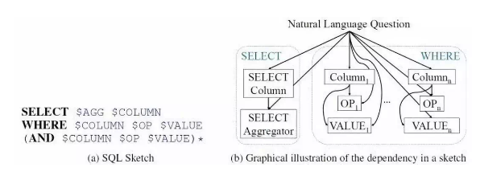

## 动机

当前，大量信息存储在结构化和半结构化知识库中，如数据库。对于这类数据的分析和获取需要通过SQL等编程语言与数据库进行交互操作，SQL的使用难度限制了非技术用户，给数据分析和使用带来了较高的门槛。人们迫切需要技术或工具完成自然语言与数据库的交互

## 一、什么是 Text-to-SQL?

Text-to-SQL : 一项转化自然语言描述为SQL查询语句的技术。让机器自动将用户输入的自然语言问题转成数据库可操作的SQL查询语句，实现基于数据库的自动问答能力。

举个例子：

当我们询问智能助手 “贾樟柯导演是在哪出生的啊？”

思路：

1. Text-to-SQL模型就会先根据问句解析出SQL语句

“SELECT birth_city FROM director WHERE name ="贾樟柯"”

2. 再对数据库执行该命令
3. 最后向用户返回查询结果“山西省汾阳市”。

在给定关系型数据库（或表）的前提下，将用户的提问生成相应的SQL查询语句。

问题为：有哪些系的教员平均工资高于总体平均值，请返回这些系的名字以及他们的平均工资值。可以看到该问题对应的SQL语句是很复杂的，并且有嵌套关系。

## 二、为什么需要 Text-to-SQL?

1. SQL 作为一种 数据库查询语言 被广泛使用；
2. SQL 对于普通人来说，SQL学习门槛比较高;

如果我们能够有一个工具，自动地把我们的描述转化为SQL查询语句，再交给计算机去执行，就能方便地对数据库进行查询，那就大大提高了我们的生活和工作效率。

## 三、Text-to-SQL 定义?

1. Text-to-SQL解析器：
2. 输入: 给定的数据库和针对该数据库的问题;
3. 输出：问题对应的SQL查询语句
4. SQL执行器:
5. 在数据库上完成该查询语句的执行，及给出问题的最终答案

Text-to-SQL解析器 : 红色箭头标示

SQL执行器 : 绿色箭头标示

## 四、Text-to-SQL 有哪些数据集?

### 数据集整体介绍

[A collection of datasets that pair questions with SQL queries.](https://github.com/jkkummerfeld/text2sql-data/tree/master)

1. 术语介绍：
2. 根据包含领域数量，数据集分为单领域和多领域。
3. 根据每个数据库包含表的数量，数据集分为单表和多表模式。在多表模式中，SQL生成涉及到表格的选择。
4. 根据问题复杂度，数据集分为简单问题和复杂问题模式，其中问题复杂度由SQL查询语句涉及到的关键词数量、嵌套层次、子句数量等确定。
5. 根据完整SQL生成所需轮数，数据集分为单轮和多轮。
6. 若SQL生成融进渐进式对话，则数据集增加“结合对话”标记。当前只有CoSQL数据集是融进对话的数据集。

列举了一些问题类型及对应的问题实例：

问题类型及实例

### 4.1 早期数据集：ATIS&GeoQuery

ATIS来源于机票订阅系统，由用户提问生成SQL语句，是一个单一领域且上下文相关的数据集。GeoQuery来源于美国的地理，**包括880条的提问与SQL语句**，是一个单一领域且上下文无关的数据集。

### 4.2 基于维基百科 WikiSQL

1. 动机：ATIS&GeoQuery这两个数据集存在着数据规模小（SQL不足千句），标注简单等问题
2. 介绍：2017年，VictorZhong等研究人员基于维基百科，**标注了80654的训练数据，涵盖了26521个数据库，取名为WikiSQL**。这个大型数据集一经推出，便引起学术界的广泛关注。因为它对模型的设计提出了新的挑战，**需要模型更好的建构Text和SQL之间的映射关系，更好的利用表格中的属性，更加关注解码的过程**；
3. 代表模型：seq2sql、SQLNet、TypeSQL
4. 数据地址：https://github.com/salesforce/WikiSQL

### 4.3 Spider

1. 动机：**WikiSQL 的每个问题只涉及一个表格，而且也仅支持比较简单的SQL操作**，这个不是很符合我们日常生活中的场景。现实生活中存在着医疗、票务、学校、交通等各个领域的数据库，而且每个数据库又有数十甚至上百个表格，表格之间又有着复杂的主外键联系；
2. 介绍：2018年，耶鲁大学的研究人员推出了Spider数据集，这也是目前最复杂的Text-to-SQL数据集
3. 数据集特点：
4. **领域比较丰富，拥有来自138个领域的200多个数据库，每个数据库平均对应5.1个表格**，并且训练集、测试集中出现的数据库不重合；
5. **SQL语句更为复杂，包含orderBy、union、except、groupBy、intersect、limit、having 关键字，以及嵌套查询等**。作者根据SQL语句的复杂程度（关键字个数、嵌套程度）分为了4种难度，值得注意的是，WikiSQL在这个划分下只有EASY难度；
6. Spider相比WikiSQL，对模型的跨领域、生成复杂SQL的能力提出了新的要求，目前的最佳模型也只有60%左右的准确度
7. 数据集地址：https://yale-lily.github.io/spider
8. 数据集样例介绍（Hard和Extra Hard的实例）：

Spider数据集中Hard以及Extra Hard难度的样例

### 4.4 中文CSpider

1. 动机：Spider 为 英文数据，无法应用于中文场景；
2. 介绍：西湖大学在EMNLP2019上提出了**一个中文text-to-sql的数据集CSpider，主要是选择Spider作为源数据集进行了问题的翻译**，并利用SyntaxSQLNet作为基线系统进行了测试，同时探索了在中文上产生的一些额外的挑战，包括中文问题对英文数据库的对应问题(question-to-DBmapping)、中文的分词问题以及一些其他的语言现象；
3. 数据集地址：https://taolusi.github.io/CSpider-explorer/

### 4.5 耶鲁大学的研究团队 Sparc

1. 动机：Spider 只是单条查询，无法解决 上下文下文问题；
2. 介绍：耶鲁大学的研究团队后续又推出了SParC，即Spider的上下文相关版本。数据库基于Spider，模拟了用户进行数据库查询的过程：用户通过若干条相关的提问最后达到一个最终查询目的。
3. 数据集地址：https://yale-lily.github.io/sparc
4. 图示：

Sparc数据集中的样例

不同数据集对比如下图所示（平均含表格指每个数据库平均包含多少个表格）

## 五、Text-to-SQL 如何评价?

1. 精确匹配率（exact match ）：**预测得到的SQL语句与标准SQL语句精确匹配成功的问题占比**。为了处理由成分顺序带来的匹配错误，当前精确匹配评估将预测的SQL语句和标准SQL语句按着SQL关键词分成多个子句，每个子句中的成分表示为集合，当两个子句对应的集合相同则两个子句相同，当两个SQL所有子句相同则两个SQL精确匹配成功；

1. 执行正确率（executionaccuracy）：执行预测的SQL语句，数据库返回正确答案的问题占比。

## 六、Text-to-SQL 有哪些模型，都存在哪些优缺点?

### 6.1 seq2seq 模型

#### 6.1.1 传统的seq2seq模型

1. 效果：
2. 在ATIS、GeoQuery数据集上达到84%的精确匹配；
3. 在WikiSQL上只能达到23.3%的精确匹配，37.0%的执行正确率；
4. 在Spider上则只能达到5～6%的精确匹配。
5. 问题原因分析：
6. 在编码方面，**自然语言问句与数据库之间需要形成很好的对齐或映射关系**，即问题中到底涉及了哪些表格中的哪些实体词，以及问句中的词语触发了哪些选择条件、聚类操作等；
7. 在解码部分，**SQL作为一种形式定义的程序语言，本身对语法的要求更严格（关键字顺序固定）以及语义的界限更清晰**，失之毫厘差之千里。普通的seq2seq框架并不具备建模这些信息的能力。
8. 优化方法：
9. 通过更强的表示（BERT、XLNet）、更好的结构（GNN）来**显式地加强Encoder端的对齐关系及利用结构信息**；
10. 通过树形结构解码、填槽类解码来**减小搜索解空间**，以增加SQL语句的正确性；
11. 通过中间表示等技术**提高SQL语言的抽象性**；
12. 通过定义新的对齐特征，利用重排序技术，对beamsearch得到的多条候选结果进行正确答案的挑选；
13. 数据增强方法。

#### 6.1.2 Pointer Network

1. 动机：**传统的seq2seq模型的解码器部分所使用的单词表是固定的，即在生成序列中都是从固定的单词表中进行选取**。但Text-to-SQL不同于一般的seq2seq任务，它的生成序列中可能出现：
2. a）问句中的单词；
3. b) SQL关键字；
4. c)对应数据库中的表名、列名
5. 思路：**其输出所用到的词表是随输入而变化的**。具体做法是利用注意力机制，直接从输入序列中选取单词作为输出；
6. 做法：
7. **把用户的提问以及目标SQL语句可能出现的其他词作为输入序列 (列名单词序列；SQL的关键字表；问题的单词序列），利用PointerNetwork直接从输入序列中选取单词作为输出**；
8. 在解码器的每一步，与编码器的每一个隐层状态计算注意力分数，取最大值作为当前的输出以及下一步的输入；

#### 6.1.3 Seq2SQL

1. 动机：Pointer Network虽然一定程度上解决了问题，但是它并**没有利用到SQL语句固有的语法结构**；
2. Seq2SQL 做法：将生成的SQL语句分为三个部分：**聚合操作：（SUM、COUNT、MIN、MAX等）**、**SELECT：选取列**、**WHERE：查询条件。每一部分使用不同的方法进行计算**
3. SELECT与聚合操作，均采用了注意力机制进行分类。WHERE子句可以利用前面介绍的Pointer Network进行训练，但是对于很多查询来说，WHERE子句的写法并不是唯一的

SELECT name FROM insurance WHERE age > 18 AND gender ="male";

SELECT name FROM insurance WHERE gender = "male"AND age > 18;

1. 利用强化学习基于查询结果来进行优化。在解码器部分，对可能的输出进行采样，产生若干个SQL语句，每一句表示为y=[y1, y2 ... yT]，用打分函数对每一句进行打分：

### 6.2 模板槽位填充方法

1. 介绍：将SQL的生成过程分为多个子任务，每一个子任务负责预测一种语法现象中的列
2. 优点：对于单表无嵌套效果好，并且生成的SQL可以保证语法正确；
3. 缺点：只能建模固定的SQL语法模板，对于有嵌套的SQL情况，无法对所有嵌套现象进行灵活处理

#### 6.2.1 SQLNet 模型

根据SQL Sketch，将Seq2Seq形式的序列生成转化为Seq2SET形式的槽值填充

1. 动机：Seq2SQL使用强化学习效果不明显的问题
2. 方法介绍：**SQLNet 将SQL语句分成了SELECT和WHERE两个部分，每个部分设置了几个槽位，只需向槽位中填入相应的符号即可**。
3. 思路：
4. SELECT子句部分与Seq2SQL类似；
5. 不同地方在于在于WHERE子句：
6. 它使用了一种**sequence-to-set**（由序列生成集合）机制，用于**选取目标SQL语句中的WHERE子句可能出现的列**；
7. 对于表中的每一列给出一个概率；
8. 之后计算出WHERE子句中的条件个数k；
9. 然后选取概率最高的前k个列；
10. 最后通过注意力机制进行分类得到操作符和条件值。

#### 6.2.2 TypeSQL 模型

TypeSQL示意图：显式地赋予每个单词类型

1. 介绍：基于SQLNet，使用模版填充的方法生成SQL语句。为了更好地建模文本中出现的罕见实体和数字，TypeSQL显式地**赋予每个单词类型**。
2. 类型识别过程：
3. 将问句分割n-gram （n取2到6），并搜索数据库表、列；
4. 对于匹配成功的部分赋值column类型赋予数字、日期四种类型：INTEGER、FLOAT、DATE、YEAR；
5. 对于命名实体，通过搜索FREEBASE，确定5种类型：PERSON，PLACE，COUNTREY，ORGANIZATION，SPORT。这五种类型包括了大部分实体类型。当可以访问数据库内容时，进一步将匹配到的实体标记为具体列名（而不只是column类型）
6. 与 SQLNet 区别：
7. SQLNet：为模版中的每一种成分设定了单独的模型；
8. TypeSQL：对于相似的成分，例如SELECT_COL 和COND_COL以及#COND（条件数），这些信息间有依赖关系，通过合并为单一模型，可以更好建模。TypeSQL使用3个独立模型来预测模版填充值：
9. MODEL_COL：SELECT_COL，#COND，COND_COL
10. MODEL_AGG：AGG
11. MODEL_OPVAL：OP, COND_VAL

#### 6.2.3 SyntaxSQLNet 模型

1. 介绍：相比于之前decoder输出一段线性的文本，SyntaxSQLNet将解码的过程引入了结构性信息，即解码的对象为SQL语句构成的树结构。通过该技术，模型的精确匹配率提高了14.8%。

SyntaxSQLNet利用SQL的树结构进行解码

1. 思路：SyntaxSQLNet将SQL语句的预测分解为9个模块，每个模块对应了SQL语句中的一种成分。解码时由预定义的SQL文法确定这9个模块的调用顺序，从而引入结构信息。树的生成顺序为深度优先。分解出的9个模块有：
2. IUEN模块：预测INTERCEPT、UNION、EXCEPT、NONE（嵌套查询相关）
3. KW模块：预测WHERE、GROUP BY、ORDER BY、SELECT关键字
4. COL模块：预测列名
5. OP模块：预测>、<、=、LIKE等运算符
6. AGG模块：预测MAX、MIN、SUM等聚合函数
7. Root/Terminal模块：预测子查询或终结符
8. Module模块：预测子查询或终结符
9. AND/OR模块：预测条件表达式间的关系
10. DESC/ASC/LIMIT模块：预测与ORDERBY相关联的关键字
11. HAVING模块：预测与GROUPBY相关的Having从句
12. 数据增强方法：
13. 效果：精确匹配率提高了7.5%
14. 做法：
15. 对SPIDER中的每条数据，将值和列名信息除去，得到一个模板；
16. 对处理后的SQL模版进行聚类，通过规则去除比较简单的模板，并依据模板出现的频率，挑选50个复杂SQL模板；
17. 人工核对SQL-问句对，确保SQL模板中每个槽在问句中都有对应类型的信息。
18. 得到一一对应的模板后，应用于WikiSQL数据库：
19. 首先随机挑选10个模板；
20. 然后从库中选择相同类型的列；
21. 最后用列名和值填充SQL模板和问句模板。

### 6.3 中间表达方法

1. 介绍：将SQL生成分为两步，第一步预测SQL语法骨干结构，第二步对前面的预测结果做列和值的补充。

#### 6.3.1 IRNet 模型

1. 介绍：
2. 改进一：**定义了一系列的CFG文法，将SQL转发为语法树结构。可以将其看作一种自然语言与SQL语句间的中间表示（作者称之为SemQL），整个parsing的过程也是针对SemQL进行的**。

IRNet利用定义的CFG将SQL转化为更抽象的SemQL

1. 改进二：在schemelinking，即如何找到问题中所提到的表格与列。他将问题中可能出现的实体分为3类：表格名、列名、表中的值。根据3类实体的不同，具体做法分为：
2. 表格名和列名：以n-gram的形式枚举问题中的span，然后和表格名、列名进行匹配。可以看到下图中的Question中对应的单词有的被标成了Column或者Table。
3. 表中的值：将问题中以引号为开头结尾的span，送给ConceptNet进行查询，再将返回结果中的 ‘is a type of’/'related terms'关系的词与列名进行匹配。

IRNet的模型结构

### 6.4 结合图网络的方法

1. 动机：此方法主要为解决多个表中有同名的列的时候，预测不准确的问题
2. 问题：由于数据库之间并没有边相连接，所以此方法提升不大且模型消耗算力较大

#### 6.4.1 Global-GNN

1. 动机：上述方法 无法更好的利用关系型数据库的结构信息；
2. 介绍：
3. 提出使用图网络来建模表格名和列名

圆圈加粗的结点代表表格，不加粗的结点代表列名；双向边代表表格和列名的从属关系；红虚边和蓝虚边代表主外键关系。橙色节点代表与问题有关的结果，淡色为无关。

左：模型输入样例（问题、表名、列名、主外键关系）

右：用于建模表格结构信息的GNN（包括两类节点，三类边）

1. 提出了一种基于全局信息重排序的做法

根据全局信息，[我们可以通过country来确定第一个name为](http://xn--countrynamesinger-ws50a2w1jk7jnen34jk04b307at72ahe0hwbqao44lebc.xn--namesong-g49l260r3p5c.name/)[singer.name](http://singer.name/)[而不是](http://xn--countrynamesinger-ws50a2w1jk7jnen34jk04b307at72ahe0hwbqao44lebc.xn--namesong-g49l260r3p5c.name/)[song.name](http://song.name/)（name和nation同属于一个实体）

首先先看下面这个例子，我们不知道name到底指向的是singer还是song，但是我们可以观察到nation只在singer中出现，[所以应该是](http://xn--singer-2x8iu48hx5g19jds8h.name/)[singer.name](http://singer.name/)。这样做globalreasoning，就能减小歧义性。

GlobalGNN的工作流程

#### 6.4.2 RAT-SQL

1. 动机：看作图网络GNN的后续工作，作者在Table、Column、Question三者之间定义了更多的边（共33种），是目前榜单上的最强模型
2. 思路：Global-GNN只建模了Table和Column的联系，RAT-SQL在此基础上又在图中加入Question的节点，而且利用字符串匹配的方法丰富了边的类型。

RAT-SQL的样例：引入了Question节点

RAT SQL新定义的边关系

### 6.5 强化学习方法

1. 介绍：此方法以Seq2SQL为代表，每一步计算当前决策生成的SQL是否正确，本质上强化学习是基于交互产生的训练数据集的有监督学习，此法效果和翻译模型相似。

### 6.6 结合预训练模型、语义匹配的方法

1. 介绍：该方法以表格内容作为预训练语料，结合语义匹配任务目标输入数据库Schema，从而选中需要的列
2. 例如：BREIDGE、GRAPPA等。