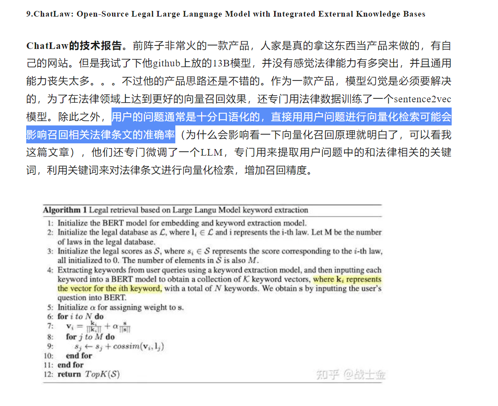

| 方法（想法）                                                 | 训练 | 数据集     | prompt修改 | 系统性评价 | 备注                                                         |
| ------------------------------------------------------------ | ---- | ---------- | ---------- | ---------- | ------------------------------------------------------------ |
| 基于（sqlcoder）Zero-shot prompt turning                     | ❌    | ❌          | ✔          | ✔          | 前期模型性能验证                                             |
| 基于（sqlcoder）few-shot prompt turning                      | ❌    | few（q,a） | ✔          | ✔          | 前期的模型性能验证，针对垂直任务领域的优化，需要客户提供少量数据协助 |
| 基于（sqlcoder）指令fineturn                                 | 微调 | (q,a)      |            | ✔          | 中期对针对性任务的优化，应该在与客户达成协定后，客户与我们协定制作大量的微调数据。 |
| 针对错误案例对模型做调整（结合传统的方法）                   |      |            |            |            | 中期                                                         |
| 加入领域知识微调（中文领域，通话通信领域知识）  模型参数是否支撑？ |      |            |            |            | 可能是后期，可能前期                                         |
| 动态prompt                                                   |      |            |            |            |                                                              |
| 分词器                                                       |      |            |            |            |                                                              |
| 设置错误返回边界                                             |      |            |            |            |                                                              |

动态prompt
分词器？

比如列出本月所有记录，

如果说表里面有一个字段名叫记录，

​					理解起来到底是选取全部字段还是只有记录那一条字段	

解决：大模型把所有可能性都列出来

schema link

建表语句+查询语句+3行数据

tokenizer 的目的就是将一句话进行切词，并将切好词的列表喂给模型进行训练。

