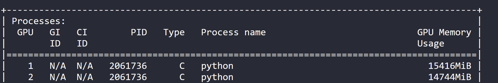

#### 2023.9.20

#### 今日进展

- [x] Chinese-Alpaca-33B-SuperHOT-8K-fp16.zip部署

- [x] ”时间词具体化“大模型(用于对问题意图补充)  效果不稳定

- [x] ”长句子断句“大模型(用于对问题字段捕获理解) 效果不错

- [ ] 根据客户用户需求，优化模型

  - [x] 9月8日有多少个号码语音不正常？列举出语音不正常事件
  - [x] 9月8日号码18971348021的语音不正常事件关联基站小区？

- [ ] ###### 书生·浦语InternLM-20B(刚开源，正在部署)

#### 明日计划

- [ ] 书生·浦语InternLM-20B(刚开源，正在部署)
- [ ] 针对多表连接查询问题改进， 大模型用20b的书生·浦语InternLM-20B替代
- [ ] 根据客户用户需求

---

#### 2023.9.21

#### 今日进展

- [x] 书生·浦语InternLM-20B部署测试

- [x] 将客户给的sql库转化为excle可视化以便于分析

- [ ] 针对多表连接查询问题改进，（模型本身具有多表查询能力）对复杂问题设计的(字段多)的还是不行

  - [ ] 尝试拆分问题，step by step

- [ ] 根据客户用户需求改进

  - [x] 9月8日号码18971348021的语音不正常事件时间点关联基站的最大RRC连接用户数？
  - [x] 9月8日号码18971348021的语音不正常事件时间点关联基站的最大RRC连接用户数和mr覆盖率？ 

  

#### 明日计划

- [ ] 整理进展，问题，计划做个简短汇报

---

#### 2023.9.25

#### 今日进展

- [x] 将数据表格利用大模型生成图表分析

  - [ ] 结果是：调用openai的情况下有效果，用本地13b大模型报错

#### 明日计划

- [ ] debug，

---

#### 2023.9.26

#### 今日进展

- [x] 测试sqlcoder在doris的情况
  - [x] 测试环境部署drios
  - [ ] 测试sqlcoder生成的sql是否可以查询doris

- [ ] 封装api 正在进行
- [ ] debug大模型生成图表的能力

#### 明日计划

- [ ] debug大模型生成图表的能力
- [ ] 封装api 
- [ ] 测试sqlcoder生成的sql是否可以查询doris
- [ ] 测试text2sql在es数据中的能力

---

#### 2023.10.7

#### 今日进展

- [x] text2sql api 接口开发完成

  

#### 明日计划

- [ ] 协同洞察攻坚测试

---

#### 2023.10.8

#### 今日进展

- [x] 协同洞察攻坚测试

  - [x] 设置错误边界条件（数据不存在）

- [ ] 发现问题：1.生成的sql很容易直接select所有字段

  ​                   2.目前运行速度不稳定，和sql输出的长短和输入token长短以及问题类型都有关系，

#### 明日计划

- [ ] 继续协同洞察攻坚测试

- [ ] 开发字段剪枝算法（每次只输入与问题相关的字段）

  ---

  

#### 2023.10.10

#### 今日进展

- [x] text2sql api服务添加简易日志

- [x] 基于code llama 13B  和spider数据集lora微调计划

  主要解决对sqlcoder模型运行时间慢的问题和后续模型可控问题。

  计划时间10.10- 10.14

#### 明日计划

- [ ] 开发字段剪枝算法（每次只输入与问题相关的字段）

- [ ] 基于code llama 13B  和spider数据集lora微调计划

  计划时间10.10- 10.14

[todo]   1.微调codellama

​	      2.测试sqlcoder2

​              3.aotugpt

​              4.优化延迟

​              5.字段理解

显存增加

模型载入

第一次运行

同样问题第二次运行

第一次换个问题

0 shot

查询本地网是武汉的前3条记录

列出前十的聊天

第一次：列出前十的聊天

第一次

列出客户名称为李志军的各个指标名称的原始账单金额

18564

列出前十的聊天

没有用cache

flash attention 可以加速推理

**10月17日日报**： 

今日进展

1.制作NL2SQL的研发进展PPT。

2.文字分析报告初步展示

明日计划

1.对大模型解码器参数的学习和解读，并且将它提升我们nl2sql性能上

**10月18日日报**： 

今日进展

1.完善昨日ppt

2.调节num_bean,以及use_cache参数，提高解码性能

3.开始部署codellama到vllm，

------

**10月19日日报**：

今日进展 

1.安装vllm框架，查看说明文档。

2.部署codellama到vllm，目前不成功遇到位置bug

明日计划

1.解决vllm在codellama部署过程中出现的bug（依然没成功）。

2.查看vllm 博客文档

10月20日

深度学习模型，

文本分类

严重错误，

数据特征很多，

3000个标签？

1000个标签

10.26

1.走读chatglm2 的推理代码

​	

11.1：

1.nl2sql输入剪枝算法

12.1：

1.nl2sql,数据增强微调

2.

12.12

1.agent学习

12.13

1.qwencode学习

12.14

1.机器学习学习

