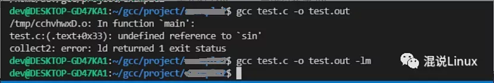
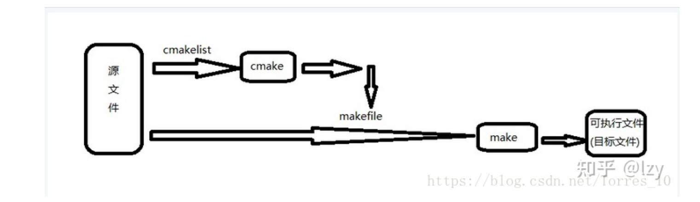

## CMake

CMake**是一个**跨平台的**编译(Build)工具**,可以用简单的语句来**描述**所有平台的**编译过程**。

CMake能够**输出**各种各样的**makefile**或者project文件，能测试编译器所支持的C++特性,类似UNIX下的automake。

假如我们有一个深度学习框架的部分工程列表，里面有超过40个互相调用的工程共同组成，一些用于生成库文件，一些用于实现逻辑功能。他们之间的调用关系复杂而严格，如果我想在这样复杂的框架下进行二次开发，显然只拥有它的源码是远远不够的，还需要清楚的明白这几十个项目之间的复杂关系，在没有原作者的帮助下进行这项工作几乎是不可能的。

即使是原作者给出了相关的结构文档，对新手来说建立工程的过程依旧是漫长而艰辛的，因此CMake的作用就凸显出来了。**原作者只需要生成一份CMakeLists.txt文档**，框架的使用者们只需要在下载源码的同时下载作者提供的CMakeLists.txt，就可以**利用CMake**，在”原作者的帮助下“**进行工程的搭建**。


这时候一个疑问又产生了，cmake是怎么生成Makefile的？

其实cmake又是根据一个叫CMakeLists.txt的文件生成Makefile的，就是make是用来执行Makefile的，cmake是用来执行CMakeLists.txt的。那CMakeLists.txt又是谁生成的？哈哈！CMakeLists.txt是自己手写的哦。

前段时间看到一句话我觉得说的非常好：“在编程的世界里没有捷径可走，还是要脚踏实地的。”

我们只能一步一步想办法怎么让我们使用更加方便，不断去改善，社会不也是一点一点进步的嘛！我们现在的生活更加便利快捷，归根结底还是靠人类创造的，CMakeLists.txt也是一样的，也是需要我们自己写出来的，只是写CMakeLists.txt比写Makefile使用更方便，这就是进步

## makefile


首先，gcc大家应该知道吧，gcc（GNU Compiler Collection，GNU编译器套件）是由GNU开发的编程语言编译器。使用gcc命令编译你会遇到一些麻烦：

> \1. 对于c语言，使用gcc编译的时候，其实它只会默认帮你链接一些基本的c语言标准库（例如libc.a或者libc.so)，有很多的依赖库（例如非标准库、第三方库等）是需要我们手动链接的，就是在gcc命令后面加上要链接的库，下面列举一些需要手动链接库的麻烦：
>
> 1）如果用到了数学math库的时候，即使写了标准头文件<math.h>，不手动链接的话在 编译的时候会发生未定义的错误：
>
> ```c
> #include <stdio.h>
> #include <math.h>
> 
> #define PI 3.14159265
> int main()
> {
>     double angle, result;
>     angle = 30.0;
>     result = sin (angle * PI / 180.0);
>     printf ("result = %f \n", result);
>     return 0;
> }
> ```
>
> 没有手动链接库编译会报错，手动链接后就不会报错：
>
> 
>
> 数学库的文件名就是libm.a，gcc会根据-l后面的基本名称自动添加前缀lib和后缀.a，例如gcc test.c -o test.out -lm，m是基本名称，添加前缀后缀就变成数学库libm.a。
>
> 3）其实还有好多需要手动添加的库。。。。

然而，还有另一个工具make，make是用来执行Makefile的，make可以说成一个音乐家，Makefile就是一篇乐谱，音乐家根据乐谱的内容奏乐，make就是根据Makefile中写的内容进行编译和链接，make更像是一个批处理的工具，可以批处理源文件，只要执行一条make命令，就可以实现自动编译。

当我们编译整个项目工程的时候，make只会编译我们修改过的文件，没有修改过的就不用重新编译，这样我们debug了一个小bug后重新编译就不用花费大量的编译时间。只要没有添加文件或者删除文件，Makefile的内容都是不需要修改的。所以使用make+Makefile极大的提高了我们的工作效率。

对于一些不是很大的工程，Makefile完全是可以我们手工写的，但是工程非常大的时候，手写Makefile也是一件麻烦的事，而且Makefile又不是万能的，换了一个别的平台，Makefile又得重写。

于是又有人想，我们是不是可以自动生成一个Makefile呢？只需要把所有源文件读入就行，所以后面又出现了另一个工具，可以跨平台项目管理的工具cmake，cmake就可以生成Makefile文件给make去执行，这样就不用跨平台了还得去修改。

**或许很多Winodws的程序员都不知道这个东西，因为那些Windows的IDE都为你做了这个工作**，但我觉得要作一个好的和professional的程序员，makefile还是要懂。这就好像现在有这么多的HTML的编辑器，但如果你想成为一个专业人士，你还是要了解HTML的标识的含义。特别在Unix下的软件编译，你就不能不自己写makefile了，会不会写makefile，从一个侧面说明了一个人是否具备完成大型工程的能力。因为，makefile关系到了整个工程的编译规则。

一个工程中的源文件不计数，其按类型、功能、模块分别放在若干个目录中，**makefile定义了一系列的规则来指定，哪些文件需要先编译，哪些文件需要后编译，哪些文件需要重新编译，甚至于进行更复杂的功能操作**，因为makefile就像一个Shell脚本一样，其中也可以执行操作系统的命令。

makefile带来的好处就是——“自动化编译”，一旦写好，**只需要一个make命令**，**整个工程完全自动编译，**极大的提高了软件开发的效率。make是一个命令工具，是一个解释makefile中指令的命令工具，一般来说，大多数的IDE都有这个命令，比如：Delphi的make，Visual C++的nmake，Linux下GNU的make。可见，makefile都成为了一种在工程方面的编译方法。

# make

make是一个命令工具，是一个解释makefile中指令的命令工具，一般来说，大多数的IDE都有这个命令，比如：Delphi的make，Visual C++的nmake，Linux下GNU的make。可见，makefile都成为了一种在工程方面的编译方法。

# **CMake和makefile**

Cmake是用来makefile的一个工具：读入所有源文件之后，自动生成makefile。



# 参考

https://zhuanlan.zhihu.com/p/473704406