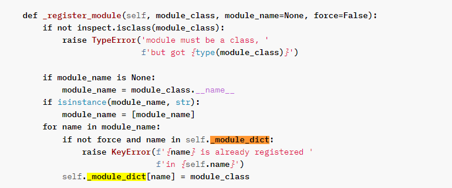
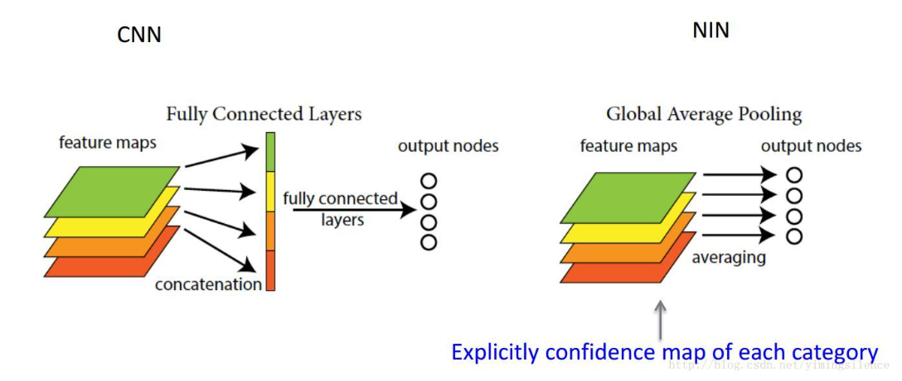

从demo_video_structuralize.py理解代码


首先是

```
skeleton_based_action_recognition//函数 ,对整个视频进行群体行为识别
```

关键代码:

```python
def skeleton_based_action_recognition(args, pose_results, num_frame, h, w):
    fake_anno = dict(
        frame_dict='',
        label=-1,
        img_shape=(h, w),
        origin_shape=(h, w),
        start_index=0,
        modality='Pose',
        total_frames=num_frame)
    num_person = max([len(x) for x in pose_results])

    num_keypoint = 17
    keypoint = np.zeros((num_person, num_frame, num_keypoint, 2),#这是输入
                        dtype=np.float16)
    keypoint_score = np.zeros((num_person, num_frame, num_keypoint),#对于每一个点的置信度分数
                              dtype=np.float16)
    for i, poses in enumerate(pose_results):
        for j, pose in enumerate(poses):       
            pose = pose['keypoints']
            keypoint[j, i] = pose[:, :2]    #i是第i个framge  j个框
            keypoint_score[j, i] = pose[:, 2]

    fake_anno['keypoint'] = keypoint      #keypoint的
    fake_anno['keypoint_score'] = keypoint_score

    label_map = [x.strip() for x in open(args.label_map).readlines()]#群体运动行为
    num_class = len(label_map)

    skeleton_config = mmcv.Config.fromfile(args.skeleton_config)#获取config字典
    skeleton_config.model.cls_head.num_classes = num_class  # for K400 dataset
    skeleton_pipeline = Compose(skeleton_config.test_pipeline)#  将pipline都联系到一起
    skeleton_imgs = skeleton_pipeline(fake_anno)['imgs'][None]
    skeleton_imgs = skeleton_imgs.to(args.device)


```

### compose():

---

​     简述:将config的pipeline变成一个序列

​     内部关键的一个函数  

```
transform = build_from_cfg(transform, PIPELINES)   #通过注册的方式,将字符串变成一个类,并且依次运行,在register的源码有交代


并且通过_call_()  方法可以直接通过类运行函数,所以有了如下操作 
```

---


```python
 skeleton_imgs = skeleton_pipeline(fake_anno)['imgs'][None]
```

​        这里就相当于,fake_anno作为参数,运行了_call_, 也就是所有的pipeline流程

			- UniformSampleFrames
			- PoseDecode
			- PoseCompact
			- Resize
			- CenterCrop
			- GeneratePoseTarget
			- FormatShape
			- Collect
			- ToTensor

----

### UniformSampleFrames:均匀采样帧

从视频中采样一个 n 帧剪辑。 UniformSampleFrames 基本上将视频分成n个等长的片段，随机采样一个每个段的帧。 为了使测试结果具有可重复性，在测试期间设置随机种子，以使抽样结果确定性的。

-    clip_len (int): Frames of each sampled output clip.
- ​    num_clips (int): Number of clips to be sampled. Default: 1.
- ​    test_mode (bool): Store True when building test or validation dataset. Default: False.
- ​    seed (int): The random seed used during test time. Default: 255.

首先分成clip_len等分,当然后通过随机offset ,一共采集num_clips个cut


get_test_clips

最后return 的data为num_clips组index帧

_ call_

最后return一个result dict


## PoseDecode

使用给定的索引加载和解码姿势。

 必需的键是“keypoint”、“frame_inds”（可选）、“keypoint_score”，添加或修改的键是“keypoint”，“keypoint_score”（如果
适用的）。


重点将keypoint_score和keypoint按照frame_inds分布解码


### Posecompact

转换关键点的坐标以使其更紧凑。
具体来说，它首先找到一个围绕所有关节的紧密边界框
在每一帧中，然后我们通过给定的填充率扩展紧密框。为了

例如，如果'padding == 0.25'，则扩展框的中心不变，
 和 1.25 倍的宽度和高度。

    结果中需要的键是“img_shape”、“keypoint”、添加或修改键
    是“img_shape”、“keypoint”、“crop_quadruple”。
---

### Resize

将图像调整为特定大小。

必需的键是“img_shape”、“modality”、“imgs”（可选）、“keypoint”
（可选），添加或修改的键是“imgs”，“img_shape”，“keep_ratio”，
“scale_factor”、“lazy”、“resize_size”。 “懒惰”中的必需键是无，
添加或修改的关键是“插值”。


### Centercrop

从图像中裁剪中心区域。

     必需的键是“img_shape”、“imgs”（可选）、“keypoint”（可选）、
     添加或修改的键是“imgs”、“keypoint”、“crop_bbox”、“lazy”和
     “img_shape”。 “lazy”中的必需键是“crop_bbox”，添加或修改键
     是“crop_bbox”。
### GeneratePoseTarget

关键类:根据关节坐标和置信度生成伪热图


### FormatShape

将最终的 imgs 形状格式化为给定的 input_format。

     必需的键是“imgs”、“num_clips”和“clip_len”，添加或修改
     键是“imgs”和“input_shape”。
### Collect

从加载器中收集与特定任务相关的数据。

     这将保持“keys”中的项目原样，并收集项目
     ``meta_keys`` 到一个名为 ``meta_name`` 的元项目中。数据加载器管道的最后阶段。
     比如当keys='imgs', meta_keys=('filename', 'label','original_shape'), meta_name='img_metas', 结果将是一个带有键'imgs'和'img_metas'，其中'img_metas'是一个DataContainer,另一个带有键“文件名”、“标签”、“原始形状”的字典
### ToTensor

make  imgs to  tensor

```

```


### 模型推理

```python
model = dict(
    type='Recognizer3D',
    backbone=dict(
        type='ResNet3dSlowOnly',
        depth=50,
        pretrained=None,
        in_channels=17,
        base_channels=32,
        num_stages=3,
        out_indices=(2, ),
        stage_blocks=(4, 6, 3),
        conv1_stride_s=1,
        pool1_stride_s=1,
        inflate=(0, 1, 1),
        spatial_strides=(2, 2, 2),
        temporal_strides=(1, 1, 2),
        dilations=(1, 1, 1)),
    cls_head=dict(
        type='I3DHead',
        in_channels=512,
        num_classes=120,
        spatial_type='avg',
        dropout_ratio=0.5),
    train_cfg=dict(),
    test_cfg=dict(average_clips='prob'))
```


### Recognizer3D(self,ResNet3dSlowOnly,I3DHead)


1. ​	_do_test(self, imgs):
2.  			extract_feat(imgs):特征提取
3. ​			self.cls_head(feat):GAP+fc
4. ​           average_clip(cls_score, num_segs):平均计算sore


(1,1,17,48,64,64)

|

resnet{conv3D1,resnet3D..}

第一个3DCNN ,最后通道数输出为32,


1,512,24,8,8

global Average pooling


fc


**Global Average Pooling**

这个概念出自于 network in network 。主要是用来解决全连接的问题，其主要是是将最后一层的特征图进行整张图的一个均值池化，形成一个特征点，将这些特征点组成最后的特征向量，进行softmax中进行计算。

举个例子。假如，最后的一层的数据是10个6*6的特征图，**global average pooling是\**将每一张特征图计算所有像素点的均值\**，输出一个数据值，这样10 个特征图就会输出10个数据点，将这些数据点组成一个1\*10的向量的话，就成为一个特征向量，就可以送入到softmax的分类中计算了**


出处：Lin M, Chen Q, Yan S. Network in network[J]. arXiv preprint arXiv:1312.4400, 2013.

定义：将特征图所有像素值相加求平局，得到一个数值，即用该数值表示对应特征图。

目的：替代全连接层

效果：减少参数数量，减少计算量，减少过拟合
————————————————
版权声明：本文为CSDN博主「五岳凌峰」的原创文章，遵循CC 4.0 BY-SA版权协议，转载请附上原文出处链接及本声明。
原文链接：https://blog.csdn.net/u012911202/article/details/87099559

