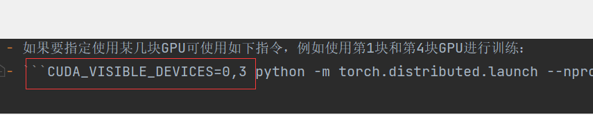
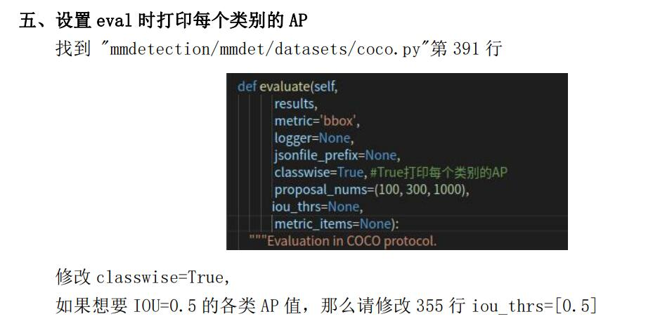

backbone的预训练模型原理


```
8 gpus、imgs_per_gpu = 2：lr = 0.02；
4 gpus、imgs_per_gpu = 2：lr = 0.01；
2 gpus、imgs_per_gpu = 2 ：lr = 0.005；
1 gpu、imgs_per_gpu = 2 ：lr = 0.0025；


你=1GPU*2img/GPU=2
MMdet=8GPU*2img/GPU=16
MMdet_lr=0.02
你的lr=你/MMdet*MMdet_lr=0.0025
```

训练



###  指定GPU单卡训练

```
    CUDA_VISIBLE_DEVICES=0 python tools/train.py configs/balloon/mask_rcnn_r50_caffe_fpn_mstrain-poly_1x_balloon.py
```

多gpu训练

```
CUDA_VISIBLE_DEVICES=0,1,2,3 PORT=29500 ./tools/dist_train.sh ${CONFIG_FILE} 4
```


### 测试

```
python tools/test.py configs/balloon/mask_rcnn_r50_caffe_fpn_mstrain-poly_1x_balloon.py work_dirs/mask_rcnn_r50_caffe_fpn_mstrain-poly_1x_balloon.py/latest.pth --eval bbox segm
```

测试一个集合

```
python tools/test.py model_train/yolof/yolof_r50_c5_8x8_1x_coco.py model_train/yolof/latest.pth 
--show-dir img_test_out/yolof
```

需要指定config文件、模型文件、图片保存文件夹。
其中config文件中有数据集信息。


demoimage.py

```

python demo/image_demo.py demo/demo.jpg \
    configs/faster_rcnn/faster_rcnn_r50_fpn_1x_coco.py \
    checkpoints/faster_rcnn_r50_fpn_1x_coco_20200130-047c8118.pth \
    --device cpu
```

demovideo.py

```
python demo/video_demo.py demo/demo.mp4 \
    configs/faster_rcnn/faster_rcnn_r50_fpn_1x_coco.py \
    checkpoints/faster_rcnn_r50_fpn_1x_coco_20200130-047c8118.pth \
    --out result.mp4
```


### 评估



### 可视化

这边可视化的是loss的变化，可以根据自己需要可视化不同的变量值，只需要改变key的值就可以了，好像有loss/AP/acc等选项。

```
python tools/analysis_tools/analyze_logs.py plot_curve ../checkpoint/20210815_093915.log.json --keys loss --out ./plot_result/1.png

```


###  compute_loss

loss分为cls_loss, box_loss, obj_loss三部分。cls_loss用于监督类别分类，box_loss用于监督检测框的回归，obj_loss用于监督grid中是否存在物体。loss的计算在每层feature map上进行。


## 训练策略

- 我们采用和[Detectron](https://links.jianshu.com/go?to=https%3A%2F%2Fgithub.com%2Ffacebookresearch%2FDetectron%2Fblob%2Fmaster%2FMODEL_ZOO.md%23training-schedules)相同的训练策略。
- 1x 策略表示：在总batch size为8时，初始学习率为0.01，在8 epoch和11 epoch后学习率分别下降10倍，最终训练12 epoch。
- 2x 策略为1x策略的两倍，同时学习率调整位置也为1x的两倍。


作者：不为什么的人
链接：https://www.jianshu.com/p/78dd521303d4
来源：简书
著作权归作者所有。商业转载请联系作者获得授权，非商业转载请注明出处。


```
培训时间表
我们使用三个训练计划，由下表中的 lr schd 列指示。

1x：对于大小为 16 的小批量，此调度从 0.02 的 LR 开始，在 60k 和 80k 次迭代后减少 * 0.1 倍，最后在 90k 次迭代时终止。这个时间表在 coco_2014_train union coco_2014_valminusminival（或等效的 coco_2017_train）中的 118,287 个图像上产生了 12.17 个 epoch。
2x：LR 变化点按比例缩放的 1x 时间表的两倍。
s1x（“stretched 1x”）：这个schedule将1x schedule扩展了大约1.44x，但也延长了第一个learning rate的持续时间。小批量大小为 16 时，它在 100k 和 120k 次迭代时将 LR 减少 * 0.1，最终在 130k 次迭代后结束。
所有训练计划也使用 500 次迭代线性学习率预热。在 8 到 16 个图像之间更改 minibatch 大小时，我们根据我们的论文 Accurate, Large Minibatch SGD: Training ImageNet in 1 Hour 中概述的原则调整 SGD 迭代次数和基本学习率。

epoch bitch iter
epoch：训练时，所有训练数据集都训练过一次。

batch_size：在训练集中选择一组样本用来更新权值。1个batch包含的样本的数目，通常设为2的n次幂，常用的包括64,128,256。 网络较小时选用256，较大时选用64。

iteration​：训练时，1个batch训练图像通过网络训练一次​（一次前向传播+一次后向传播），每迭代一次权重更新一次；测试时，1个batch测试图像通过网络一次​（一次前向传播）。所谓iterations就是完成一次epoch所需的batch个数
```

## **2. 换算关系**


实际上，梯度下降的几种方式的根本区别就在于上面公式中的 Batch Size不同。

 

*注：上表中 Mini-Batch 的 Batch 个数为 N / B + 1 是针对未整除的情况。整除则是 N / B。

## **3. 示例**

CIFAR10 数据集有 50000 张训练图片，10000 张测试图片。现在选择 Batch Size = 256 对模型进行训练。

- **每个 Epoch 要训练的图片数量：**
- **训练集具有的 Batch 个数：**
- **每个 Epoch 需要完成的 Batch 个数：**
- **每个 Epoch 具有的 Iteration 个数：**
- **每个 Epoch 中发生模型权重更新的次数：**
- **训练**  **代后，模型权重更新的次数：**
- **不同代的训练，其实用的是同一个训练集的数据。第**  **代和第**  **代虽然用的都是训练集的五万张图片，但是对模型的权重更新值却是完全不同的。因为不同代的模型处于代价函数空间上的不同位置，模型的训练代越靠后，越接近谷底，其代价越小。**

