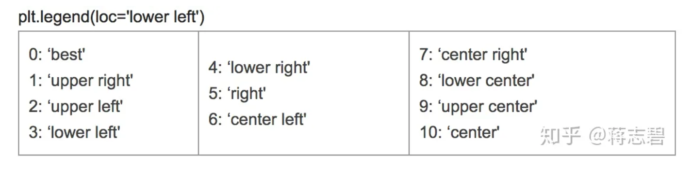
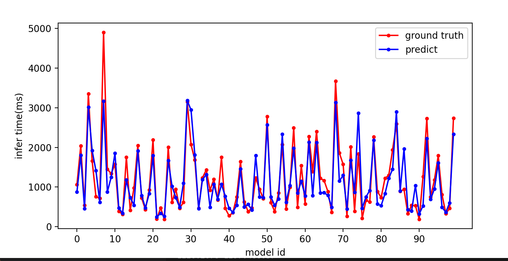
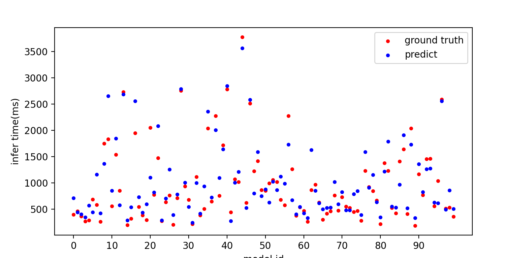

### 画折线图

```python
fig, axes = plt.subplots(1, 1, figsize=(8, 4))
# 折线图
axes.plot(x, y, linestyle='-', color='#DE6B58', marker='x', label='xx')
axes.plot(x, y2, linestyle='-', color='#E1A084', marker='x', label='yy')
# 设置最小刻度间隔
axes.yaxis.set_minor_locator(MultipleLocator(2.5))
axes.xaxis.set_minor_locator(MultipleLocator(0.5))
# 画网格线
axes.grid(which='minor', c='lightgrey')
# 设置x、y轴标签
axes.set_ylabel("Generation Consistency")
axes.set_xlabel("KB Row Number")
# 设置y轴的刻度
axes.set_yticks([70, 75, 80, 85, 90, 95])
# 图例
plt.legend( loc='lower right')
# 展示图片
plt.show()
#保存
plt.savefig("taskRelaiton.png",dpi=300) 

```





### 散点图

```
    axes.scatter(dev_x, target_test, c='r', marker=".",label='ground truth')
    axes.scatter(dev_x, predictions, c='b', marker=".",label='predict')
```

