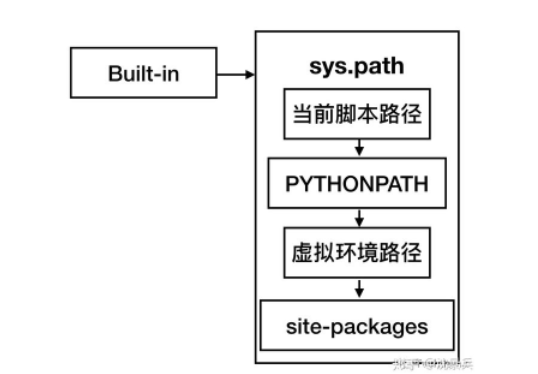

1.assert 断言,报错信息中断,不报错继续

2.class 中 _call_() ,即 __call__()。该方法的功能类似于在类中重载 () 运算符，使得类实例对象可以像调用普通函数那样，以“对象名()”的形式使用。

3.如果子类继承父类（单继承和多继承），可以使用__base__属性查看对应的父类

4.python 装饰器

	- Python的装饰器语法想必大家都不陌生，所谓装饰器其实就是一个“函数增强器”，可以理解为输入一个函数对象，输出一个函数对象的函数
	- https://zhuanlan.zhihu.com/p/350821621

5

\1. __repr__()方法是object类提供的方法，而所有的Python类都是object类的子类，因此所有的Python对象都具有__repr__() 方法。所以如果需要将任何对象与字符串进行连接时，都可先调用__repr__()方法将对象转为字符串，再将字符串连接在一起。

\2. __repr__()之所以特殊，是因为它是一个“自我描述”的方法，该方法通常实现场景是：当开发人员直接打印该对象时，系统将会输出该对象的“自我描述”信息，用来告诉外界该对象具有的状态信息。

\3. object类提供的__repr__()方法总是返回该对象实现类的“类名+object at + 内存地址 ”值，这个返回值并不能真正实现“自我描述”的功能，因此如果用户需要自定义类能实现“自我描述”的功能，就必须重写__repr__()方法。

大部分时候，重写__repr__() 方法总是返回该对象令人感兴趣的信息所组成的字符串。通常可返回如下格式的字符串：


```
类名[field1=值1,field2=值2,...]
```


6.    .astype() **就是转换numpy数组的数据类型**

7. 布尔数组可以用来筛索引

8.**索引中省略号的作用****省略前面所有的 ‘：‘索引操作**

9.super方法: 获取了父类，并调用父类的方法

10.首先，用**@classmethod**描述类方法，然后用"cls"代表本类。**类方法对类属性进行的处理是有记忆性的**。


11.import的搜索顺序：

首先判断这个module是不是built-in即内建模块，如果是则引入内建模块，如果不是则在一个称为sys.path的list中寻找
sys.path在python脚本执行时动态生成，包括以下3个部分：
1、脚本执行的位置，即当前路径
2、环境变量中的PYTHONPATH, 即.bash_profilec.
3、安装python时的依赖位置




12.atexit模块

***\*模块简介：\****

 

从模块的名字也可以看出来，atexit模块主要的作用就是在程序即将结束之前执行的代码，atexit模块使用register函数用于注册程序退出时的回调函数，然后在回调函数中做一些资源清理的操作