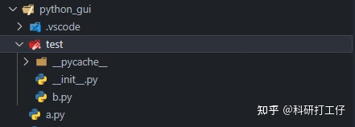

### 一、模块&包简介

模块：所谓模块就是一个.py文件,用来存放变量,方法的文件,便于在其他python文件中导入(通过import或from)。
包(package): 包是更大的组织单位,用来组织区别管理多个模块文件。
import 用来导入模块
from 用于从模块中导入方法(全部或部分)，也可用as 重命名导入的方法

### 二、import&from使用方法

1. import使用方法:
*import 模块 [as  别名模块]

*import 包.[N包].模块;

注：import 导入 最后一个必须是模块,而不能以包结尾

a)导入单模块文件（import 模块 [as  别名模块]）import导入单模块文件后，在import时会执行模块中的代码(从上到下)
b)导入包中的模块（import 包.[N包].模块)import导入包中的模块时，首先会执行包下的__init__.py 注：__init__.py ：用来给包做一些初始化的工作。可以为空，但必须要有
c)导入 包.包.模块import导入多层包中的模块时，会执行各包下的__init__.py
d)导入 包.包 出错 

2. ### from使用方法:

  *from 包.[..包]   import 模块

*from 包.模块  import 方法

*from 模块 import 方法。

注：from 包 import *时,受__init__.py中的__all__影响，没有列出来的模块是没法导入引用的。为方便表述，我们假设：a.py 要 import 文件 b.py

针对不同情况，可分为三种方式：

## **1. a.py 和 b.py 在同一目录下**

直接 import 即可：

```python3
import b
```

或者

```text
from b import *
```

两者的区别是：

如果用 import b，我们在调用b.py中定义的函数fun1()或类class1()时，需要写成 b.fun1()或b.class1()；

如果用 from b import *，我们在调用b.py中定义的函数fun1()或类class1()时，可以直接写成 fun1()或class1()；

## **2. b.py 在 子目录 test下**

需要先在test目录下创建一个空文件 __init__.py。创建该文件的目的是将test目录变成一个Python包。



然后我们就可以通过如下方式 import

```text
import test.b
```

或者

```text
from test.b import *
```

- 如果test包中还有子目录 sub_test/，则**不需要**在sub_test/中创建 __init__.py 即可通过如下方式导入 sub_test/中的 c.py


```text
import test.sub_test.c
```

## 3. b.py在任意路径下

假设 b.py 在路径 H:\Documents\user\test 下，则需要通过如下代码将路径加入到系统路径中，然后直接导入 b.py即可。

```text
import sys
sys.path.append(r"H:\Documents\user\test")
import b
```

注意：由于python中 '\' 是转义符号，因此路径名称的字符串需要写成 r"H:\Documents\user\test" 或 "H:\\Documents\\user\\test" 。

这里是绝对导入


### 相对导入学习

　　1、文件夹中必须有__init__.py文件，该文件可以为空，但必须存在该文件。

　　2、不能作为顶层模块来执行该文件夹中的py文件（即不能作为主函数的入口）。