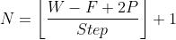
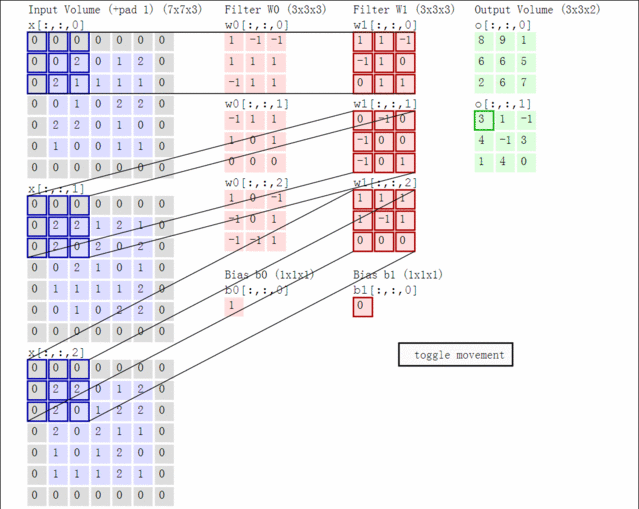
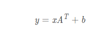
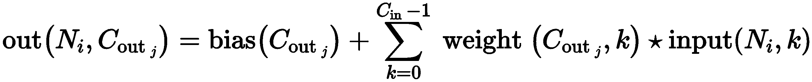
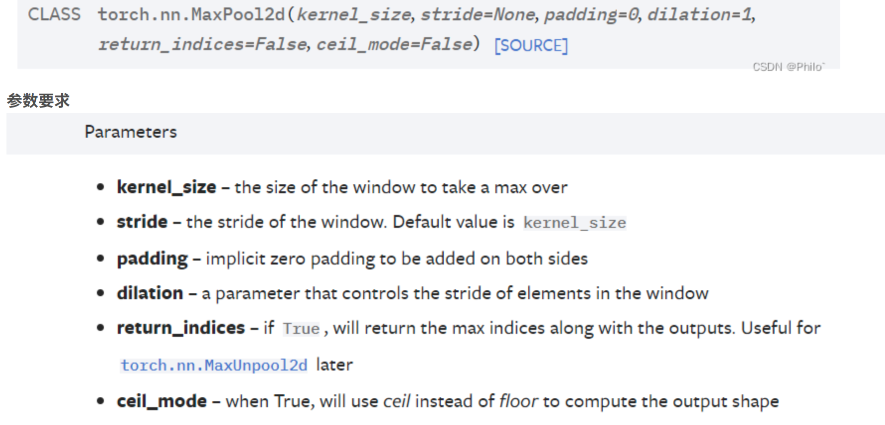

### 1.pytorch之nn.Conv2D

`torch.nn.``Conv2d`(*in_channels*, *out_channels*, *kernel_size*, *stride=1*, *padding=0*, *dilation=1*, *groups=1*, *bias=True*, *padding_mode='zeros'*, *device=None*, *dtype=None*

​	2d卷积函数

- **in_cha nn els** ( [*int*](https://docs.python.org/3/library/functions.html#int) ) –输入图像中的通道数
- **out_cha nn els** ( [*int*](https://docs.python.org/3/library/functions.html#int) ) –卷积产生的通道数
- **kernel_size** ( [*int*](https://docs.python.org/3/library/functions.html#int) *or* [*tuple*](https://docs.python.org/3/library/stdtypes.html#tuple) ) – 卷积核的大小
- **stride** ( [*int*](https://docs.python.org/3/library/functions.html#int) *or* [*tuple*](https://docs.python.org/3/library/stdtypes.html#tuple) *,* *optional* ) -- 卷积的步幅。默认值：1
- **padding** ( [*int*](https://docs.python.org/3/library/functions.html#int) *,* [*tuple*](https://docs.python.org/3/library/stdtypes.html#tuple)*或*[*str*](https://docs.python.org/3/library/stdtypes.html#str) *,* *optional* ) – 添加到输入的所有四个边的填充。默认值：0

图像卷积计算公式

先定义几个参数

- 输入图片大小 W*W
- Filter（卷积核）大小F*F
- 步长 Step
- padding（填充）的像素数P，P=1就相当于给图像填充后图像大小为W+1     *W+1
- 输出图片的大小为N * N

 



图示



eg:

```
import torch as t
m=t.nn.Conv2d(in_channels=3,out_channels=2,kernel_size=3)
input=t.randn(1,3,7,7)
output=m(input)
print(output.shape)
print(output)
print(m.weight)
torch.Size([1, 2, 5, 5])
```

网络期望的张量是【batchsize,channels, height, width】

需要使用unsqueeze方法来为其增加一个维度

**计算公式**:


### 2.pytorch之linear

* ​	y*=*x**A**T*+*b*
  - **in_features** – size of each input sample
  - **out_features** – size of each output sample
  - **bias** – If set to `False`, the layer will not learn an additive bias. Default: `True`

eg:

m = nn.Linear(20, 30)
input = torch.randn(128, 20)
output = m(input)
print(output.size())

```
torch.Size([128, 30])
```

```
m=nn.
```

m的权重为(30,20)

但是经过了

转至

### 3.view

相当于resize()

### 4.pytorch 之 conv3D

21321																										

in_channels(int) – 输入信号的通道，就是输入中每帧图像的通道数

out_channels(int) – 卷积产生的通道，就是输出中每帧图像的通道数

kernel_size(int or tuple) - 过滤器的尺寸，假设为(a,b,c)，表示的是过滤器每次处理 a 帧图像，该图像的大小是b x c。

stride(int or tuple, optional) - 卷积步长，形状是三维的，假设为(x,y,z)，表示的是三维上的步长是x，在行方向上步长是y，在列方向上步长是z。

padding(int or tuple, optional) - 输入的每一条边补充0的层数，形状是三维的，假设是(l,m,n)，表示的是在输入的三维方向前后分别padding l 个全零二维矩阵，在输入的行方向上下分别padding m 个全零行向量，在输入的列方向左右分别padding n 个全零列向量。

dilation(int or tuple, optional) – 卷积核元素之间的间距，这个看看空洞卷积就okay了

groups(int, optional) – 从输入通道到输出通道的阻塞连接数；没用到，没细看

bias(bool, optional) - 如果bias=True，添加偏置；没用到，没细看
————————————————
版权声明：本文为CSDN博主「Sean Q」的原创文章，遵循CC 4.0 BY-SA版权协议，转载请附上原文出处链接及本声明。
原文链接：https://blog.csdn.net/weixin_30767863/article/details/114491831

### 5.forward

forward(*input)
方法: forward(*input)
    Defines the computation performed at every call.
    该方法定义了神经网络每次调用时都需要执行的前向传播计算.
    Should be overridden by all subclasses.
    所有的子类都必须要重写这个方法.

    Note  注意:
    
    Although the recipe for forward pass needs to be defined within 
    this function, one should call the Module instance afterwards 
    instead of this since the former takes care of running the 
    registered hooks while the latter silently ignores them.
    尽管在这个函数中定义了神经网络前向传递计算的具体流程和特定的细节,但是
    此后我们应该调用这个模块实例,而不是调用这个方法【
    	译者注: model = Model,之后应该调用model(input_data),
    		这里实际上执行的时model.__call__(input_data),
    		而不应该调用model.forward(input_data)
    】,因为前者(即:model(input_data))会小心地处理并执行相关地注册登记好
    的钩子函数,然而后者(即:model.forward(input_data))仅仅静默地忽略掉
    这些钩子函数.
### 6.super(LeNet, self).\_\_init\_\_()

概述：`super用于继承中的代指父类（多重继承时指最近的父类），`

可以隐式地将子类中的方法与父类的方法关联，

作用：这样做可以解决基类重复调用以及父类变更时免去函数内容的修改。

此处，super指nn.Module,调用了其__init__（）函数：	

class Module(object):
  def __init__(self):
    """
    Initializes internal Module state, shared by both nn.Module and ScriptModule.
    """
    torch._C._log_api_usage_once("python.nn_module")

    self.training = True
    self._parameters = OrderedDict()
    self._buffers = OrderedDict()
    self._backward_hooks = OrderedDict()
    self._forward_hooks = OrderedDict()
    self._forward_pre_hooks = OrderedDict()
    self._state_dict_hooks = OrderedDict()
    self._load_state_dict_pre_hooks = OrderedDict()
    self._modules = OrderedDict()
也就是说，super的目的在于初始化了Module中的这些参数

> 两种使用方式
>
> 1. super(cls,obj).classfunc 是个’method’，即视作类方法，obj作为X.classfunc的第一个self参数自动传入（隐式传入）
> 2. super(cls,cls).classfunc是个’function’,即视作独立的普通函数，其原型中的第一个self参数也需要手动写入（显示传入

### 7.named_children()

遍历net一级 子模块

### 8.Pytorch中apply函数作用

[pytorch](https://so.csdn.net/so/search?q=pytorch&spm=1001.2101.3001.7020)中的**model.apply(fn)会递归地将函数fn应用到父模块的每个子模块submodule**，也包括model这个父模块自身。**经常用于初始化init_weights的操作**。如下apply递归调用_init_vit_weights，初始化ViT模型的子模块。

### 9.weight和biasj



### 10.实际上parameters里存的就是weight，parameters()会返回一个生成器（迭代器）

### 11.**利用Python的语言特性，y = model(x)是调用了对象model的__\*call\*__\*方法，而nn.Module把\*__\*call_\*_方法实现为类对象的forward函数，所以任意继承了nn.Module的类对象都可以这样简写来调用forward函数。**

12.宽卷积vs窄卷积

3x3的卷积核在矩阵中心没问题，那如果是边缘呢？对于矩阵的第一个元素，左方和上方没有临近元素怎么办？我们可以使用zero-padding。所有（其实并不存在）掉在矩阵之外的元素都用0填充。这样就可以对输入矩阵的所有元素使用卷积核，得到更大或同样大小的输出。zero-padding也叫宽卷积，如果不用zero-padding就是窄卷积


### 12.model.eval的作用

在模型中，我们通常会加上Dropout层和batch normalization层，在模型预测阶段，我们需要将这些层设置到预测模式，model.eval()就是帮我们一键搞定的，如果在预测的时候忘记使用model.eval()，会导致不一致的预测结果。

相应的，在训练之前，我们也要记得将这些特殊的层设置到训练模式：

```text
model.train()
```

而在测试时，应该用整个训练好的模型，因此不需要dropout。我们不会对神经元进行随机置0，这就导致预测值和训练值的大小是不一样的。因此，有两个解决办法：

- train()
  启用 BatchNormalization 和 Dropout
- eval()
  不启用 BatchNormalization 和 Dropout，保证BN和dropout不发生变化，pytorch框架会自动把BN和Dropout固定住，不会取平均，而是用训练好的值，不然的话，一旦test的batch_size过小，很容易就会被BN层影响结果。

### 8.MaxPool2d详解



tips: padding 默认为kernel的大小

9.tensor.unsquzeeze()

`unsqueeze()`用于增加一个维度,括号里面指明增加哪维
