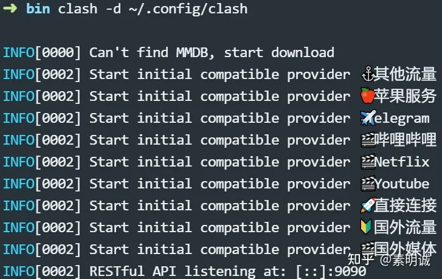

```
export http_proxy=http://127.0.0.1:7890
export https_proxy=http://127.0.0.1:7890
```

1. 打开终端。
2. 使用以下命令下载 Clash 的最新版本：

```text
wget https://github.com/Dreamacro/clash/releases/download/v1.17.0/clash-linux-amd64-v1.17.0.gz
```

- 使用以下命令解压下载的文件：

```text
gunzip clash-linux-amd64-v1.17.0.gz
```

- 使用以下命令将解压后的文件移动到 `/usr/local/bin` 目录，并重命名为 `clash`：

```text
sudo mv clash-linux-amd64-v1.17.0 /usr/local/bin/clash
```

- 使用以下命令给 Clash 添加执行权限：

```text
sudo chmod +x /usr/local/bin/clash
```

至此，Clash 已经安装完成。

**更新订阅**

- 使用以下命令创建 Clash 的配置文件目录：

```text
mkdir -p ~/.config/clash
```

- 使用以下命令下载订阅内容并保存为配置文件：

```text
curl https:/xxxx.yaml > ~/.config/clash/config.yaml
curl https://fast.gfwstable.icu/api/v1/client/subscribe?token=2025fc4fa6f65b603df33befaa8d3109 >./.config/clash/config.yaml
curl 1693648760557.yml > ./.config/clash/config.yaml


wget -O ./.config/clash/config.yaml  https://fast.gfwstable.icu/api/v1/client/subscribe?token=2025fc4fa6f65b603df33befaa8d3109
https://fast.gfwstable.icu/api/v1/client/subscribe?token=2025fc4fa6f65b603df33befaa8d3109
```

请将 `https://xxxx.yaml` 替换为你的订阅链接。

至此，Clash 的配置文件已经创建完成。

最后，我们可以启动 Clash。使用以下命令启动 Clash：

```text
clash -d ~/.config/clash
```

这个命令会启动 Clash，并使用你在 `~/.config/clash` 目录下的配置文件。



**现在，就可以直接使用了，记得放开端口**

