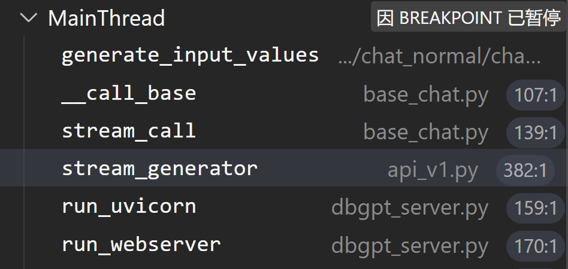

1.数据分析(chat excle)：（无法实现）

​	输入excle表格，利用prompt生成json，结合json生成分析以及图表

​	输出表格分析，图表形式

> ​	利用prompt，反复调用大模型

2:知识库问答：

1. 文本分割，建立向量数据库，问答匹配

3：多轮对话能力


#### 调试报告：


##### 总体流程：

1. 问题输入：
2. api_v1 里面调用params_load
3. 进入chat.factory.py ,导入各种场景
4. 执行相应的场景代码，解析到输出


> 1.当一个文件夹中存在 `__init__.py` 文件，那么这个文件夹就会被视为一个Python包。当你尝试导入这个包或包内的模块时，`__init__.py` 会首先被执行。
>
> 2.Monkey Patching


##### chat_nomal

调用栈:



​	


run_webserver:

```
load_dotenv() //导入.env
CFG = Config()//跳转configs/config.py 获取环境变量 

```

stream_call


LL_server


Fastchat 服务、API 服务、WebUI 服务


### chat excle


excle_analyze   的chat.py进入learn_chat=exclelearning(**chat_parm)


最终还是要在basechat的__call_base()来看input——values


输出还是在default_work中的generate_stream在gong'zuo


#### Chatknowledge：

知识库存放位置：

/data/

存放的数据库是在：default_sqlite.db

里面有

document_chunk   ：存放具体文本  

 knowledge_document  ：

分别文件knowledge_space：分别知识空间

这三张表
