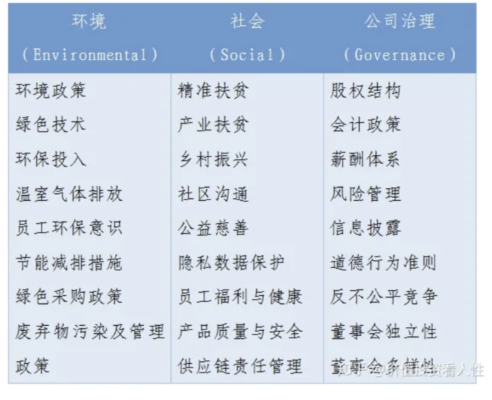
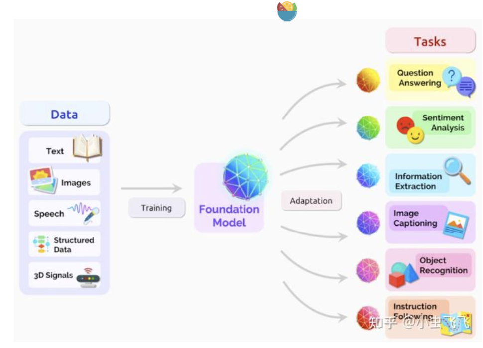
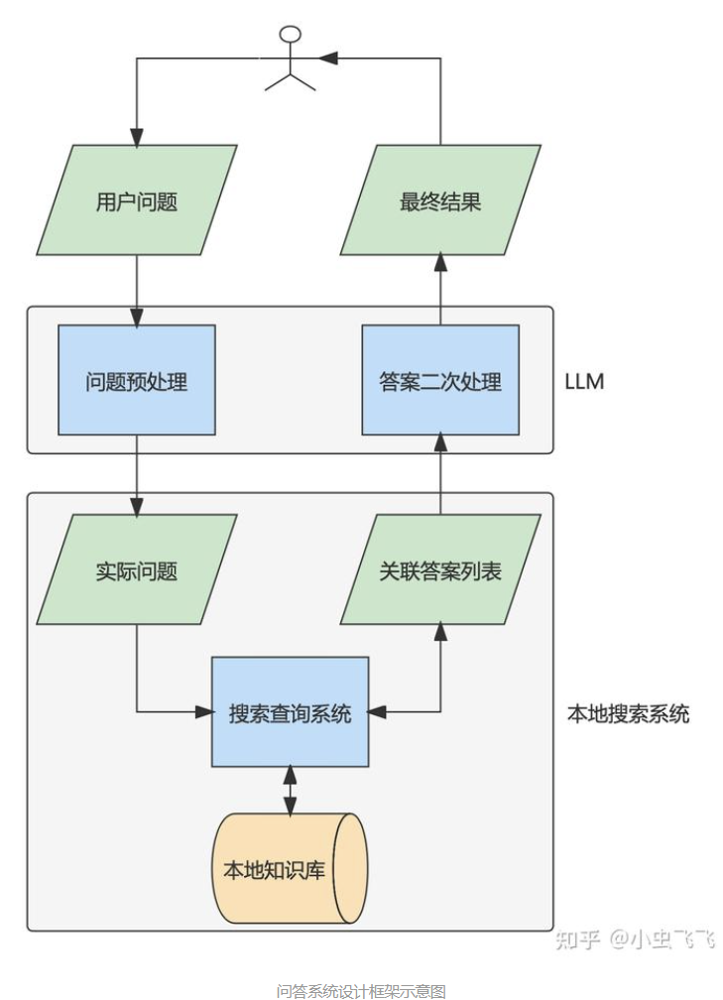
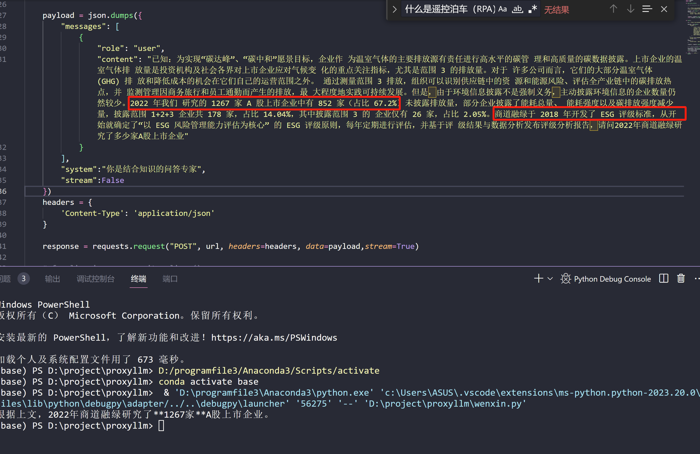

**不同ESG评级机构在机构使命、机构特性、评级目标、评级框架、评级方法、打分机制、评级结果，乃至于产品与服务方面存在巨大差异**。

公司自己也会出ESG报告  可持续发展那里

### 国外评价标准：

**1、明晟 ESG 评价体系**：

MSCI 的 ESG 评级框架分为 4 个步骤：搜集数据、风险暴露度量与公司治理度量、关键指标的评分与权重以及 ESG 评级的最终结果。

**MSCI 研究团队在具体评分时，利用公开数据和信息，以标准化方法评估公司在行业中的风险敞口和风险管理情况，并基于 0-10 分的规则对 35项 ESG 关键指标进行打分，最终给予公司"AAA—CCC"的 ESG 评级结果**

### 需要什么数据：

财务报表

数据来源：

1.公司官网

1.相关公司财务报表

**利用公开数据和信息**，以标准化方法评估公司在行业中的风险敞口和风险管理情况，并基于 0-10 分的规则对 35项 ESG 关键指标进行打分，**最终给予公司"AAA—CCC"的 ESG 评级结果**。

**根据公司报告的数据**

上市公司近年公开披露的数据、上交所和深交所等监督管理机构发布的信息以及第三方评级机构、主流媒体等外部渠道

公开的数据

上市公司ESG评级数据（Wind 版）2018-2022.xlsx

上市公司ESG评级数据（华证版）2009-2022.xlsx

上市公司ESG评级数据（[盟浪](https://www.zhihu.com/search?q=盟浪&search_source=Entity&hybrid_search_source=Entity&hybrid_search_extra={"sourceType"%3A"answer"%2C"sourceId"%3A"3200216586"})版）2018-2022.xlsx

上市公司ESG评级数据（[富时罗素](https://www.zhihu.com/search?q=富时罗素&search_source=Entity&hybrid_search_source=Entity&hybrid_search_extra={"sourceType"%3A"answer"%2C"sourceId"%3A"3200216586"})版）2018-2022.xlsx

上市公司ESG评级数据（商道融绿版）2015-2022.xlsx

上市公司ESG评级数据（[润灵环球](https://www.zhihu.com/search?q=润灵环球&search_source=Entity&hybrid_search_source=Entity&hybrid_search_extra={"sourceType"%3A"answer"%2C"sourceId"%3A"3200216586"})版）2019-2021.xlsx

上市公司ESG评级数据（[彭博](https://www.zhihu.com/search?q=彭博&search_source=Entity&hybrid_search_source=Entity&hybrid_search_extra={"sourceType"%3A"answer"%2C"sourceId"%3A"3200216586"})版）2011-2021.xlsx

### 国内评价标准：

华证 ESG 评级、中证 ESG 评级、商道融绿 ESG 评级、嘉实 ESG 评级、社会价值投资联盟 ESG 评级、万得 ESG 评级

通过公司公开披露与多方监控等多渠道获取

微众揽月的 AI-ESG 评级利用计算机分析卫星图像收集丰富另类数据以更加高效客观地监测企业环境影响。

过去10年中国a股公司esg评级分析报告

部分常见ESG指标如下表所示

评级对象是上市公司

同类型产品：

> https://github.com/PKU-YuanGroup/ChatLaw
>
> 

### 问题以及疑惑：

问题和回答的demo

问题理解，口语，简语理解？

文心一言API

视频数据？

多轮问答

chatpdf逆向

知识库里明明有一样的问题，为啥有时提问还没法准确回答

autogpt

有些问题，不用知识库问答。仅仅文心一言的回答就可以了。

用api的方式无法生成k个加答案

> 百度项目与系统搭建：
>
> ​	负责百度大模型在ESG领域的问答系统搭建，他项目主要分为三期，一期：基于本地知识库的大模型ESG领域问答（2023年11月完成）主要工作有1.本地知识库构建：根据A股公司自身的公开ESG报告以及摩根士丹利资本国际（MSCI）提供的ESG报告以及评级2.基座模型选择3.LangChain框架搭建：完成基本的ESG问答模型，二期：基于领域数据SFT（2023年12月完成），主要工作有1.SFT数据集：收集大量的 {指令，回复} 数据对2.尝试各种微调方式优化模型， 三期：基于RLHF优化SFT模型（2024年2月完成）主要工作是1.收集（指令、回复、奖励）三元组的数据集在SFT模型根据指令生成回答<备注：为了实现更好的对齐，继续用强化学习训练SFT模型：用SFT模型对每条指令生成回复，基于对回复按照多个指标进行人类偏好排序。用排序结果训练一个符合人类偏好的打分模型（Reward Model, RM）。最后，使用PPO算法用RM的打分优化SFT模型。
> 具体技术指标如下:
>
> ​	一期搭建起稳定可控的系统，二期实现可用的智能回答功能，三期实现好用复杂多样的智能问答系统。
>
> 华为端云协同项目结项：
>
> ​	负责将课题一当中的”动态运行设备上模型推理延迟预测“工作落地以及论文投递工作。
> 具体指标如下：
>
> 项目延迟预测能够达到±10%误差内90%以上的准确率并通过结项检查，论文1项投稿MSN。
>

