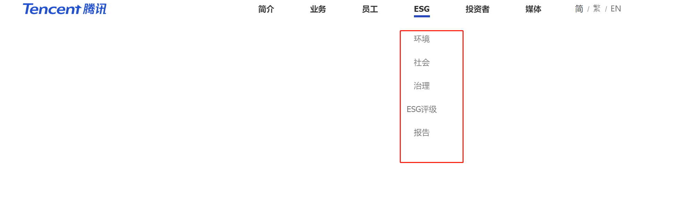

### 1.ESG报告需要的数据：

#### 需要的相关数据指标

1. **环境（Environment）**:
   - 能源消耗，水资源管理，废物管理，温室气体排放，生态影响等：
2. **社会（Social）**:
   - 员工福利，供应链管理，社区关系，客户关系，人权等：
3. **治理（Governance）**:
   - 公司治理结构，高管薪酬，股东权益，业务道德，风险管理等：

> 具体的数据指标可能会因评级机构、报告要求、公司行业等因素而有所不同。

#### 数据获取来源

1. **公司自身的公开报告和文件**:

   - 可持续发展报告（ESG报告）：（例如腾讯）

     

   - 财务年报和季报

   - 公司官网发布新闻中与ESG相关信息

2. **政府和监管机构的公开文件**:

   - **环保部门**：一些国家的环保部门会定期公布企业的排放数据、违规记录等。
   - **证券交易所**：上市公司需要定期向交易所提交一些文件和报告，这些文件中可能包含一些ESG相关的信息。

3. **第三方数据库和平台**:

   - **ESG评级机构**：例如MSCI、Sustainalytics、Bloomberg等，这些机构会定期发布企业的ESG评级和报告。

     **摩根士丹利资本国际（MSCI）**提供了ESG报告以及评级（例如百度）：

     

     ​	

     - **投资研究机构**：例如Morningstar、FactSet等，这些机构提供的投资研究报告中可能会包含一些ESG相关的分析。

4. **新闻媒体和社交媒体**:

   - **新闻媒体**：一些主流媒体会报道企业的重大事件、丑闻、争议等，这些信息可能对企业的ESG评级产生影响。
   - **社交媒体**：企业的社交媒体账号上可能会发布一些与ESG相关的信息，例如企业的公益活动、环保项目等。

## 2.时间安排：

| 时间段 | 任务                              | 计划详情                                                     |
| ------ | --------------------------------- | ------------------------------------------------------------ |
| 一期   | 基于本地知识库的大模型ESG领域问答 | 1.本地知识库构建：根据A股**公司自身的公开ESG报告**以及**摩根士丹利资本国际（MSCI）提供的ESG报告以及评级** 2.基座模型选择 3.LangChain框架搭建：完成基本的ESG问答模型 |
| 二期   | 基于领域数据SFT                   | 1.SFT数据集：收集大量的 {指令，回复} 数据对 2.尝试各种微调方式优化模型 |
| 三期   | 基于RLHF优化SFT模型               | 1.收集（**指令、回复、奖励**）三元组的数据集在SFT模型根据指令生成回答 备注：为了实现更好的对齐，继续用强化学习训练SFT模型： 用SFT模型对每条指令生成回复，基于对回复按照多个指标进行人类偏好排序。用排序结果训练一个符合人类偏好的打分模型（Reward Model, RM）。最后，使用PPO算法用RM的打分优化SFT模型。 |

- [ ] 初步知识库  （范峻铨唐创）
- [ ] 前端修改(潘)
- [x] 换成文心一言api（唐）
  4.换成fasii（唐）
- [ ] 视频输出（潘长期研究）
- [x] 多轮对话实现（范）
- [x] 图表生成测试（范）没有demo
  

问答框分离
