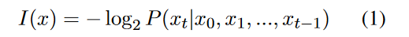

用户: 你好，我需要一些关于如何照顾宠物狗的建议。

**机器人**: 当然可以帮助您。首先，定期带您的狗狗去兽医做体检非常重要。您有特定的问题吗？

**用户**: 我刚养了一只小狗，不太清楚应该给它喂什么。

**机器人**: 对于小狗来说，选择高品质、营养均衡的狗粮非常重要。您应该根据它的年龄、大小和活动水平来选择适合的食物。

**用户**: 它应该多久运动一次？

**机器人**: 小狗通常精力充沛，每天至少需要30分钟到一个小时的运动。您可以分成几次短时间的散步和游戏。

**用户**: 它晚上总是哭闹，我应该怎么办？

**机器人**: 小狗可能会因为离开了它的母亲和兄弟姐妹感到焦虑。给它一个温暖、舒适的睡眠环境，并保持一定的夜间例行程序可以帮助它适应。

**用户**: 我应该如何训练它？

**机器人**: 开始基本的服从训练很重要，如“坐下”、“留下”和“来”。使用积极的强化方法，如奖励和表扬，会更有效。

**用户**: 如果我不在家，它会感到孤独吗？

**机器人**: 是的，狗狗可能会感到孤独。确保它有足够的玩具来保持忙碌，并考虑定期安排狗狗日托。

**用户**: 它需要定期洗澡吗？

**机器人**: 是的，定期洗澡对于维持狗狗的卫生和健康非常重要。根据它的品种和活动水平，大约每月洗一到两次。

**用户**: 我应该怎样处理它的健康问题？

**机器人**: 对于任何健康问题，最好咨询兽医。定期的体检和适当的疫苗接种对预防疾病至关重要。

**用户**: 谢谢你的帮助，我觉得更有信心照顾我的小狗了。

**机器人**: 不用谢，很高兴能帮到您。记得，耐心和爱是照顾狗狗的关键。祝您和您的小狗拥有愉快的时光！

 

用户**:你好需要一些关于如何照顾宠物狗机器人当然可以帮助您。首先定期带的狗狗兽医做体检非常您有特定问题吗用户我刚养小不太清楚应该给喂。对于选择高、营养均衡狗粮非常您根据它年龄大小和活动水平来它应该多久运动小狗通常精力每天3 0到一个的您分成几次短散步和游戏它晚上总是哭闹我小狗可能会因为离开了母亲和兄弟姐妹感到焦虑给一个温暖、并保持一定夜间例行程序可以它适应。我训练它开始基本服从很如[ U N K ]坐留下和 ]来使用积极强化方法奖励和表扬，会更如果我不在家它会感到吗是的狗狗。确保它有玩具来保持忙碌并考虑定期安排狗狗日托它需要定期洗澡吗是的定期对于维持的卫生和非常根据它品种和大约每月洗一到。我怎样处理健康任何健康最好咨询兽医定期的体检和适当疫苗接种对预防疾病至关重要谢谢你觉得更信心照顾我小了不用谢，很高兴能帮到记得，耐心和爱是照顾祝和拥有时光！                                                                                                                            

在信息论中，自信息度量的是与事件相关的惊讶或不确定程度；罕见事件传递的信息较多，因此自信息度较高，而常见事件传递的信息较少，因此自信息度较低。在语言建模中，自信息可用于评估词性单位（如单词、短语或句子）的信息量。自信息较低的词汇单位信息量较少，因此更有可能从上下文中推断出来。因此，在 LLM 推理过程中，我们可以将输入的这些部分视为冗余。

主要看loss和logits，GPT2是一个自回归语言模型，就是用当前词的前面部分预测当前词。代码里指定了labels和input_ids相等，这里的流程可以展开说一下，使用"[CLS]"预测"你"，"[CLS]你"预测"好"，"[CLS]你好"预测下一个字。label和input计算loss时要移一位：

缺点：1.丢失关键信息

​	    2.会消耗时长 