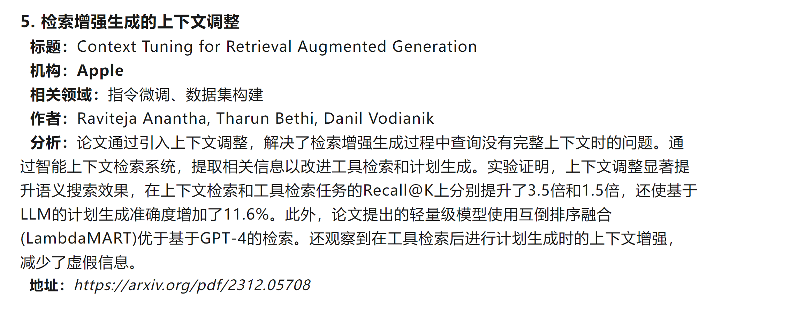
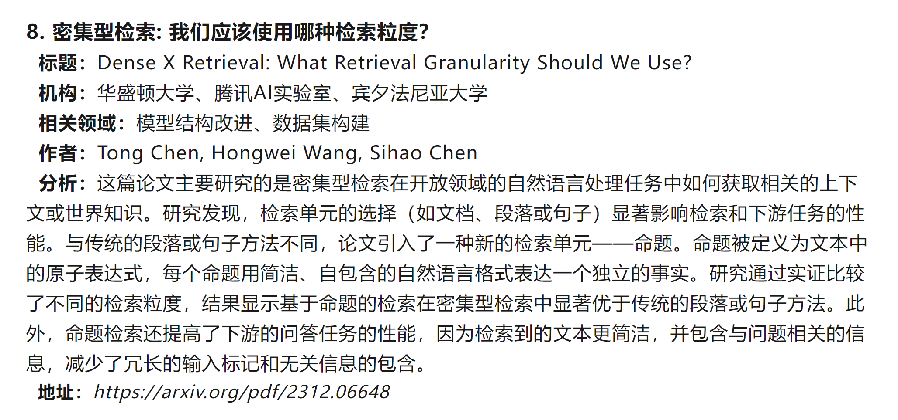
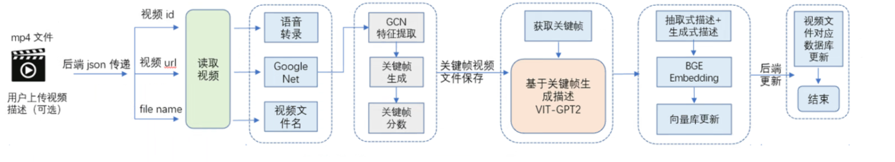

RAG和微调分别的作用：

RAG检索到正确的答案，防止回答错误（关键数据）

微调是：可以让回答更加人性化

综述：

Large Language Models for Information Retrieval: A Survey 

> https://blog.csdn.net/lzz10081203/article/details/134493624

1.用户点采有什么用

