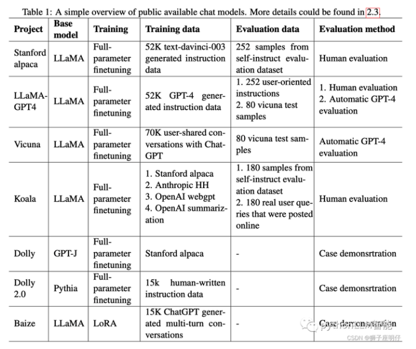
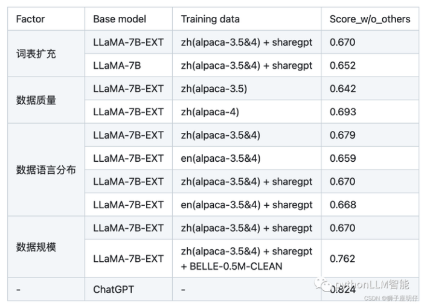
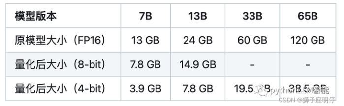

## 1. 如果想要在某个模型基础上做全参数微调，究竟需要多少显存？

一般 n B的模型，最低需要 16-20 n G的显存。（cpu offload基本不开的情况下）

vicuna-7B为例，官方样例配置为 4*A100 40G，测试了一下确实能占满显存。（global batch size 128，max length 2048）当然训练时用了FSDP、梯度累积、梯度检查点等方式降显存。

## 2. 为什么SFT之后感觉LLM傻了?

1. 原版答案：

SFT的重点在于激发大模型的能力，SFT的数据量一般也就是万恶之源alpaca数据集的52k量级，相比于预训练的数据还是太少了。

**如果抱着灌注领域知识而不是激发能力的想法，去做SFT的话，可能确实容易把LLM弄傻**。

1. 新版答案：

**指令微调是为了增强（或解锁）大语言模型的能力。**

其真正作用：

**指令微调后，大语言模型展现出泛化到未见过任务的卓越能力**，即使在多语言场景下也能有不错表现 。

## 3. SFT 指令微调数据 如何构建?

1. **代表性**。应该**选择多个有代表性的任务**；
2. **数据量**。**每个任务实例数量不应太多**（比如：数百个）否则可能会**潜在地导致过拟合问题并影响模型性能**；
3. **不同任务数据量占比**。应该**平衡不同任务的比例**，并且限制整个数据集的容量（通常几千或几万），**防止较大的数据集压倒整个分布**。

## 4. 领域模型Continue PreTrain 数据选取？

技术标准文档或领域相关数据是领域模型Continue PreTrain的关键。因为领域相关的网站和资讯重要性或者知识密度不如书籍和技术标准。

## 5. 领域数据训练后，通用能力往往会有所下降，如何缓解模型遗忘通用能力？

1. 动机：仅仅使用领域数据集进行模型训练，模型很容易出现灾难性遗忘现象.
2. 解决方法：通常在领域训练的过程中加入通用数据集

那么这个比例多少比较合适呢？

目前还没有一个准确的答案。主要与领域数据量有关系，当数据量没有那么多时，一般领域数据与通用数据的比例在1:5到1:10之间是比较合适的。

## 6. 领域模型Continue PreTrain ，如何 让模型在预训练过程中就学习到更多的知识？

领域模型Continue PreTrain时可以同步加入SFT数据，即MIP，Multi-Task Instruction PreTraining。

预训练过程中，可以加下游SFT的数据，可以让模型在预训练过程中就学习到更多的知识。

## 7. 进行SFT操作的时候，基座模型选用Chat还是Base?

仅用SFT做领域模型时，资源有限就用在Chat模型基础上训练，资源充足就在Base模型上训练。（资源=数据+显卡）

资源充足时可以更好地拟合自己的数据，如果你只拥有小于10k数据，建议你选用Chat模型作为基座进行微调；如果你拥有100k的数据，建议你在Base模型上进行微调。

## 8. 领域模型微调 指令&数据输入格式 要求？

在Chat模型上进行SFT时，请一定遵循Chat模型原有的系统指令&数据输入格式。

建议不采用全量参数训练，否则模型原始能力会遗忘较多。

## 9. 领域模型微调 领域评测集 构建？

领域评测集时必要内容，建议有两份，一份选择题形式自动评测、一份开放形式人工评测。

选择题形式可以自动评测，方便模型进行初筛；开放形式人工评测比较浪费时间，可以用作精筛，并且任务形式更贴近真实场景。

## 10. 领域模型词表扩增是不是有必要的？

领域词表扩增真实解决的问题是解码效率的问题，给模型效果带来的提升可能不会有很大。

## 11. 如何训练自己的大模型？

如果我现在做一个sota的中文GPT大模型，会分2步走：1. 基于中文文本数据在LLaMA-65B上二次预训练; 2. 加CoT和instruction数据, 用FT + LoRA SFT。

提炼下方法，一般分为两个阶段训练：

1. 第一阶段：扩充领域词表，比如金融领域词表，在海量领域文档数据上二次预训练LLaMA模型；
2. 第二阶段：构造指令微调数据集，在第一阶段的预训练模型基础上做指令精调。还可以把指令微调数据集拼起来成文档格式放第一阶段里面增量预训练，让模型先理解下游任务信息。

当然，有低成本方案，因为我们有LoRA利器，第一阶段和第二阶段都可以用LoRA训练，如果不用LoRA，就全参微调，大概7B模型需要8卡A100，用了LoRA后，只需要单卡3090就可以了。

## 12. 训练中文大模型有啥经验？

链家技术报告《Towards Better Instruction Following Language Models for Chinese: Investigating the Impact of Training Data and Evaluation》中，介绍了开源模型的训练和评估方法：

还对比了各因素的消融实验：

消融实验结论：

1. 扩充中文词表后，可以增量模型对中文的理解能力，效果更好
2. 数据质量越高越好，而且数据集质量提升可以改善模型效果
3. 数据语言分布，加了中文的效果比不加的好
4. 数据规模越大且质量越高，效果越好，大量高质量的微调数据集对模型效果提升最明显。解释下：数据量在训练数据量方面，数据量的增加已被证明可以显著提高性能。值得注意的是，如此巨大的改进可能部分来自belle-3.5和我们的评估数据之间的相似分布。评估数据的类别、主题和复杂性将对评估结果产生很大影响
5. 扩充词表后的LLaMA-7B-EXT的评估表现达到了0.762/0.824=92%的水平

他们的技术报告证明中文大模型的训练是可行的，虽然与ChatGPT还有差距。这里需要指出后续RLHF也很重要，我罗列在这里，抛砖引玉。

## 13. 指令微调的好处？

有以下好处：

1. 对齐人类意图，能够理解自然语言对话（更有人情味）
2. 经过微调（fine-tuned），定制版的GPT-3在不同应用中的提升非常明显。OpenAI表示，它可以让不同应用的准确度能直接从83%提升到95%、错误率可降低50%。解小学数学题目的正确率也能提高2-4倍。（更准）

踩在巨人的肩膀上、直接在1750亿参数的大模型上微调，不少研发人员都可以不用再重头训练自己的AI模型了。（更高效）

## 14. 预训练和微调哪个阶段注入知识的？

预训练阶段注入知识的，微调是在特定任务训练，以使预训练模型的通用知识跟特定任务的要求结合，使模型在特定任务上表现更好。

## 15. 想让模型学习某个领域或行业的知识，是应该预训练还是应该微调？

可以使用预训练和微调相结合的方式，先用篇章数据进行预训练以获取广泛的知识，再用问答对数据进行微调，使模型更好的学习到特定领域的知识。

当然，GPT大模型的预训练和微调，从实现方式来讲是没有什么差别的，都是decoder only的语言模型训练并更新参数，如果样本集小，没有大量的篇章文档数据，我认为只进行微调也能注入知识的，不必太纠结预训练。而且特定领域跟预训练模型的分布差别不大，也不用二次预训练。

## 16. 多轮对话任务如何微调模型？

跟正常的指令微调方法一样，只是组织数据的时候把历史聊天记录拼接起来，作为上下文信息喂给模型。

{"prompt": "长城h3风扇不转。继电器好的。保险丝好的传感器新的风扇也新的这是为什么。就是继电器缺一个信号线", "response": "用电脑能读数据流吗？水温多少", "history": []}

{"prompt": "95", "response": "上下水管温差怎么样啊？空气是不是都排干净了呢？", "history": [["长城h3风扇不转。继电器好的。保险丝好的传感器新的风扇也新的这是为什么。就是继电器缺一个信号线", "用电脑能读数据流吗？水温多少"]]}

{"prompt": "是的。上下水管都好的", "response": "那就要检查线路了，一般风扇继电器是由电脑控制吸合的，如果电路存在断路，或者电脑坏了的话会出现继电器不吸合的情况！", "history": [["长城h3风扇不转。继电器好的。保险丝好的传感器新的风扇也新的这是为什么。就是继电器缺一个信号线", "用电脑能读数据流吗？水温多少"], ["95", "上下水管温差怎么样啊？空气是不是都排干净了呢？"]]}

## 17. 微调后的模型出现能力劣化，灾难性遗忘是怎么回事？

所谓的**灾难性遗忘**：即学习了新的知识之后，几乎彻底遗忘掉之前习得的内容。这在微调ChatGLM-6B模型时，有同学提出来的问题，表现为原始ChatGLM-6B模型在知识问答如“失眠怎么办”的回答上是正确的，但引入特定任务（如拼写纠错CSC）数据集微调后，再让模型预测“失眠怎么办”的结果就答非所问了。

我理解ChatGLM-6B模型是走完 “预训练-SFT-RLHF” 过程训练后的模型，其SFT阶段已经有上千指令微调任务训练过，现在我们只是新增了一类指令数据，相对大模型而已，微调数据量少和微调任务类型单一，不会对其原有的能力造成大的影响，所以我认为是不会导致灾难性遗忘问题，我自己微调模型也没出现此问题。

应该是微调训练参数调整导致的，微调初始学习率不要设置太高，lr=2e-5或者更小，可以避免此问题，不要大于预训练时的学习率。

## 18. 微调模型需要多大显存？

## 19. 大模型LLM进行SFT操作的时候在学习什么？

（1）预训练->在大量无监督数据上进行预训练，得到基础模型-->将预训练模型作为SFT和RLHF的起点。

(2) SFT-->在有监督的数据集上进行SFT训练，利用上下文信息等监督信号进一步优化模型-->将SFT训练后的模型作为RLHF的起点。

(3) RLHF-->利用人类反馈进行强化学习，优化模型以更好地适应人类意图和偏好-->将RLHF训练后的模型进行评估和验证，并进行必要的调整。

## 20. 预训练和SFT操作有什么不同

下面使用一个具体的例子进行说明。

问题：描述计算机主板的功能

回答：计算机主板是计算机中的主要电路板。它是系统的支撑。

进行预训练的时候会把这句话连接起来，用前面的词来预测后面出现的词。在计算损失的时候，问句中的损失也会被计算进去。

进行SFT操作则会构建下面这样一条训练语料。

输入：描述计算机主板的功能[BOS]计算机主板是计算机中的主要电路板。它是系统的支撑。[EOS]

标签：[......][BOS]计算机主板是计算机中的主要电路板。它是系统的支撑。[EOS]

其中[BOS]和[EOS]是一些特殊字符，在计算损失时，只计算答句的损失。在多轮对话中，也是一样的，所有的问句损失都会被忽略，而只计算答句的损失。

因此SFT的逻辑和原来的预训练过程是一致的，但是通过构造一些人工的高质量问答语料，可以高效地教会大模型问答的技巧。

## 21. 样本量规模增大，训练出现OOM错

1. 问题描述：模型训练的样本数量从10万，增大300万，训练任务直接报OOM了。
2. 解决方案，对数据并行处理，具体实现参考海量数据高效训练，核心思想自定义数据集本次的主要目标是使向量化耗时随着处理进程的增加线性下降，训练时数据的内存占用只和数据分段大小有关，可以根据数据特点，灵活配置化。核心功能分为以下几点:
3. 均分完整数据集到所有进程（总的GPU卡数）
4. 每个epoch训练时整体数据分片shuffle一次，在每个进程同一时间只加载单个分段大小数据集
5. 重新训练时可以直接加载向量化后的数据。

## 22. 大模型LLM进行SFT 如何对样本进行优化？

1. 对于输入历史对话数据进行左截断，保留最新的对话记录。
2. 去掉样本中明显的语气词，如嗯嗯，啊啊之类的。
3. 去掉样本中不合适的内容，如AI直卖，就不应出现转人工的对话内容。
4. 样本中扩充用户特征标签，如年龄，性别，地域，人群等

## 23. 模型参数迭代实验

验证历史对话轮次是否越长越好，通过训练两个模型，控制变量max_source_length｜max_target_length，对训练好之后的模型从Loss、Bleu指标、离线人工评估等角度进行对比分析。

结论：从人工评估少量样本以及loss下降来看，历史对话长度1024比512长度好，后续如果训练可能上线模型，可以扩大到1024长度。

## 24. 微调大模型的一些建议

1. 模型结构:
2. 模型结构+训练目标: Causal Decoder + LM。有很好的zero-shot和few-shot能力，涌现效应
3. layer normalization: 使用Pre RMS Norm
4. 激活函数: 使用GeGLU或SwiGLU
5. embedding层后不添加layer normalization，否则会影响LLM的性能
6. 位置编码: 使用ROPE或ALiBi。ROPE应用更广泛
7. 去除偏置项:去除dense层和layer norm的偏置项，有助于提升稳定性
8. 训练配置:
9. batch: 选用很大的batch size; 动态地增加batch size的策略，GPT3逐渐从32K增加到3.2M tokens。
10. 学习率调度:先warmup再衰减。学习率先线性增长，再余弦衰减到最大值的10%。最大值一般在5e-5到1e-4之间。
11. 梯度裁剪:通常将梯度裁剪为1.0。
12. 权重衰减: 采用AdamW优化器，权重衰减系数设置为0.1Adamw相当于Adam加了一个L2正则项
13. 混合精度训练:采用bfloat16，而不是foat16来训练。
14. 训练崩溃挽救:
15. 选择一个好的断点，跳过训练崩溃的数据段，进行断点重训。选择一个好的断点的标准: 损失标度lossscale>0;梯度的L2范数<一定值 && 波动小