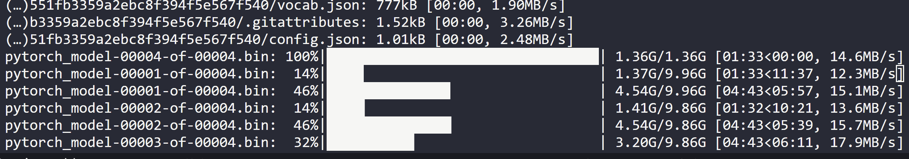

本站域名 `**hf-mirror.com**`，用于镜像 [huggingface.co](https://huggingface.co/) 域名。

更多用法和详细介绍参见[这篇文章](https://padeoe.com/huggingface-large-models-downloader)。简介：

1. 方法一：使用

   huggingface 官方提供的 [**`huggingface-cli`** ](https://hf-mirror.com/docs/huggingface_hub/guides/download#download-from-the-cli)命令行工具。

   (1) 安装依赖

   ```
   pip install -U huggingface_hub
   ```

   (2) 基本命令示例：

   ```
   export HF_ENDPOINT=https://hf-mirror.com
   ```

   ```
   huggingface-cli download --resume-download defog/sqlcoder --local-dir sqlcoder
   
   huggingface-cli download --resume-download BAAI/bge-base-zh --local-dir bge-base-zh
   
   huggingface-cli download --resume-download BAAI/bge-base-zh --local-dir bge-base-zh --local-dir-use-symlinks False
   huggingface-cli download --resume-download THUDM/chatglm3-6b --local-dir chatglm3-6b
   huggingface-cli download --resume-download spacy/zh_core_web_trf --local-dir   zh_core_web_trf 
   
   huggingface-cli download --resume-download Qwen/Qwen-7B-Chat --local-dir   Qwen-7B-Chat
   
   huggingface-cli download --resume-download moka-ai/m3e-base --local-dir m3e-base --local-dir-use-symlinks False
   
   huggingface-cli download --resume-download codefuse-ai/CodeFuse-QWen-14B --local-dir CodeFuse-QWen-14B
   --local-dir-use-symlinks False
   
   
   huggingface-cli download --resume-download BAAI/bge-reranker-base --local-dir bge-reranker-base --local-dir-use-symlinks False
   
   
   huggingface-cli download --resume-download moka-ai/m3e-large --local-dir moka-ai/m3e-large --local-dir-use-symlinks False
   
   
   huggingface-cli download --resume-download Qwen/Qwen-14B-Chat --local-dir Qwen-14B-Chat --local-dir-use-symlinks False
   
   huggingface-cli download --resume-download 01-ai/Yi-6B --local-dir Yi-6B --local-dir-use-symlinks False
   
   huggingface-cli download --resume-download microsoft/phi-2 --local-dir phi-2 --local-dir-use-symlinks False
   
   
   huggingface-cli download --resume-download NousResearch/Llama-2-7b-hf --local-dir Llama-2-7b-hf --local-dir-use-symlinks False
   
   
   huggingface-cli download --resume-download deepseek-ai/deepseek-coder-6.7b-base  --local-dir deepseek-coder-6.7b-base --local-dir-use-symlinks False
   ```
   
   
   
   
   
   `huggingface-cli` 隶属于 `huggingface_hub` 库，不仅可以下载模型、数据，还可以可以登录huggingface、上传模型、数据等。huggingface-cli 属于官方工具，其长期支持肯定是最好的。**优先推荐！**
   
   **安装依赖**
   
   ```text
   pip install -U huggingface_hub
   ```
   
   *注意：huggingface_hub 依赖于 Python>=3.8，此外需要安装 0.17.0 及以上的版本，推荐0.19.0+。*
   
   **基本用法**
   
   ```bash
   huggingface-cli download --resume-download bigscience/bloom-560m --local-dir bloom-560m
   ```
   
   **下载数据集**
   
   ```bash
   huggingface-cli download --resume-download --repo-type dataset lavita/medical-qa-shared-task-v1-toy
   
   ```
   
   
   
   值得注意的是，有个`--local-dir-use-symlinks False` 参数可选，因为huggingface的工具链默认会使用符号链接来存储下载的文件，导致`--local-dir`指定的目录中都是一些“链接文件”，真实模型则存储在`~/.cache/huggingface`下，如果不喜欢这个可以用 `--local-dir-use-symlinks False`取消这个逻辑。
   
   但我不太喜欢取消这个参数，**其最大方便点在于，调用时可以用模型名直接引用模型，而非指定模型路径。**
   
   什么意思呢？我们知道，`from_pretrain` 函数可以接收一个模型的id，也可以接收模型的存储路径。
   
   假如我们用浏览器下载了一个模型，存储到服务器的 `/data/gpt2` 下了，调用的时候你得写模型的绝对路径
   
   ```python3
   AutoModelForCausalLM.from_pretrained("/data/gpt2")
   ```
   
   然而如果你用的 `huggingface-cli download gpt2 --local-dir /data/gpt2` 下载，即使你把模型存储到了自己指定的目录，但是你仍然可以简单的用模型的名字来引用他。即：
   
   ```text
   AutoModelForCausalLM.from_pretrained("gpt2")
   ```
   
   原理是因为huggingface工具链会在 `.cache/huggingface/` 下维护一份模型的**符号链接**，无论你是否指定了模型的存储路径 ，缓存目录下都会链接过去，这样可以避免自己忘了自己曾经下过某个模型，此外调用的时候就很方便。
   
   所以用了官方工具，既可以方便的用模型名引用模型，又可以自己把模型集中存在一个自定义的路径，方便管理。
   
   当然，该工具目前还是有一些缺点的：
   
   一是其**存储逻辑不太直观，**如上所属的缓存与链接逻辑，使得新手经常询问，模型究竟下载到哪里去了？
   
   二是**不支持单文件多线程**。目前的行为是多文件并行，一次性会同时下载多个文件。
   
   三是**遇到网络中断会报错退出，不会自动重试**，需要重新手动执行。**【更新，v0.19.0已支持自动重试】**
   
   
   
   
   
   
   
   如需提高下载速度，推荐设置环境变量开启
   
   [`hf_tranfer`](https://github.com/huggingface/hf_transfer)
   
   ，官方的下载加速库，缺点是没有进度条、容错性低（网络不稳定则容易报错）。
   
   ```
   export HF_HUB_ENABLE_HF_TRANSFER=1Copy
   ```
   
   (3)
   
    
   
   下载需要登录的模型（Gated Model）
   
   请添加
   
   ```
   --token hf_***
   ```
   
   参数，其中
   
   ```
   hf_***
   ```
   
   是
   
    
   
   access token
   
   ，请在
   
   huggingface官网这里
   
   获取。示例：
   
   ```
   huggingface-cli download --token hf_*** --resume-download bigscience/bloom-560m --local-dir bloom-560mCopy
   ```
   
2. 方法二：使用url直接下载时，将 `huggingface.co` 直接替换为本站域名`hf-mirror.com`。使用浏览器或者 wget -c、curl -L、aria2c 等命令行方式即可。
   下载需登录的模型需命令行添加 `--header hf_***` 参数，token 获取具体参见上文。