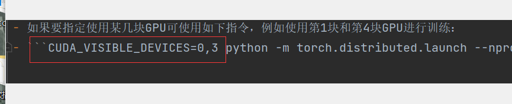

1.mmaction2文档阅读

2.config 命名里面keypoint和limb有什么区别

3.下载中断文件保存?

`resume_from`和之间的差异`load_from`： `resume_from`加载模型权重和优化器状态，并且纪元也从指定的检查点继承。它通常用于恢复意外中断的训练过程。 `load_from`仅加载模型权重，并且训练时期从0开始。通常用于微调。

4.如何多gpu训练

5.短视频的方法

5.阅读demo_structural代码,理解其中逻辑关系                                                            

学习一下排版

