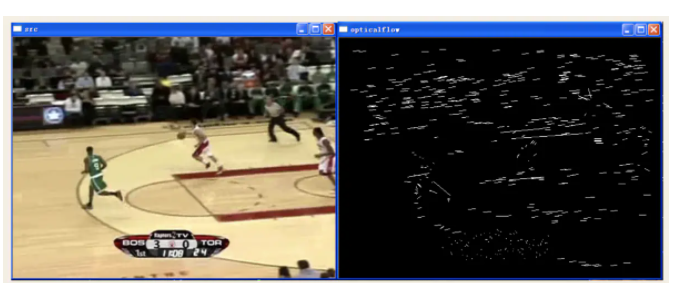
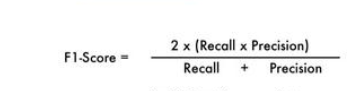

### 1.backbone是什么?

​	在神经网络中，尤其是CV领域，一般先对图像进行特征提取（常见的有vggnet，resnet，谷歌的inception），这一部分是整个CV任务的根基，因为后续的下游任务都是基于提取出来的图像特征去做文章（比如分类，生成等等）。

### 2.光流

[]: https://blog.csdn.net/qq_41368247/article/details/82562165

​	光流是空间运动物体在观察平面成像平面上的像素运动的瞬时速度

   光流法是利用图像序列中像素在时间域上的变化以及相邻帧之间的相关性来找到上一帧跟当前帧之间存在的对应关系，从而计算出相邻帧之间物体的运动信息的一种方法。

### 3.感受野

### 4.关于CNN

- 卷积层：在这一层中，过滤器用于从图像中提取特征。最重要的参数是内核的大小和步幅。
- 池化层：它的功能是减小空间大小以减少网络中的参数和计算量

5.**什么是flops**

对flops有疑惑，首先得先捋清这个概念：

- **FLOPS**：注意全大写，是floating point operations per second的缩写，意指每秒浮点运算次数，理解为计算速度。是一个衡量硬件性能的指标。
- **FLOPs**：注意s小写，是floating point operations的缩写（s表复数），意指浮点运算数，理解为计算量。可以用来衡量算法/模型的复杂度。

### 6.

### 

准确率Accuracy是一种度量标准,用于衡量

​                   
$$
\text { Accuracy }=\frac{\text { True Positives }+\text { True Negatives }}{\text { Total # samples }}
$$

即使该模型已将100％的数据分类为0类，但鉴于TN的数量占主导地位，其准确率也足够好。这就是为什么当存在类不平衡问题（准确性悖论）时，准确率**Accuracy** 度量常常会误导人们的原因。

精度percision:在所有模型列为正数的元素中，有多少是正确的。
$$
\text { Precision }=\frac{\text { True Positives }}{\text { True Positives }+\text { False Positives }}
$$

**召回率**是针对我们原来的**样本**而

​	$$\frac{True Positives}{True Positives + False Negatives}$$

mAP: mean Average Precision, 即各类别AP的平均值

如果召回率非常低就表明某些事情是不正确的。也就是说，一些确实为阳性的样本被归类为阴性。

F1-SCORE

最后，为了概括精度和召回率指标，我们实现了F1-Score指标，该指标被理解为精度和召回率之间的“谐波平均值”，换句话说，它提供了两个指标之间的比率。

### 7.benchmark and baseline 

通俗的讲，一个算法之所以被称为benchmark，是因为它的**性能已经被广泛研究，人们对它性能的表现形式、测量方法都非常熟悉，因此可以作为标准方法来衡量其他方法的好坏**。

通俗的讲，一个算法被称为baseline，基本上表示比这个算法性能还差的基本上不能接受的，除非方法上有革命性的创新点，而且还有巨大的改进空间和超越benchmark的潜力，只是因为是发展初期而性能有限。所以baseline有一个自带的含义就是“性能起点”。这里还需要指出其另一个应用语境，就是在算法优化过程中，一般version1.0是作为baseline的，即这是你的算法能达到的一个基本性能，在算法继续优化和调参数的过程中，你的目标是比这个性能更好，因此需要在这个base line的基础上往上跳。
————————————————
版权声明：本文为CSDN博主「快乐成长吧」的原创文章，遵循CC 4.0 BY-SA版权协议，转载请附上原文出处链接及本声明。
原文链接：https://blog.csdn.net/qq_37791134/article/details/84962058

### 8.Map

mAP: mean Average Precision, 即各类别AP的平均值

### 9. **Top-K准确率**

**Top-K准确率就是用来计算预测结果中概率最大的前K个结果包含正确标签的占比**