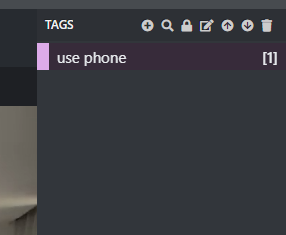
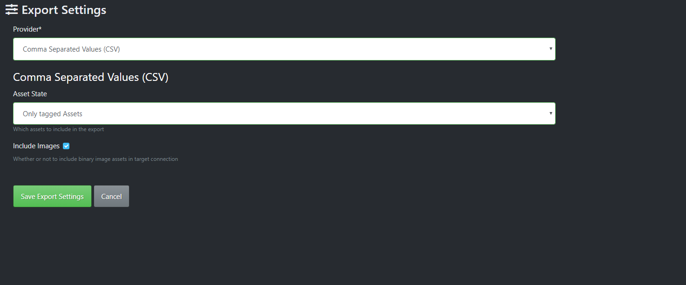
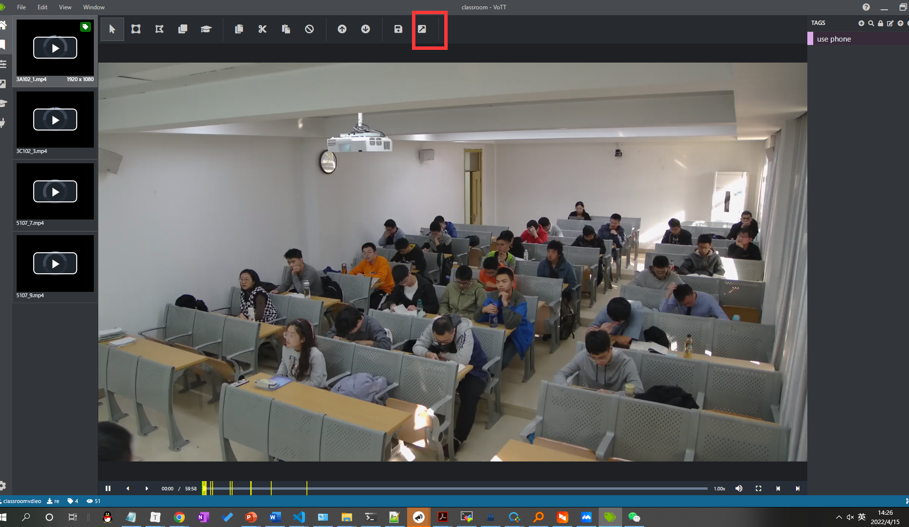
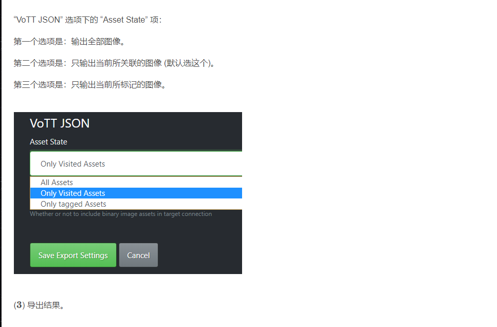

### 一.安装

访问 https://github.com/Microsoft/VoTT/releases下载相应的文件。

vott-2.2.0-win32.exe

### 二.使用方法

​       1.打开VOTT，新建项目 new project

​      

​       2. 编写项目设置

​       

​	   3.添加标签tag

​     4.保存设置

5. 导出
6. 

### 问题解决

1.invalid literal for int() with base 10

