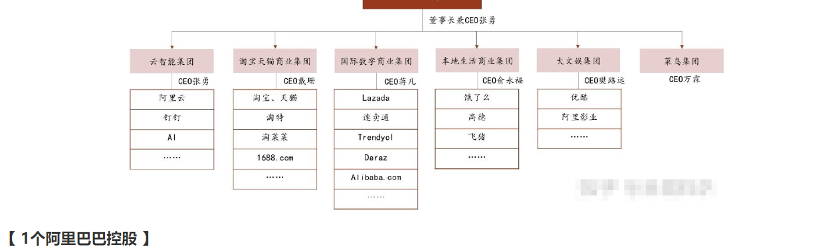

| 公司                   | 时间结点                      | 是否投递                                                  | 是否面试 |
| ---------------------- | ----------------------------- | --------------------------------------------------------- | -------- |
| 美团暑期（大模型方向） | 2.26-3.9（需要简历筛选-笔试） | 3月3日已投递  三个志愿和一个日常实习（大模型方向） 无内推 |          |
| 阿里巴巴               | 2.29  3月中旬---笔面试        |                                                           |          |
| vivo暑期实习(推荐算法) | 2.21                          |                                                           |          |
| 华为暑期实习           | 可以开始投递                  |                                                           |          |
| 蚂蚁大模型日常         |                               | 已投递                                                    |          |
|                        |                               |                                                           |          |
|                        |                               |                                                           |          |
|                        |                               |                                                           |          |
|                        |                               |                                                           |          |
|                        |                               |                                                           |          |
|                        |                               |                                                           |          |
|                        |                               |                                                           |          |
|                        |                               |                                                           |          |
|                        |                               |                                                           |          |

