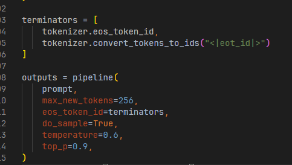
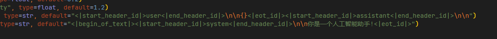
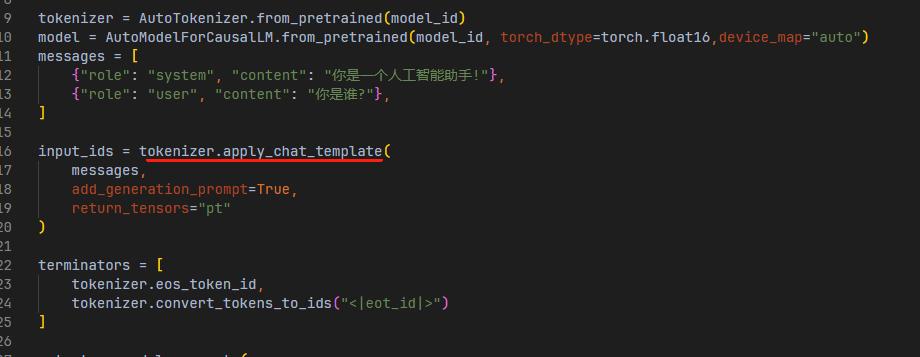
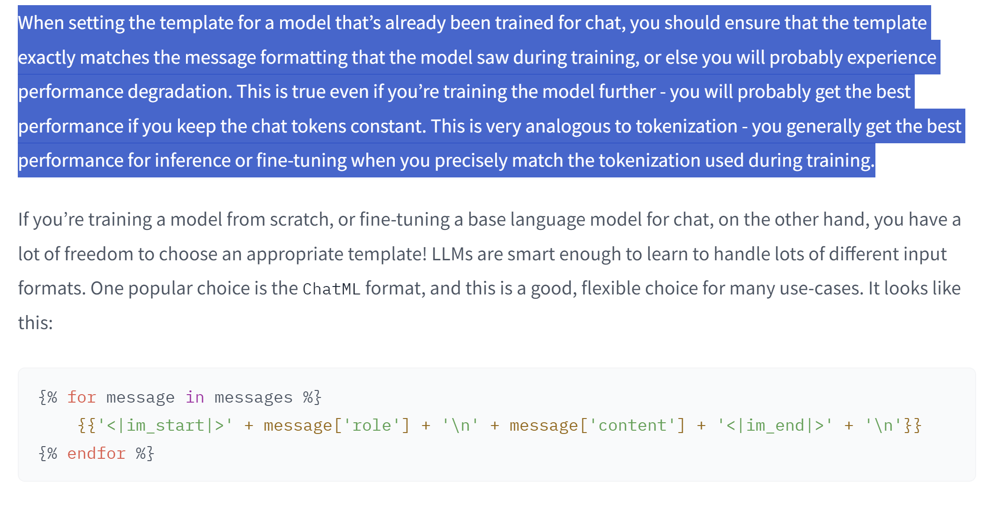

```
input_text = """<|im_start|>system 
You are a helpful AI assistant.
<|im_end|> 
<|im_start|>user
What is the most interesting fact about kangaroos that you know?
<|im_end|> 
<|im_start|>assistant
```


设置template


```
template = tokenizer.chat_template
template = template.replace("SYS", "SYSTEM")  # Change the system token
tokenizer.chat_template = template  # Set the new template
tokenizer.push_to_hub("model_name")  # Upload your new template to the Hub!
```

