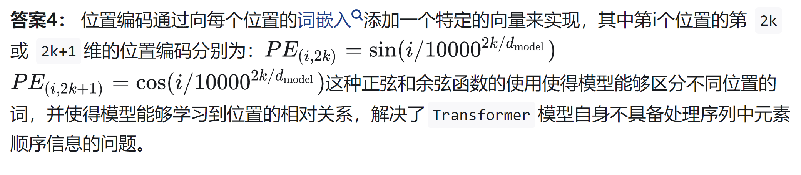

#### 1.transformer为什么要用三个不一样的QKV？

回答:可以增强网络的容量和表达能力

#### 2.**为什么上面那个公式要对QK进行scaling(放缩)**

主要是后面接了softmax函数，太大，会发生梯度消失

#### 3**为什么transformer要用Layernorm, 有什么用处**

任何norm都是为了让norm之后的网络层的数据输入的分布变得更好，使数据分布进入敏感区间，缓解梯度消失的问题，从而让模型更加容易训练。当然这么做也舍弃了初此维度之外其他维度的其他信息

4.**为什么不用BatchNorm**

在nlp中，做batchnorm是没有意义的，因为不同句话的同一位置的字之间没有必要保持在同一维度(就像”大模型是个潜力股“，”我爱学习“, 把"大"和"我"对齐是无意义的，还会导致”大“和”模“和”型“之间的关联信息丢失掉)，但是做layernorm是有意义的，它做的是同一句话在同一channel下的；

 Layer Normalization的目的是对每个样本的所有特征进行归一化

5. ### transformer的计算量

   假设输入序列的长度为 n，每层的隐藏单元数为 h，注意力头的数量为 k，则BERT中的自注意力计算复杂度为 O(n^2 * h * k)

#### 6.如何在数学上被实现，它如何改进自注意力机制的性能？

#### 7.Transformer模型中的如何数学上表示，它解决了什么问题

根据三角函数的特点，每个位子的每一个维度可以都可以用其他位置信息的线性组合

#### 8。残差

残差连接有助于解决深度模型中的[梯度消失问题](https://www.zhihu.com/search?q=梯度消失问题&search_source=Entity&hybrid_search_source=Entity&hybrid_search_extra={"sourceType"%3A"article"%2C"sourceId"%3A"689965833"})，使得更深层次的模型训练成为可能。

#### 9**Transformer 模型中多头注意力机制的维度拆分是如何实现的**

#### 10**为什么 Transformer 模型能够有效处理[长距离依赖问题**

 由于自注意力机制能够直接计算序列中任意两点之间的依赖关系，`Transformer`模型能够有效捕捉长距离依赖，避免了传统序列模型（如[RNN](https://www.zhihu.com/search?q=RNN&search_source=Entity&hybrid_search_source=Entity&hybrid_search_extra={"sourceType"%3A"article"%2C"sourceId"%3A"689965833"})）中信息传递路径长导致的信息丢失。

#### 11.**Transformer 模型中的“注意力遮蔽”（Attention Masking）是如何工作的**

 注意力遮蔽通过将一些位置的注意力权重设为负无穷（在`softmax`之前），从而在计算注意力时忽略这些位置，常用于遮蔽解码器中未来的位置以防止信息泄露。

12.梯度消失和梯度爆炸

上图可知，**上式主要由两部分构成：多个激活函数偏导数的连乘，和多个权重参数的连乘。**如果激活函数求导后与权重相乘的积大于1，那么随着层数增多，求出的梯度更新信息将以指数形式增加，即发生**梯度爆炸；**如果此部分小于1，那么随着层数增多，求出的梯度更新信息将会以指数形式衰减，即发生**梯度消失**

梯度爆炸是指在训练深度神经网络时，梯度在反向传播过程中逐渐变大，导致网络权重被更新得过大，从而使得网络变得不稳定。为了避免梯度爆炸，

[梯度消失](https://so.csdn.net/so/search?q=梯度消失&spm=1001.2101.3001.7020)是指在训练深度神经网络时，梯度在反向传播过程中逐渐变小，导致网络权重更新变得非常缓慢，从而使得模型训练变得困难。为了避免梯度消失

**Batch Normalization**