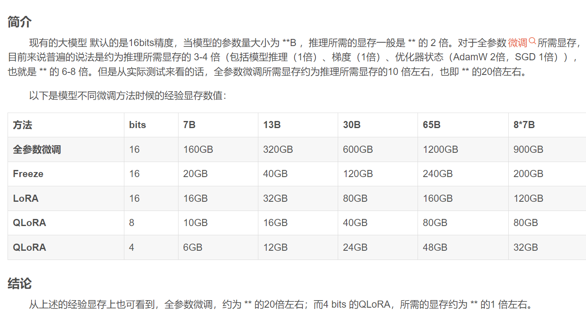

https://blog.csdn.net/2301_79093491/article/details/135908706#:~:text=%E7%8E%B0%E6%9C%89%E7%9A%84%E5%A4%A7%E6%A8%A1%E5%9E%8B%20%E9%BB%98%E8%AE%A4%E7%9A%84%E6%98%AF16bits%E7%B2%BE%E5%BA%A6%EF%BC%8C%E5%BD%93%E6%A8%A1%E5%9E%8B%E7%9A%84%E5%8F%82%E6%95%B0%E9%87%8F%E5%A4%A7%E5%B0%8F%E4%B8%BA%20%2A%2AB%20%EF%BC%8C%E6%8E%A8%E7%90%86%E6%89%80%E9%9C%80%E7%9A%84%E6%98%BE%E5%AD%98%E4%B8%80%E8%88%AC%E6%98%AF%20%2A%2A%20%E7%9A%84%202%20%E5%80%8D%E3%80%82,3-4%20%E5%80%8D%EF%BC%88%E5%8C%85%E6%8B%AC%E6%A8%A1%E5%9E%8B%E6%8E%A8%E7%90%86%EF%BC%881%E5%80%8D%EF%BC%89%E3%80%81%E6%A2%AF%E5%BA%A6%EF%BC%881%E5%80%8D%EF%BC%89%E3%80%81%E4%BC%98%E5%8C%96%E5%99%A8%E7%8A%B6%E6%80%81%EF%BC%88AdamW%202%E5%80%8D%EF%BC%8CSGD%201%E5%80%8D%EF%BC%89%EF%BC%89%EF%BC%8C%E4%B9%9F%E5%B0%B1%E6%98%AF%20%2A%2A%20%E7%9A%84%206-8%20%E5%80%8D%E3%80%82

：7B-float 是 28 GB，7B-BF16 是 14GB，7B-int8 是 7GB

### 显存占用及训练速度

下面记录7B和14B模型在单GPU使用LoRA（LoRA (emb)指的是embedding和输出层参与训练，而LoRA则不优化这部分参数）和QLoRA时处理不同长度输入的显存占用和训练速度的情况。本次评测运行于单张A100-SXM4-80G GPU，使用CUDA 11.8和Pytorch 2.0，并使用了flash attention 2。我们统一使用batch size为1，gradient accumulation为8的训练配置，记录输入长度分别为256、512、1024、2048、4096和8192的显存占用（GB）和训练速度（s/iter）。我们还使用2张A100测了Qwen-7B的全参数微调。受限于显存大小，我们仅测试了256、512和1024token的性能。

对于 Qwen-7B，我们额外测试了多机微调的性能。我们在两台服务器上运行评测，每台服务器包含两张A100-SXM4-80G GPU，其余配置与Qwen-7B的其他评测相同。多机微调的结果在表中以 LoRA (multinode) 标示。

对于 Qwen-72B，我们测试了两种方案：1）使用4个 A100-SXM4-80G GPUs，通过 Lora + DeepSpeed ZeRO 3 微调和2）使用单张A100-SXM4-80G GPU，通过 QLora (int4) 微调。请注意，使用 LoRA (emb) 微调和不带 DeepSpeed ZeRO 3 的 LoRA 微调在4个A100-SXM4-80G GPUs 上都会出现OOM（你可以通过将`--deepspeed finetune/ds_config_zero3.json`参数传给[`finetune/finetune_lora_ds.sh`](https://github.com/QwenLM/Qwen/blob/main/finetune/finetune_lora_ds.sh)来打开 DeepSpeed ZeRO 3 配置）。

具体数值如下所示：

| Model Size       | Method                 | #Nodes | #GPUs per node   | Sequence Length   |                   |                   |                   |                   |                    |
| ---------------- | ---------------------- | ------ | ---------------- | ----------------- | ----------------- | ----------------- | ----------------- | ----------------- | ------------------ |
| 256              | 512                    | 1024   | 2048             | 4096              | 8192              |                   |                   |                   |                    |
| 1.8B             | LoRA                   | 1      | 1                | 6.7G / 1.0s/it    | 7.4G / 1.0s/it    | 8.4G / 1.1s/it    | 11.0G / 1.7s/it   | 16.2G / 3.3s/it   | 21.8G / 6.8s/it    |
| LoRA (emb)       | 1                      | 1      | 13.7G / 1.0s/it  | 14.0G / 1.0s/it   | 14.0G / 1.1s/it   | 15.1G / 1.8s/it   | 19.7G / 3.4s/it   | 27.7G / 7.0s/it   |                    |
| Q-LoRA           | 1                      | 1      | 5.8G / 1.4s/it   | 6.0G / 1.4s/it    | 6.6G / 1.4s/it    | 7.8G / 2.0s/it    | 10.2G / 3.4s/it   | 15.8G / 6.5s/it   |                    |
| Full-parameter   | 1                      | 1      | 43.5G / 2.1s/it  | 43.5G / 2.2s/it   | 43.5G / 2.2s/it   | 43.5G / 2.3s/it   | 47.1G / 2.8s/it   | 48.3G / 5.6s/it   |                    |
| 7B               | LoRA                   | 1      | 1                | 20.1G / 1.2s/it   | 20.4G / 1.5s/it   | 21.5G / 2.8s/it   | 23.8G / 5.2s/it   | 29.7G / 10.1s/it  | 36.6G / 21.3s/it   |
| LoRA (emb)       | 1                      | 1      | 33.7G / 1.4s/it  | 34.1G / 1.6s/it   | 35.2G / 2.9s/it   | 35.1G / 5.3s/it   | 39.2G / 10.3s/it  | 48.5G / 21.7s/it  |                    |
| Q-LoRA           | 1                      | 1      | 11.5G / 3.0s/it  | 11.5G / 3.0s/it   | 12.3G / 3.5s/it   | 13.9G / 7.0s/it   | 16.9G / 11.6s/it  | 23.5G / 22.3s/it  |                    |
| Full-parameter   | 1                      | 2      | 139.2G / 4.0s/it | 148.0G / 4.0s/it  | 162.0G / 4.5s/it  | -                 | -                 | -                 |                    |
| LoRA (multinode) | 2                      | 2      | 74.7G / 2.09s/it | 77.6G / 3.16s/it  | 84.9G / 5.17s/it  | 95.1G / 9.25s/it  | 121.1G / 18.1s/it | 155.5G / 37.4s/it |                    |
| 14B              | LoRA                   | 1      | 1                | 34.6G / 1.6s/it   | 35.1G / 2.4s/it   | 35.3G / 4.4s/it   | 37.4G / 8.4s/it   | 42.5G / 17.0s/it  | 55.2G / 36.0s/it   |
| LoRA (emb)       | 1                      | 1      | 51.2 / 1.7s/it   | 51.1G / 2.6s/it   | 51.5G / 4.6s/it   | 54.1G / 8.6s/it   | 56.8G / 17.2s/it  | 67.7G / 36.3s/it  |                    |
| Q-LoRA           | 1                      | 1      | 18.7G / 5.3s/it  | 18.4G / 6.3s/it   | 18.9G / 8.2s/it   | 19.9G / 11.8s/it  | 23.0G / 20.1s/it  | 27.9G / 38.3s/it  |                    |
| 72B              | LoRA + Deepspeed Zero3 | 1      | 4                | 215.4G / 17.6s/it | 217.7G / 20.5s/it | 222.6G / 29.4s/it | 228.8G / 45.7s/it | 249.0G / 83.4s/it | 289.2G / 161.5s/it |
| Q-LoRA           | 1                      | 1      | 61.4G / 27.4s/it | 61.4G / 31.5s/it  | 62.9G / 41.4s/it  | 64.1G / 59.5s/it  | 68.0G / 97.7s/it  | 75.6G / 179.8s/it |                    |