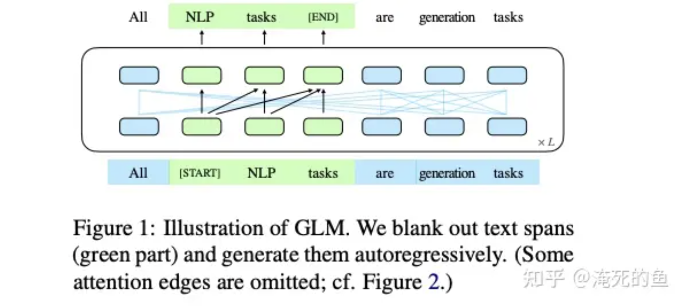
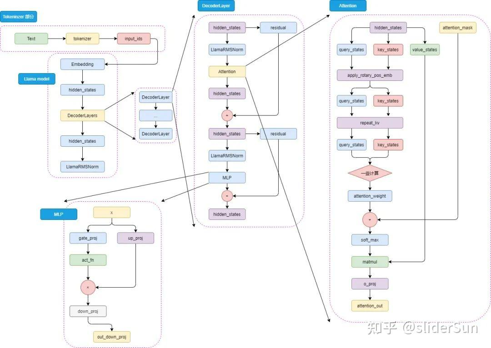

### 1.chatglm、llama、qwen的区别是什么

#### glm 预训练架构：

**核心：**GLM的核心是：Autoregressive Blank Infilling，即将文本中的一段或多段空白进行填充识别。

**输入：**输入 x 被分成两部分：Part A 是损坏的文本Xcorrupt ，Part B 是被遮盖的片段。Part A 的词可以相互看到，但不能看到 Part B 中的任何词。Part B 的词可以看到 Part A 和 Part B 中的前置词，但不能看到 Part B 中的后续词。为了实现自回归生成，每个片段都用特殊的符号 [START] 和 [END] 进行填充，分别用于输入和输出。这样，模型就自动地在一个统一的模型中学习了一个双向编码器（用于 Part A）和一个单向解码器（用于 Part B）

**架构**：单个Transformer，更改了laynorm和attention的顺序

llama架构：

