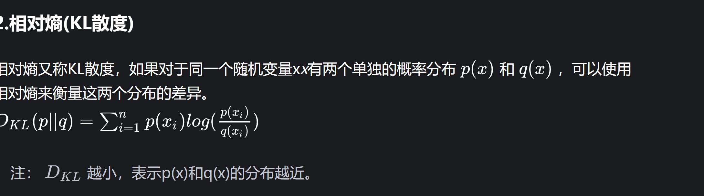

#### 1.自信息，熵，相对熵（KL散度），交叉熵

自信息（self-information）表示一个随机事件所包含的信息量。概率取对数的负数

熵(Entrop对于分布为 ( ) 的随机变量 ，其自信息的数学期望就叫做熵。

交叉熵(Cross-entropy)交叉熵可以用来衡量两个概率分布之间的距离
在机器学习中，我们希望模型在训练数据上学到的预测数据分布与真实数据分布越相近越好，上面讲过了，用相对熵，但是为了简便计算使用交叉熵就可以了。

