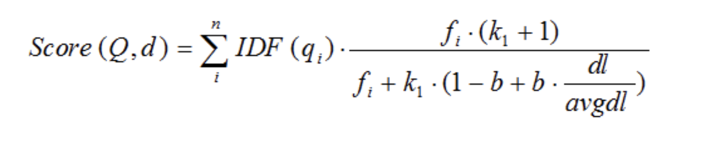
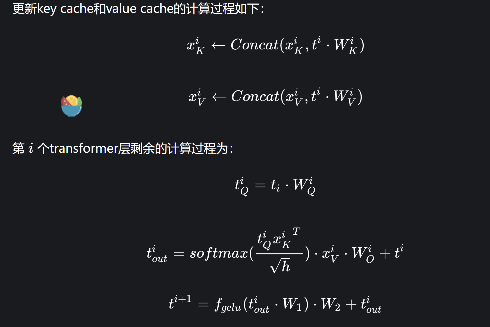
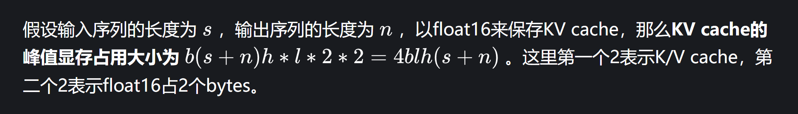
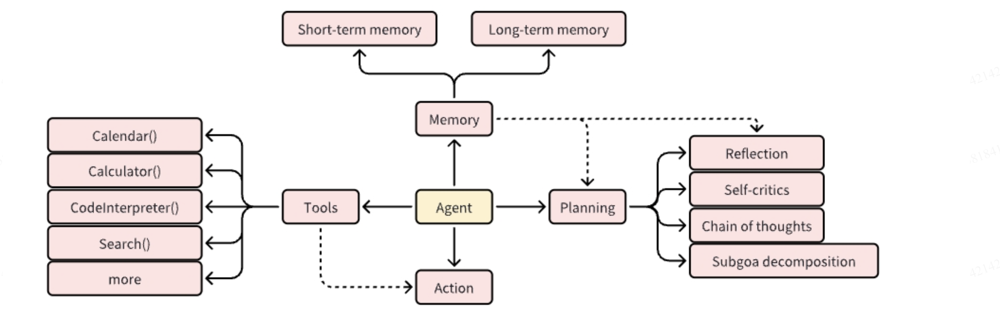

自我介绍

面试官老师，您好！我的名字叫范峻铨，我是中科大计算机科学与技术专业的硕士研究生，2025年6月毕业。本科就读于湖南大学大学智能科学与技术专业，在本科期间积极参加各类比赛，曾获高教杯数学建模全国一等奖，推免至科大研究生。我在实验室的研究方向是基于大模型的知识库问答系统，研究生期间积极参加实验室项目和各类比赛，其中包括与百度合作的ESG领域的大模型检索问答系统，以及一些相关比赛比如全球智能汽车AI挑战赛中获得较好的名次，除此之外，我还对端设备模型性能，推理优化有所研究。曾参加实验室与华为合作的端边协同推理优化项目，负责端设备模型性能评估工作，并且发表了一篇论CCF C文。我个人情况大概是这样，请问老师有什么问题吗。


sft阶段是这样

##### faiss向量数据库和其他数据库有什么不同

我们用的检索算法是高效的ANN算法，fassi还集成了其他的一些算法索引算法

向量数据库通过量化、索引压缩等技术，可以有效减少向量数据的存储需求

HNSW算法，随机近邻算法

HNSW 算法是一种用于向量相似性搜索的算法。它是基于可导航小世界图的概念，在构建图结构时具有高效的性能。

1.构建层次结构

2.利用层次结构，搜索过程可以从粗到细地进行，先在较高层次的节点上搜索，然后逐渐向下深入细化搜索，从而提高了搜索效率。


每个项目难点以及如何克服：

如何解决幻觉问题的

1.修改解码参数，调改解码策略 （）,SFT微调，提前停止，

2.rag

3.代码生成

评估方式是什么，效果怎么样


1. 聊一下RAG项目总体思路？
2. 使用外挂知识库主要是为了解决什么问题？
3. 如何评价RAG项目的效果好坏，即指标是什么？
4. 在做RAG项目过程中遇到哪些问题？怎么解决的？
5. RAG项目里面有哪一些亮点？目前开源的RAG项目非常多，你的项目和他们有什么区别？
6. 数据集怎么构建的，什么规模，评估指标是什么，这些指标存在哪些问题？
7. 模型底座是什么，这些不同底座什么区别，什么规模？
8. 使用哪一种训练方法，什么sft，这些方法有什么不同，有什么优缺点，原理上解释不不同方法的差别？
9. 模型推理是怎么做的，有没有cot，tot等等，还是单轮？
10. 大模型可控性如何实现，怎么保证可控性？
11. 模型部署的平台，推理效率怎么样，如何提升推理效率？
12. 项目最后上线了么，上线之后发现什么问题，如何解决？
13. 给一个总的输入输出样例，每一步包含什么prompt，多轮推理每一步输出什么结果，模拟一下，数据集格式是否要调整成这样，数据形式是什么，怎么拆分成多轮形式？


### **介绍一下 RAG?**

检索增强 LLM ( Retrieval Augmented LLM )，简单来说，就是给 LLM 提供外部数据库，对于用户问题 ( Query )，通过一些信息检索 ( Information Retrieval, IR ) 的技术，先从外部数据库中检索出和用户问题相关的信息，然后让 LLM 结合这些相关信息来生成结果给用户。

如何将文本分块，存入知识库

如何根据用户问题进行检索

大模型根据检索内容进行总结性回答


本项目是基于百度金融部门提供的ESG（视频+文本数据），结合大模型做一个检索增强的问答系统。

主要流程是对于用户问题通过信息检索技术，从外部数据库中检索出用户问题相关的文本块，然后结合用户问题，让大模型生成回复给用户。


如何将文本分块，存入知识库 ，采用的粒度是段落为粒度

如何根据用户问题进行检索

大模型根据检索内容进行总结性回答


微调bge

{"query": str, "pos": List[str], "neg":List[str]}


项目相关：

#### 介绍一下TF-IDF和BM25和向量相似性

共同任务：衡量文本之间的相似性

**TF-IDF**评估单词对于一个文档集合中的一个文档的重要程度。如果一个词出现得越多肯定越重要，，但也要考虑该单词是不是在所有文档都出现，所以需要和另一个权重相乘，IDF，。

词频 (TF, Term Frequency):

例如，一个词在文档中出现了5次，而文档总共有100个词，那么这个词的TF就是5/100=0.05。

逆文档频率 (IDF, Inverse Document Frequency):

IDF = log(文档总数 / 包含该词的文档数目)。

BM25是基于TF-IDF的改进:

​	对于 TF-IDF 算法，**TF(t) 部分的值越大，整个公式返回的值就会越大。**

BM25 就针对这点进行来优化，**随着TF(t) 的逐步加大，该算法的返回值会趋于一个数值**

k1：这个参数控制着词频结果在**词频饱和度中的上升速度。**默认值为1.2。值越小饱和度变化越快，值越大饱和度变化越慢。
b：这个参数**控制着字段长归一值所起的作用，**0.0会禁用归一化，1.0会启用完全归一化。默认值为0.75。

​	改进点是这个参数控制着词频结果在**词频饱和度中的上升速度**



向量空间模型的相似性度量，如余弦相似度、


##### prompt压缩原理

在信息论中，自信息度量的是与事件相关的惊讶或不确定程度；罕见事件传递的信息较多，因此自信息度较高，而常见事件传递的信息较少，因此自信息度较低。在语言建模中，自信息可用于评估词性单位（如单词、短语或句子）的信息量。自信息较低的词汇单位信息量较少，因此更有可能从上下文中推断出来。因此，在 LLM 推理过程中，我们可以将输入的这些部分视为冗余。

计算办法上文推理当前词的概率的对数的倒数


##### 痛点以及难点：

为什么会遗忘：lost in middel对于中间（在sft的时候的结果）

海底捞针

###### 判断知识需要召回文档还是一些通识的知识：

比较简单的就是无论咋样都查一次库，没结果就不走这条rag的路就好了

做意图识别

- 对于一些闲聊query（eg：“你好呀！”、“你叫什么！”等）可以进入FAQ闲聊，这种query一般结构比较简单。
- 对于一些复杂 query or query 长度比较长 or 科普类 query or 需要对一些内容进行总结的query，可以直接走大模型RAG

###### 痛点2：文档切分粒度不好把控，既担心噪声太多又担心语义信息丢失


##### 问题2：如何让LLM回答出全面的粗粒度（跨段落）知识？（召回内容残缺）

将所有的文本组织成二级索引，第一级索引是 [关键信息]，第二级是 [原始文本]，二者一一映射。

**检索部分只对关键信息做embedding，参与相似度计算，把召回结果映射的 原始文本 交给LLM**。

语义相关

中国的法律

​        的规则

MSCI有什么针对全球esg投资情况的数据吗？


bert模型是怎么微调的


问题是百度的股份架构

召回了大量的腾讯股份架构的内容


##### **评价RAG系统**

答案相关性  （最终答案对比）

 忠实度（答案是否根据上下文回答）

上下文精确度（召回）

答案正确性


1. **答案忠实度评估**：利用大语言模型 (LLM) 分解答案为多个陈述，检验每个陈述与上下文的一致性。最终，根据支持的陈述数量与总陈述数量的比例，计算出一个“忠实度得分”。
2. **答案相关性评估**：使用大语言模型 (LLM) 创造可能的问题，并分析这些问题与原始问题的相似度。答案相关性得分是通过计算所有生成问题与原始问题相似度的平均值来得出的。
3. **上下文相关性评估**：运用大语言模型 (LLM) 筛选出直接与问题相关的句子，以这些句子占上下文总句子数量的比例来确定上下文相关性得分。


##### vllm和rt-llm

PagedAttention 是 vLLM 的核心技术，它解决了LLM服务中内存的瓶颈问题。传统的注意力算法在[自回归解码](https://www.zhihu.com/search?q=自回归解码&search_source=Entity&hybrid_search_source=Entity&hybrid_search_extra={"sourceType"%3A"article"%2C"sourceId"%3A"664106696"})过程中，需要将所有输入Token的注意力键和值张量存储在GPU内存中，以生成下一个Token。这些缓存的键和值张量通常被称为KV缓存


### KVcache


一次推理只输出一个token，输出token会与输入tokens 拼接在一起，然后作为下一次推理的输入，这样不断反复直到遇到终止符


当前轮输出token与输入tokens拼接，并作为下一轮的输入tokens，反复多次。可以看出第i+1i+1i+1 轮输入数据只比第iii轮输入数据新增了一个token，其他全部相同！因此第i+1i+1i+1轮推理时必然包含了第 iii 轮的部分计算。KV Cache的出发点就在这里，缓存当前轮可重复利用的计算结果，下一轮计算时直接读取缓存结果，就是这么简单，不存在什么Cache miss问题。

分为两个阶段

​	**预填充阶段**：输入一个prompt序列，为每个transformer层生成 key cache和value cache（KV cache）。

​	**解码阶段**：使用并更新KV cache，一个接一个地生成词，当前生成的词依赖于之前已经生成的词。


解码的时候用 新词的向量*Wq   去和concat从Xk和xv苏娜



### 显存占用




## MQA&GQA


kvcache是可变长的

首先，PageAttention命名的灵感来自OS系统中虚拟内存和分页的思想。可以实现在不连续的空间存储连续的kv键值


vLLm 运行大模型非常快主要使用以下方法实现的

- 先进的服务吞吐量
- 通过PageAttention 对attention key & value 内存进行有效的管理
- 对于输入请求的连续批处理
- 高度优化的CUDA kernels

虚拟内存和操作系统中的[分页技术](https://www.zhihu.com/search?q=分页技术&search_source=Entity&hybrid_search_source=Entity&hybrid_search_extra={"sourceType"%3A"article"%2C"sourceId"%3A"670804296"})

1. TensorRT-llm

- 组装优化大语言模型推理解决方案的工具，提供Python API 来定义大模型，并为 NVIDIA GPU 编译高效的 TensorRT 引擎.

   -flash attention 的基本的思想 优化了attentuion

、FMHA(fused multi-head attention) kernel 

 MMHA(Masked Multi-Head Attention)

- [kv cache](https://www.zhihu.com/search?q=kv cache&search_source=Entity&hybrid_search_source=Entity&hybrid_search_extra={"sourceType"%3A"answer"%2C"sourceId"%3A3205459574})（学习vllm的page方法？）
- 高度优化的[self-attention](https://www.zhihu.com/search?q=self-attention&search_source=Entity&hybrid_search_source=Entity&hybrid_search_extra={"sourceType"%3A"answer"%2C"sourceId"%3A3205459574})（极致的性能优化）
- 服务端优化（支持**[inflight batching](https://www.zhihu.com/search?q=inflight batching&search_source=Entity&hybrid_search_source=Entity&hybrid_search_extra={"sourceType"%3A"answer"%2C"sourceId"%3A3205459574})**，和continuous batching类似）


，比如MQA、GQA（[大模型性能优化（二）：KV cache与MQA、GQA](https://zhuanlan.zhihu.com/p/667357806)），PagedAttention（[VLLM大模型推理优化](https://zhuanlan.zhihu.com/p/670841350)），GPTQ（[便捷的post training quantization方案: GPTQ](https://zhuanlan.zhihu.com/p/668968587)），这篇文章来研究下[in-flight batching](https://www.zhihu.com/search?q=in-flight batching&search_source=Entity&hybrid_search_source=Entity&hybrid_search_extra={"sourceType"%3A"answer"%2C"sourceId"%3A3375750097})

作者：欠拟合
链接：https://www.zhihu.com/question/621251308/answer/3375750097
来源：知乎
著作权归作者所有。商业转载请联系作者获得授权，非商业转载请注明出处。

prompt规则：

角色

指令

输入

输出

专家例子：


GPT和bert：

BERT是Transformer Encoder，属于自监督训练方式，然后两大预训练任务，主要用于下游任务抽特征，GPT是Decoder，自回归训练，主要是预测下一个词的分布，依赖大语料库，

Bert 的模型由多层双向的Transformer编码器组成，由12层组成


分词


##### transform组成：

是一个标准的**Encoder-Decoder结构**

输入：嵌入矩阵加位置编码（绝对位置编码）

多头自注意力机制：**模型在对当前位置的信息进行编码时，会过度的将注意力集中于自身位置**

前馈全连接

归一化

- encoder的输入：
  - 输入x，比如词向量的embediing
  - Positional Encoding
- decoder的输入：
  - 初始输入：前一时刻Decoder输入+前一时刻Decoder的预测结果 + Positional Encoding
  - 中间输入：Encoder Embedding
  - Shifted Right：在输出前添加起始符，方便预测第一个Token

- - query代表的是当前单词，key代表的是每个单词，value代表的也是当前单词。
  - Decoder**每层是有两块Attention**的：
    - 一块是正常的Self-Attention，QKV的输入都来自Decoder上一层的输出。
    - 另一块是问题中提到的Decoder Encoder Attention，其中的K，V输入来自encoder的输出。

掩码原理：

在计算注意力分数之后，应用一个掩码矩阵来将未来的信息屏蔽掉。这个掩码通常是一个上三角矩阵，确保每个位置只能关注到自身及之前的位置。

#### transformer的训练与推理

#### 强制学习

​	解码器接收的输入是来自训练数据的真实目标序列中的下一个标记，而不是根据之前的预测自动生成的。这样做可以加速模型的训练过程，并且可以确保模型在训练期间能够看到正确的输出，从而有助于模型学习正确的语言结构和模式。


### 旋转位置编码（Rotary Position Embedding，RoPE）


##### lora 

Lora方法的核心是在大型语言模型上对指定参数增加额外的低秩矩阵，也就是在原始PLM旁边增加一个旁路，做一个降维再升维的操作。并在模型训练过程中，固定PLM的参数，只训练降维矩阵A与升维矩阵B。

用两个低秩矩阵替代待更新的权重矩阵的增量

- 基本思想：**在不改变原始预训练权重的基础上，通过引入可训练的低秩分解矩阵来调整模型参数，以适应特定任务或领域**。
- 这种方法的优势：相较于全模型微调，它仅更新少数参数，因此可以显著减少计算资源消耗和潜在的过拟合风险，同时保留了预训练模型的泛化能力。


 更新模型的某一层权重W时，不是直接改变W的值，而是通过与这两个低秩矩阵相乘或相加的方式来间接更新

lora一般a矩阵高斯初始化，b矩阵零初始化


4. 适应过程：

• 在训练过程中，根据目标任务的训练数据，仅针对这些低秩因子进行反向传播和梯度更新。

• 由于低秩矩阵具有较小的维度，因此大大降低了内存需求和计算复杂度，使得在有限资源下能够快速有效地微调大型模型。

### NL2SQL项目

### deespeed介绍

ZeRO-DP（零冗余优化器）是一种通过将内存占用划分到多张卡或者多个节点的支持超大规模模型训练的数据并行技术

3D并行（TP（tensor并行）+PP（流水想并行）+DP（数据并行））

> 灰常有帮助，实测13B，zero3+offload_param+offload_optimizer显存占用30G，CPU内存占用207~250G

ZeRO-1是将优化器分片，ZeRO-2是在ZeRO-1的基础上将梯度分片，ZeRO-3是在ZeRO-2的基础上将权重分配，所以理论上来说，显卡越多，那么显存占用就会越少。


freeze 、lora、P-Tuning、全参的方法

NL2sql大模型微调：

lora 原理

用两个低秩矩阵替代待更新的权重矩阵的增量，实际上用的是PEFT的库  

以及hf的trainer 类from trl import SFTTrainer


基座模型：[CodeLlama-13b-Instruct-hf]

数据集数量10000条

训练时间2个小时2张A100

- **lora_r**: 64
- **lora_alpha**: 16
- **lora_dropout**: 0.1

```
    {
        "db_id": "department_management",
        "instruction": "I want you to act as a SQL terminal in front of an example database, you need only to return the sql command to me.Below is an instruction that describes a task, Write a response that appropriately completes the request.\n\"\n##Instruction:\ndepartment_management contains tables such as department, head, management. Table department has columns such as Department_ID, Name, Creation, Ranking, Budget_in_Billions, Num_Employees. Department_ID is the primary key.\nTable head has columns such as head_ID, name, born_state, age. head_ID is the primary key.\nTable management has columns such as department_ID, head_ID, temporary_acting. department_ID is the primary key.\nThe head_ID of management is the foreign key of head_ID of head.\nThe department_ID of management is the foreign key of Department_ID of department.\n\n",
        "input": "###Input:\nHow many heads of the departments are older than 56 ?\n\n###Response:",
        "output": "SELECT count(*) FROM head WHERE age  >  56",
        "history": []
    }, 
```

指令微调数据的形式一般分为三个部分，即指令 (Instruction)、输入(Input)、输出(Output)。


，最后计算shifit_logits和shift_labels的交叉熵损失。


lora具体如何解决的？

lora 具体的解决梯度更新呢


### Agent




prompt设计

指令：

输入:

输出：

思维链：引导一步一步的操作


已知信息：

{context} 

根据上述已知信息，简洁和专业的来回答用户的问题。如果无法从中得到答案，请说 “根据已知信息无法回答该问题” 或 “没有提供足够的相关信息”，不允许在答案中添加编造成分，答案请使用中文。 

问题是：{question}


###  **L1正则化和L2正则化的区别?**

- L1正则化：
  - 增加的正则化项为权重向量的绝对值之和。
  - 促使模型参数变得稀疏，即某些权重变为零，从而实现特征选择的效果。
- L2正则化：
  - 增加的正则化项为权重向量的平方和。
  - 通过减小权重的同时保持它们都非零，对权重进行平滑调整。
- 区别：
  - L1正则化倾向于产生稀疏权重，对于特征选择有利；
  - L2正则化则更倾向于在所有特征上产生较小但非零的权重。

**L1和L2**都是在求loss的时候，加入到loss的求解过程中，得到被惩罚后的loss，再让loss对权重求导

pytorch DDP中

每张卡自己设置


### 大模型篇：

大模型分词算法：

​	BPE、WordPiece和Unigram

##### BPE

其基本思路也比较简单，也就是从基本的字母开始，然后不断合并字母，形成“单词”，也就是以“合并”的方法不断“增量”构建词典，并形成对应的分词算法。

BPE获得Subword的步骤如下：

1. 准备足够大的训练语料，并确定期望的Subword词表大小；
2. 将单词拆分为成最小单元。比如英文中26个字母加上各种符号，这些作为初始词表；
3. 统计训练语料中每一个连续字节对出现的频率，**「选择出现频率最高的字节对合并成新的subword，并更新词表」**
4. 重复第3步直到达到第1步设定的Subword词表大小或下一个最高频数为1.

对于给定的单词`mountain</w>`，其分词结果为：[`moun`, `tain</w>`]

### **语料解码**

语料解码就是将所有的输出子词拼在一起，直到碰到结尾为`<\w>`。举个例子，假设模型输出为：

```text
["moun", "tain</w>", "high", "the</w>"]
```

作者：谢利昂D忒待儿
链接：https://zhuanlan.zhihu.com/p/383650769
来源：知乎
著作权归作者所有。商业转载请联系作者获得授权，非商业转载请注明出处。

### 4、instructGPT的原理，讲讲RLHF、SFT、和reward。

instructGPT是一种基于强化学习的文本生成模型，其核心原理涉及两个概念：RLHF（Reinforcement Learning from Human Feedback）和reward shaping（奖励塑造）。

> RLHF：在训练instructGPT时，首先使用有人类生成的示例对模型进行预训练。然后，通过与人类评估者进行交互，收集评估结果，以创建一个用于强化学习的数据集。该数据集包含了人类评估者对生成结果的评分或反馈，用于指导模型的强化学习训练。
> Reward shaping：为了更好地引导模型的训练，reward shaping用于调整模型的奖励信号。通过将人类评估者的反馈与模型生成的文本进行比较，可以计算出一个差异度量，用作奖励信号的一部分。这样，模型可以根据这个奖励信号进行训练，并进行强化学习的训练。模型根据当前的状态（对话历史）生成文本，并通过奖励信号来评估生成文本的质量。模型的目标是最大化预期累积奖励，从而生成更高质量的文本。

通过RLHF和reward shaping的结合，instructGPT能够通过人类评估者的反馈指导模型的生成过程，并逐步提升生成文本的质量和一致性。监督微调（SFT）和人类反馈强化学习（RLHF）是两种用于微调大型语言模型的方法，它们的目的是使模型的输出更符合人类的偏好和价值观。它们的基本思想和步骤如下：

监督微调（SFT）：SFT是一种利用**人工标注的数据**来训练模型的方法，它可以使模型学习到一些基本的规则和约束，例如遵循人类的指令、避免有害或无用的输出等。SFT的步骤包括：

> 准备数据集：收集一些包含人类指令和期望输出的数据，例如Helpful and Harmless数据集，它包含了一些常见的对话场景和相应的标签。
> 训练模型：使用一个预训练好的语言模型，例如GPT-4，并在数据集上进行微调，使模型能够根据输入的指令生成合适的输出。
> 评估模型：使用一些评价指标，例如准确率、BLEU分数、ROUGE分数等，来衡量模型的性能和质量。

人类反馈强化学习（RLHF）：RLHF是一种**利用人类对模型输出的评价**来训练模型的方法，它可以使模型更好地适应人类的偏好和价值观，例如生成更有趣、更友好、更安全的输出等。RLHF的步骤包括：

> 训练奖励模型：收集一些包含人类对模型输出的评价或排名的数据，例如HumanEval数据集，它包含了一些由人类评价员对不同模型输出进行打分或排序的数据。
> 使用一个预训练好的语言模型，例如GPT-4，并在奖励模型上进行微调，使奖励模型能够根据输入和输出给出一个奖励值。
> 训练策略模型：使用一个预训练好的语言模型，例如GPT-4，并使用一种强化学习算法，例如近端策略优化（Proximal Policy Optimization，PPO），来更新模型参数。PPO算法会根据奖励模型给出的奖励值来调整模型生成不同输出的概率。
> 评估模型：使用一些评价指标，例如奖励值、人类标注、对话质量等，来衡量模型的性能和质量。


prefix Decoder causal Decoder Encoder-Decoder


微调方法有哪些

### **PT方法**

- [P-Tuning](https://link.zhihu.com/?target=https%3A//arxiv.org/abs/2103.10385)，仅对大模型的Embedding加入新的参数。
- [P-Tuning-V2](https://link.zhihu.com/?target=https%3A//arxiv.org/abs/2110.07602)，将大模型的Embedding和每一层前都加上新的参数。

## Adapter Tuning

## Prefix Tuning

Prompt Tuning

### 软件能力：

我的优点是 

1.学习能力好，很容易接受新鲜事物，并且乐于与探究原因

2.在一个任务。善于把任务拆解成子任务去有序的进行

3.专注力强，不太依赖特别安静的环境去学习

缺点是：

1.有时候容易感到紧张

2.没有经常运动吧


未来的职业规划

短期的话，我希望能够在公司实习期间将学到知识，学以致用，能够将所交付的项目，从开发到上线完整交付，从中汲取经验和知识。

 长期：希望能够认真工作获得转正的机会，

团队中的


如何学习：


遇到最困难的事情怎么解决的

工作上最困难的事情是：如何解决 文本切分之后的上下文失去关联，以及指代混乱问题

生活上最困难的事情是：疫情以前远程远程沟通协作


经历过什么挫折：高考的时候，没有发挥好


