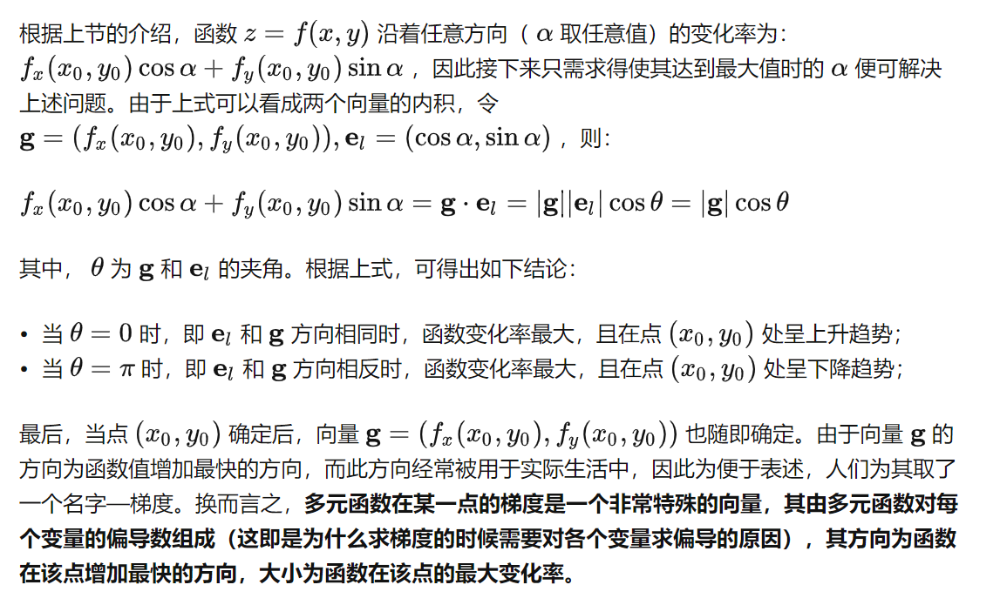
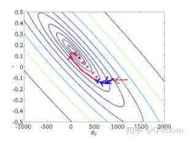
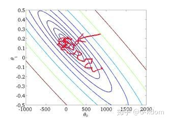

# 梯度下降

梯度下降是[神经网络](https://so.csdn.net/so/search?q=神经网络&spm=1001.2101.3001.7020)中最常用的求极值点（鞍点）的方法，本文以BP神经网络为例，介绍梯度下降的数学原理及推广

# 代价函数（损失函数）

$$
C(w, b)=\frac{1}{2 n} \sum_x\|y(x)-a\|^2
$$

我们训练算法的目的，就是最小化权值和偏置的代价函数C(w,b)

# 为什么要梯度下降？

- 一种方法就是直接用偏导去找极值点。但如果变量很多，比如神经网络至少有上千个变量和偏置，计算非常复杂。

- 另外一种方法是使用梯度下降。考虑我们目前有两个变量v1，v2，当我们在v1和v2方向分别移动一个很小的量（沿着梯度方向），这时候会发生如下变化：

$$
\Delta C \approx \frac{\partial C}{\partial v_1} \Delta v_1+\frac{\partial C}{\partial v_2} \Delta v_2
$$

我们需要使用一种方法选择Δv1和Δv2使得ΔCΔC为负，这样我们就可以使得C不断减小，逼近最小值。我们用∇C来表示梯度向量，即
$$
\nabla C \equiv\left(\frac{\partial C}{\partial v_1}, \frac{\partial C}{\partial v_2}\right)^T
$$
因此ΔC可以被重写为:
$$
\Delta C \approx \nabla C \cdot \Delta v
$$
这个式子有着很重要的意义：我们发现∇C将v的变化关联为C的变化，正如我们期望的用梯度表示。并且，我们知道了如何选取Δv才能让ΔC为负数。假设我们选取：
$$
\Delta v=-\eta \nabla C
$$
这里的ηη是一个很小的正数，我们称为学习速率。方程告诉我们，$ΔC≈∇C⋅Δv=−η||∇C||^2$。由于$||∇C||2≥0$，这保证了ΔC≤0。即，如果我们按照方程的规则去改变v，那么C会一直减小，不会增加。因此我们可以计算Δv，来移动点的位置：


$$
v \rightarrow v^{\prime}=v-\eta \nabla C
$$
然后我们用它再次更新来计算下一次移动，因此我们迭代进行，就可以获得一个全局的最小值

## 数学讲解

1，梯度的方向是多元函数变化率最大的方向



https://zhuanlan.zhihu.com/p/38525412

```
（1）方向导数：本质就是函数在A点无数个切线的斜率的定义。每一个切线都代表一个变化的方向。
（2）梯度：函数在A点无数个变化方向中变化最快的那个方向。
（3）全微分：函数从A点到B点变化的量（其实是取一个无穷小的变化的量）。
（4）偏导：多元函数降维时候的变化，比如二元函数固定y，只让x单独变化，从而看成是关于x的一元函数的变化来研究。

```

$$
\nabla f=\frac{\partial f}{\partial x} \bar{i}+\frac{\partial f}{\partial y} \bar{j}+\frac{\partial f}{\partial z} \bar{k}
$$

问题：多元函数中，已知Δx， Δy 和梯度，求Δz

这里就是全增量和全微分：

```
设u=f(x,y,z),ρ=√(Δx²+Δy²+Δz²)
全增量Δu=f(x₂,y₂,z₂)-f(x₁,y₁,z₁)
全微分du=(∂f/∂x)*dx+(∂f/∂y)*dy+(∂f/∂z)*dz
当ρ足够小时,全增量Δu可用全微分du代替

推导流程为：
```

# **1. 批量梯度下降**(Batch Gradient Descent，BGD)

使用整个训练集的优化算法被称为**批量**(batch)或**确定性**(deterministic)梯度算法，因为它们会**在一个大批量中同时处理所有样本**。


**批量梯度下降法**是最原始的形式，它是指在**每一次迭代时**使用**所有样本**来进行梯度的更新。

也就是batch=整个训练集数量

**优点：**

（1）在训练过程中，使用固定的学习率，不必担心学习率衰退现象的出现。

（2）由全数据集确定的方向能够更好地代表样本总体，从而更准确地朝向极值所在的方向。当目标函数为凸函数时，一定能收敛到全局最小值，如果目标函数非凸则收敛到局部最小值。

（3）它对梯度的估计是无偏的。样例越多，标准差越低。

（4）一次迭代是对所有样本进行计算，此时利用向量化进行操作，实现了并行。

**缺点：**

（1）尽管在计算过程中，使用了向量化计算，但是遍历全部样本仍需要大量时间，尤其是当数据集很大时（几百万甚至上亿），就有点力不从心了。

（2）每次的更新都是在遍历全部样例之后发生的，这时才会发现一些例子可能是多余的且对参数更新没有太大的作用。

从迭代的次数上来看，BGD迭代的次数相对较少。其迭代的收敛曲线示意图可以表示如下：



# **2. 随机梯度下降**(Stochastic Gradient Descent，SGD)

**随机梯度下降法**不同于批量梯度下降，随机梯度下降是在**每次迭代时**使用**一个样本**来对参数进行更新（mini-batch size =1）。

对于一个样本的损失函数为：
$$
J^{(i)}\left(\theta_0, \theta_1\right)=\frac{1}{2}\left(h_\theta\left(x^{(i)}\right)-y^{(i)}\right)^2
$$
计算损失函数的梯度：
$$
\frac{\Delta J^{(i)}\left(\theta_0, \theta_1\right)}{\theta_j}=\left(h_\theta\left(x^{(i)}\right)-y^{(i)}\right) x_j^{(i)}
$$
参数更新为：
$$
\theta_j:=\theta_j-\alpha\left(h_\theta\left(x^{(i)}\right)-y^{(i)}\right) x_j^{(i)}
$$
**优点：**

（1）在学习过程中加入了噪声，提高了泛化误差。

（2）由于不是在全部训练数据上的损失函数，而是在每轮迭代中，随机优化某一条训练数据上的损失函数，这样每一轮参数的更新速度大大加快。

**缺点：**

（1）不收敛，在最小值附近波动。

（2）不能在一个样本中使用向量化计算，学习过程变得很慢。

（3）单个样本并不能代表全体样本的趋势。

（4）当遇到局部极小值或鞍点时，SGD会卡在梯度为0处。

从迭代的次数上来看，SGD迭代的次数较多，在解空间的搜索过程看起来很盲目。其迭代的收敛曲线示意图可以表示如下：



# **3. 小批量梯度下降**(Mini-batch Gradient Descent，MBGD)

大多数用于深度学习的梯度下降算法介于以上两者之间，**使用一个以上而又不是全部的训练样本**。传统上，这些会被称为小批量(mini-batch)或小批量随机(mini-batch stochastic)方法，现在通常将它们简单地成为随机(stochastic)方法。对于**深度学习**（pytorch里的SGD）模型而言，人们所说的“**随机梯度下降, SGD**”，其实就是基于**小批量（mini-batch）的随机梯度下降**。

**什么是小批量梯度下降？**具体的说：在算法的每一步，我们从具有 m 个样本的**训练集（已经打乱样本的顺序）**中**随机抽出**一小批量(mini-batch)样本 X=(x(1),...,x(m′)) 。小批量的数目 m′ 通常是一个相对较小的数（从1到几百）。重要的是，当训练集大小 m 增长时，m′通常是固定的。我们可能在拟合几十亿的样本时，每次更新计算只用到几百个样本。

 m`个样本的损失函数为：
$$
J\left(\theta_0, \theta_1\right)=\frac{1}{2 m^{\prime}} \sum_{i=1}^{m^{\prime}}\left(h_\theta\left(x^{(i)}\right)-y^{(i)}\right)^2
$$
计算损失函数的梯度：
$$
g=\frac{\partial J\left(\theta_0, \theta_1\right)}{\partial \theta_j}=\frac{1}{m^{\prime}} \sum_{i=1}^{m^{\prime}}\left(h_\theta\left(x^{(i)}\right)-y^{(i)}\right) x_j^{(i)}
$$
参数更新：
$$
\theta_j:=\theta_j-\alpha g
$$
mini-batch的SGD算法中一个关键参数是**学习率**。在实践中，有必要**随着时间的推移逐渐降低学习率—学习率衰减**(learning rate decay)。

**为什么要进行学习率衰减呢？**

在梯度下降初期，能接受较大的步长（学习率），以较快的速度进行梯度下降。当收敛时，我们希望步长小一点，并且在最小值附近小幅摆动。假设模型已经接近梯度较小的区域，若保持原来的学习率，只能在最优点附近徘徊。如果降低学习率，目标函数能够进一步降低，有助于算法的收敛，更容易接近最优解。

**常用的学习率衰减的方法：**
$$
\begin{aligned}
&\alpha=\frac{\alpha_0}{1+\beta * \lambda} \\
&\alpha=0.95^\lambda * \alpha_0 \\
&\alpha=\frac{k}{\sqrt{\lambda}} \alpha_0 \\
&\alpha=\frac{k}{\sqrt{\text { mini-batch size }}} \alpha_0
\end{aligned}
$$
其中β 为衰减率， λ 为epoch数量， k 为常数， α0 为初始学习率。

**小批量大小**（mini-batch size）**通常由以下几个因素决定：**

（1）更大的批量会计算更精确的梯度，但是回报却是小于线性的。

（2）极小的批量通常难以充分利用多核结构。当批量低于某个数值时，计算时间不会减少。

（3）批量处理中的所有样本可以并行处理，**内存消耗和批量大小会成正比**。对于很多硬件设备，这是批量大小的限制因素。

（4）在使用**GPU**时，通常使用**2的幂数作为批量大小**可以获得更少的运行时间。一般，2的幂数取值范围是**32~256**。16有时在尝试大模型时使用。

在一定范围内，一般来说 Batch_Size 越大，其确定的下降方向越准，引起训练震荡越小。跑完一次 epoch（全数据集）所需的迭代次数减少，对于相同数据量的处理速度进一步加快，但是要想达到相同的精度，其所花费的时间大大增加了，从而对参数的修正也就显得更加缓慢。当Batch_Size 增大到一定程度，其确定的下降方向已经基本不再变化，也可能会超出内存容量。

**优点：**

（1）计算速度比Batch Gradient Descent快，因为只遍历部分样例就可执行更新。

（2）随机选择样例有利于避免重复多余的样例和对参数更新较少贡献的样例。

（3）每次使用一个batch可以大大减小收敛所需要的迭代次数，同时可以使收敛到的结果更加接近梯度下降的效果。

**缺点：**

（1）在迭代的过程中，因为噪音的存在，学习过程会出现波动。因此，它在最小值的区域徘徊，不会收敛。

（2）学习过程会有更多的振荡，为更接近最小值，需要增加学习率衰减项，以降低学习率，避免过度振荡。

（3）batch_size的不当选择可能会带来一些问题