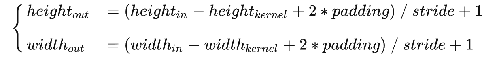
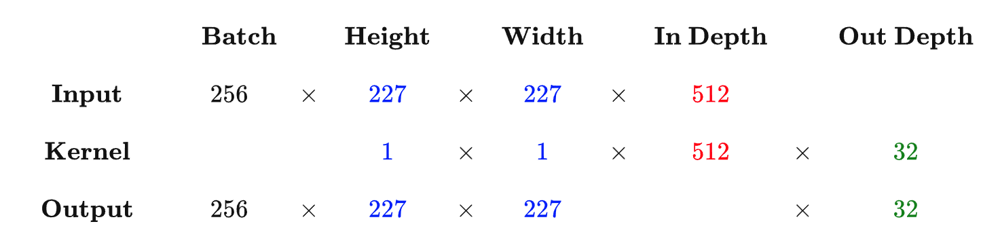
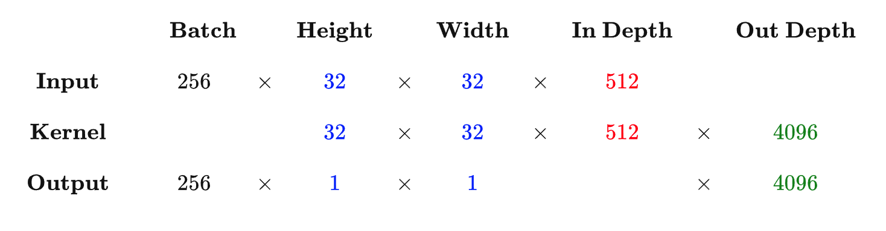
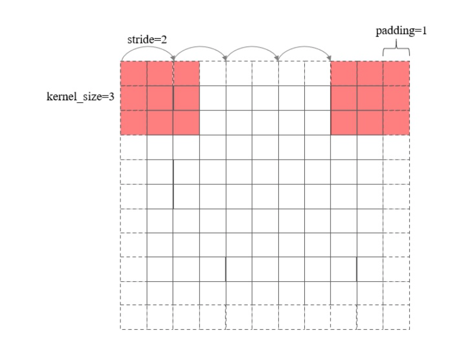

​	本文主要为了解释清楚卷积层，线性层尺寸输出关系是什么

### **卷积层尺寸的计算原理**

- **输入矩阵**格式：四个维度，依次为：样本数、图像高度、图像宽度、图像通道数

- **输出矩阵**格式：与输出矩阵的维度顺序和含义相同，但是后三个维度（图像高度、图像宽度、图像通道数）的尺寸发生变化。

- **权重矩阵**（卷积核）格式：同样是四个维度，但维度的含义与上面两者都不同，为：卷积核高度、卷积核宽度、输入通道数、输出通道数（卷积核个数）

- **输入矩阵、权重矩阵、输出矩阵这三者之间的相互决定关系**

- - 卷积核的输入通道数（in depth）由输入矩阵的通道数所决定。（红色标注）
  - 输出矩阵的通道数（out depth）由卷积核的输出通道数所决定。（绿色标注）
  - 输出矩阵的高度和宽度（height, width）这两个维度的尺寸由输入矩阵、卷积核、扫描方式所共同决定。计算公式如下。（蓝色标注）

- 

- 

#### **标准卷积计算举例**

> 以 AlexNet 模型的第一个卷积层为例，
> \- 输入图片的尺寸统一为 227 x 227 x 3 （高度 x 宽度 x 颜色通道数），
> \- 本层一共具有96个卷积核，
> \- 每个卷积核的尺寸都是 11 x 11 x 3。
> \- 已知 stride = 4， padding = 0，
> \- 假设 batch_size = 256，  
> \- 则输出矩阵的高度/宽度为 (227 - 11) / 4 + 1 = 55

#### **1 x 1 卷积计算举例**

> 后期 GoogLeNet、ResNet 等经典模型中普遍使用一个像素大小的卷积核作为降低参数复杂度的手段。
> 从下面的运算可以看到，其实 1 x 1 卷积没有什么神秘的，其作用就是将输入矩阵的通道数量缩减后输出（512 降为 32），并保持它在宽度和高度维度上的尺寸（227 x 227）。

#### **全连接层计算举例**

> 实际上，全连接层也可以被视为是一种极端情况的卷积层，其卷积核尺寸就是输入矩阵尺寸，因此输出矩阵的高度和宽度尺寸都是1。

#### 卷积尺度变换计算原理

众所周知，在定义卷积层的时候，我们一般会设置卷积核大小(kernel_size)，卷积步长 (stride)，特征图填充宽度 (padding)等参数。这些值的设置让卷积核可以从图片的第一个像素刚好扫描到最后一个像素，如下图所示

不难发现，经过卷积后的特征图尺寸等于卷积核滑动的次数 + 1，在这里等于 5。现在假设卷积前的特征图宽度为 N ，卷积后输出的特征图宽度为 M ，那么它们和上述设置的参数之间的关系是怎样的呢？首先可以确定的是padding之后的矩阵宽度等于 N+2×padding 。另一方面，卷积核的滑动次数等于 M−1

根据上图的关系，可以建立下面的等式

$N+2×padding=(M−1)×stride+kernelsize$

于是输出矩阵的宽度就等于

$M=\frac {N+2×padding−kernel } {sizestride}+1$

特别地，如果需要卷积操作不改变矩阵宽度，即 M=N ，则填充宽度为

$padding=(N−1)×stride−N+kernel_size$

类比一长3m的辆车辆行驶在10m的公路，速度为1m/s

车辆长度：kernelsize

公路长度：原特征图大小

速度：stridesize

现特征图长度：通过时间+1 ， 

### 参考文献

https://zhuanlan.zhihu.com/p/163017446

https://zhuanlan.zhihu.com/p/29119239