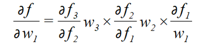

# 梯度消失

若要对于w1求梯度，根据链式[求导](https://so.csdn.net/so/search?q=求导&spm=1001.2101.3001.7020)法则，得到的解为：

通常，若使用的[激活函数](https://so.csdn.net/so/search?q=激活函数&spm=1001.2101.3001.7020)为sigmoid函数，其导数最大为1/4：

这样可以看到，如果我们使用标准化初始w，那么各个层次的相乘都是0-1之间的小数，而激活函数f的导数也是0-1之间的数，其连乘后，结果会变的很小，导致梯度消失。

老师讲：sigmod的压缩导致