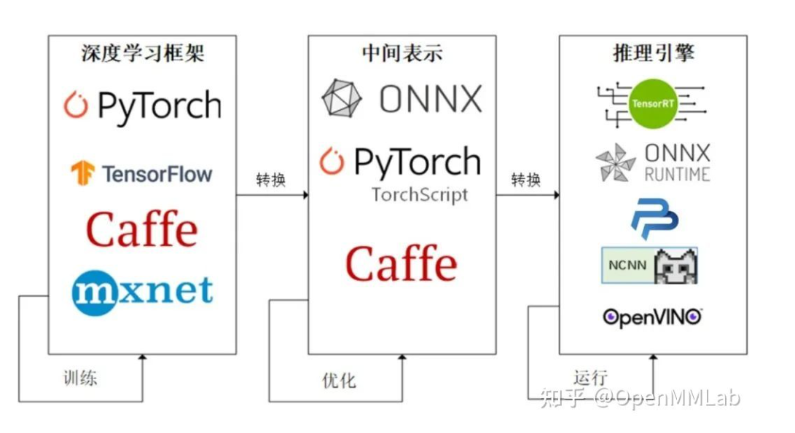

### 模型部署有了一条流行的流水线



### demo

```python
x = torch.randn(1, 3, 256, 256) 
 
with torch.no_grad(): 
    torch.onnx.export( 
        model, 
        x, 
        "srcnn.onnx", 
        opset_version=11, 
        input_names=['input'], 
        output_names=['output'])
```


其中，**torch.onnx.export** 是 PyTorch 自带的把模型转换成 ONNX 格式的函数。让我们先看一下前三个必选参数：**前三个参数分别是要转换的模型、模型的任意一组输入、导出的 ONNX 文件的文件名。**转换模型时，需要原模型和输出文件名是很容易理解的，但为什么需要为模型提供一组输入呢？这就涉及到 ONNX 转换的原理了。从 PyTorch 的模型到 ONNX 的模型，本质上是一种语言上的翻译。直觉上的想法是像编译器一样彻底解析原模型的代码，记录所有控制流。但前面也讲到，我们通常只用 ONNX 记录不考虑控制流的静态图。因此，PyTorch 提供了一种叫做追踪（trace）的模型转换方法：给定一组输入，再实际执行一遍模型，即把这组输入对应的计算图记录下来，保存为 ONNX 格式。export 函数用的就是追踪导出方法，需要给任意一组输入，让模型跑起来。我们的测试图片是三通道，256x256大小的，这里也构造一个同样形状的随机张量。

剩下的参数中，**opset_version 表示 ONNX 算子集的版本。**深度学习的发展会不断诞生新算子，为了支持这些新增的算子，ONNX会经常发布新的算子集，目前已经更新15个版本。我们令 opset_version = 11，即使用第11个 ONNX 算子集，是因为 SRCNN 中的 bicubic （双三次插值）在 opset11 中才得到支持。**剩下的两个参数 input_names, output_names 是输入、输出 tensor 的名称，我们稍后会用到这些名称。**


### 参考文献

1.[模型部署入门教程（一）：模型部署简介](https://zhuanlan.zhihu.com/p/477743341)

