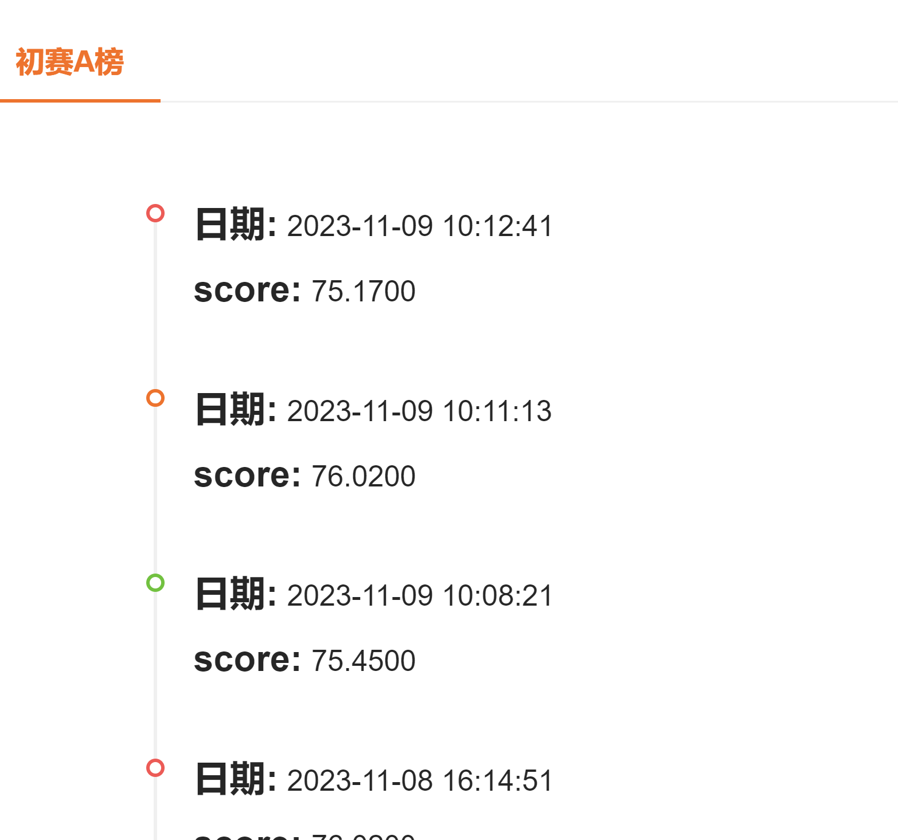

|      | topk | 备注                                     | 分数 |
| ---- | ---- | ---------------------------------------- | ---- |
| 2    | 40   | SpacyTextSplitter,zh_core_web_sm,500,100 | 65   |
| 3    | 10   | page_splite                              | 64   |
| 4    | 40   | page_splite                              | 60   |
| 5    |      | 2.去掉\n                                 |      |
| 6    | 40   | SpacyTextSplitter,zh_core_web_sm,128,50  | 66   |

0，1，2，3，4，5，6，7，8，9

什么是转向助力系统？

什么时候应该为车辆打蜡？

什么是自动驻车系统？

如何减少车辆腐蚀风险？

前方交叉路口预警系统（FCTA）的作用是什么？

在使用FCTA时需要注意哪些事项？

召回，--答案召回到




排序 --答案如果在中间，反应不敏感


回答简洁--大模型相关


错误回答：

转向助力系统是一种辅助驾驶员进行转向操作的系统。它能够根据驾驶员的需求和车辆的状态，自动调整助力的大小和方向，使得转向操作更加轻松和稳定。转向助力系统通常包括电动助力转向（EPS）和转向助力的调节系统等部分，能够通过控制动力电池的工作状态，实现对车辆转向助力的大小和方向的调节。

正确的：

车辆配备电动助力转向系统，可以在驾驶员转动方向盘时提供助力。转向助力系统可以依据车速智能调节助力大小，这样可以增强车辆的 操控性和稳定性。

放在第一行：

转向助力系统是一种车辆配备的电动助力转向系统，可以在驾驶员转动方向盘时提供助力。该系统可以依据车速智能调节助力大小，从而增强车辆的操控性和稳定性。

放在最后一行


定位文档


1.切换句子128，--每一个句子对应每一页内容

2.与问题做相似度搜索


color 为0：， 普通字体


### 解析方案

```
1.色彩 and len >1
2.冒号： 
3.按照bolock分


```


c榜榜单

qa6

| pinjie k | qa k  | socre |
| -------- | ----- | ----- |
| 10       | 6     | 76.27 |
| 6        | 10    | 74.99 |
| 15       | 3     | 76.4  |
| 15       | 6     | 76.4  |
| 20       | 6     | 77.34 |
| 15       | 10    | 76.93 |
| 20       | 10    | 77.11 |
| 25       | 6     | 77.44 |
| 30       | 6     | 77.56 |
| 30       | 10    | 77.69 |
| 30       | 6/10  | 77.91 |
| 30       | 10/15 | 78.26 |
| 35       | 10/15 | 78.02 |
| 30       | 15    | 78.21 |
| 30       | 15/20 | 77.98 |
| 30       | 6/15  | 78.53 |
| 31       | 6/15  | 78.51 |
| 28       | 6/15  | 78.21 |
| 30       | 5/15  | 77.8  |

qa7
| pinjie k | qa k | socre |
| -------- | ---- | ----- |
| 30       | 6/15 |       |


过滤

去重

重排序


```
sudo docker rm fjqtest
sudo docker run --gpus all --name fjqtest -it registry.cn-shanghai.aliyuncs.com/smashfan/smashtest:4.0 /bin/bash
```

和时间没什么关系

| pinjie k | 备注                       | qa k | socre            |
| -------- | -------------------------- | ---- | ---------------- |
| 30       | 3个7b回答 false num_beam=5 | 6/15 | 30.14            |
|          | 3个14bfalse num_beam=5     |      | 30.16            |
|          | 3个14 默认                 |      | 30.01            |
|          |                            |      |                  |
| 30       | 1个14b回答默认             |      | 30（居然不涨分） |
|          |                            |      |                  |


| top k     | 备注         | num_beam | do_sample | socre       |
| --------- | ------------ | -------- | --------- | ----------- |
| 15，10，1 | 自己的7b模型 | 1        | true      | 73.85/74,11 |
| 15，10，1 | 线上7b       | 1        | true      | 73.03       |
| 5         | 自己的7b一个 | 1        | true      | 65.5        |
| 20,10,5   |              | 1        | true      |             |

37.98:全部无答案

3是线下模型

4是线上模型

EBP
