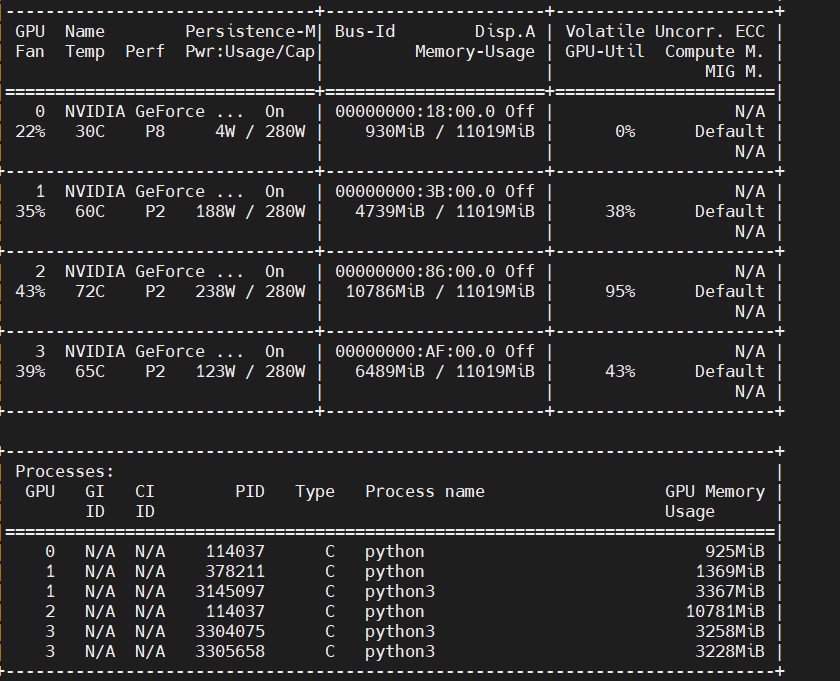

nvida-smi -L  显示全部名字

watch -n 1 gpustat

训练实际情况,多GPU




### `with torch.no_grad():`

不需要进行反向传播


3.

**利用Python的语言特性，y = model(x)是调用了对象model的__\*call\*__\*方法，而nn.Module把\*__\*call_\*_方法实现为类对象的forward函数，所以任意继承了nn.Module的类对象都可以这样简写来调用forward函数。**


### 安装环境

所有的git的项目，都可以用 [GitHub Proxy 代理加速 (ghproxy.com)](https://ghproxy.com/) 转链，尤其是swin transformer的权重文件，又大下载的又慢，转完链后就飞快了。


### 1. 创建环境

```powershell
conda create -n swin python=3.7
conda activate swin
```

```
conda install pytorch==1.8.1 torchvision==0.9.1 torchaudio==0.8.1 cudatoolkit=11.3 -c https://mirrors.tuna.tsinghua.edu.cn/anaconda/cloud/pytorch/linux-64/
```

### 2. 安装pytorch(利用国内源)

[open-mmlab/mmcv: OpenMMLab Computer Vision Foundation (github.com)](https://github.com/open-mmlab/mmcv)

在上边的网址中看好要装那个pytorch版本，例如我是cuda11.0，就只支持pytorch1.7，所以我就去安装pytorch1.7。只需要去下边网址找到对应的把下边-c前边给替换掉就行了。

pytorch所有版本安装网址：[Previous PyTorch Versions | PyTorch](https://pytorch.org/get-started/previous-versions/)

```powershell
conda install pytorch==1.7.0 torchvision==0.8.0 torchaudio==0.7.0 cudatoolkit=11.0 -c https://mirrors.tuna.tsinghua.edu.cn/anaconda/cloud/pytorch/linux-64/
```


校验是否安装成功：

```python
import torch
print(torch.cuda.is_available())
#cuda是否可用；
print(torch.__version__)
# 返回 torch 版本
print(torch.backends.cudnn.version())
# 返回 cudnn 版本
print(torch.version.cuda)
# 返回 cuda 版本
print(torch.cuda.device_count())
# 返回 gpu 数量；
print(torch.cuda.get_device_name(0))
# 返回 gpu 名字，设备索引默认从0开始；
print(torch.cuda.current_device())
# 返回当前设备索引
print(torch.rand(3,3).cuda())

import torch
import torchvision.models as models
device1 = torch.device("cuda:1")
data = torch.randn(1, 3, 224, 224)
data = data.to(device1)
model = models.vgg16()
model=model.to(device1)
res = model(data)
print(res)
```

# nvidia-smi和nvcc -V的cuda版本区别


nvidia-smi显示如下：

它显示的CUDA Version：11.0，表示此时系统所支持的CUDA最大版本为11.0。

nvcc -V显示如下：表示此时系统中所支持的cuda版本号，恰好也是11.0.

---


在安装其他框架包环境的时候，笔者发现nvidia-smi 中的CUDA 版本与 nvcc不一致，nvidia-smi的结果显示CUDA版本是11.0，而从nvcc-V命令来看，却是CUDA 10.0。但是跑代码也没啥问题，就没有管了。

分析
其实是因为CUDA 有两种API，分别是 运行时 API 和 驱动API，即所谓的 Runtime API 与 Driver API。

nvidia-smi 的结果除了有 GPU 驱动版本型号，还有 CUDA Driver API的型号，这里是 11.0。

而nvcc的结果是对应 CUDA Runtime API。

总结
nvidia-smi的版本大于nvcc -V的版本不会有什么问题，如果版本小了，可以去官网下载高版本的。
————————————————
版权声明：本文为CSDN博主「白码飞」的原创文章，遵循CC 4.0 BY-SA版权协议，转载请附上原文出处链接及本声明。
原文链接：https://blog.csdn.net/q4326rgeqaadfd/article/details/123553914

https://www.jianshu.com/p/eb5335708f2a

https://zhuanlan.zhihu.com/p/542319274