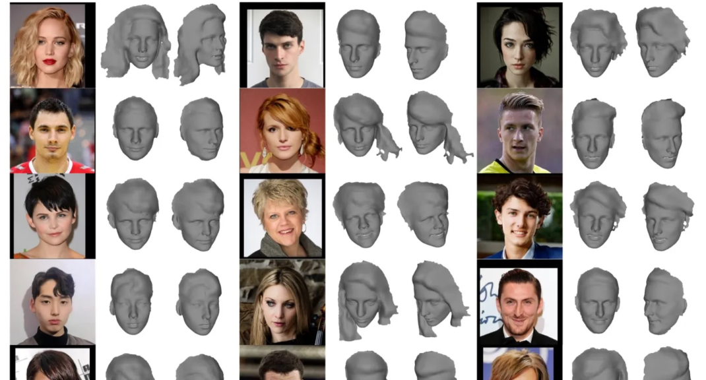

11.14日报：

1.调研虚拟头部生成模型，思路总结：利用面部特征facenet等，构建脸部以及头部参数
2.撰写捏脸面参数表，即（用mediapipe facemesh的478个关键点，计算出头部各个特征），以及python代码（公式）实现

下一步：跑通mediapipe 468点生成到头部参数提取，并且对照原图做检验，判断可行性

11.15日报

跑mediapipe 代码


去除connections=mp_face_mesh.FACEMESH_IRISES,


去除FACEMESH_CONTOURS,


去除所有


 

11.15日报

1.跑通mediapipe 468点生成到头部参数提取，修正了一些参数计算。

2.分析468特征点是否匹配公式。


3.分析特征参数是否计算正确

2D参数：如脸整体宽度，长度，如图所示，略微有些偏移（及与x，y轴的偏差，不平行）

2D角度：如下巴角度，眉毛角度，基本吻合


3D参数，比如各种前后深度，暂无法判断，根据官网对z描述，比例和x相同，那么应该有效


下一步：目前仅针对面部检测， 下一步扩展到头部检测，计算整个头部参数

11.16日报：

调研人像精细分割，**sharedmatting**

**PP-HumanSeg v2**

face parse 解析数据集https://blog.csdn.net/yuanlulu/article/details/88580741


11.16日报

调研人像精细分割，sharematting pp-humansegv2 ，face-parse（BiSeNetV2）

数据集CelebAMask-HQ，跑了一下demo

 结果是：做到比较细节的区分 头发、耳朵、眼睛、嘴巴、眉毛等

下一步：对头发耳朵建模生成方向调研


11.17日报

##### PPhub基于2D的虚拟数字人生成方案

- 形象设计 
- 表情驱动**First Order Motion**
- 语音合成
- 唇形生成

调研论文

**Deep 3D Portrait from a Single Image**（CVPR2019）

简要：**从单张图片重建3D肖像** 的方法，能够重建包括人脸、头发和耳朵区域的几何形状。




无代码

**3D Face Reconstruction with Dense Landmarks**（ECCV2022）

为了实现准确的3D人脸重建，微软提出了自己的解决方案：单纯依靠密集Landmark来实现逼真人脸重建。其中，团队表示相关方法可以准确预测十倍于平常的Landmark，覆盖整个头部，包括眼睛和牙齿。可以预测密集Landmarks（700多个），并在单个CPU线程上以超过150FPS的速度拟合我们的3D面部模型


（1）普通landmark （2）本论文landmark


**提供建模思路，但没有代码**

##### MeInGame: Create a Game Character Face from a Single Portrait（AAAI2021）

给定一张待输入的人脸照片，我们首先根据 3D 变形人脸模型（3DMM）和卷积神经网络（CNNs）重建一张 3D 人脸，然后将 3D 人脸的形状转移到模板网格中。该网络以人脸照片和去包裹的粗 UV 纹理图作为输入值，然后预测出光照系数和细化纹理图


有代码开源，开源重建头发耳朵等。缺点：运行时间慢

```
"xxx_input.jpg": an RGB image after alignment, which is the input to the network
"xxx_neu.obj": the reconstructed 3D face in neutral expression, which can be viewed in MeshLab.
"xxx_uv.png": the uvmap corresponding to the obj file.
```

