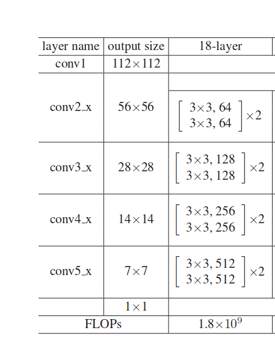
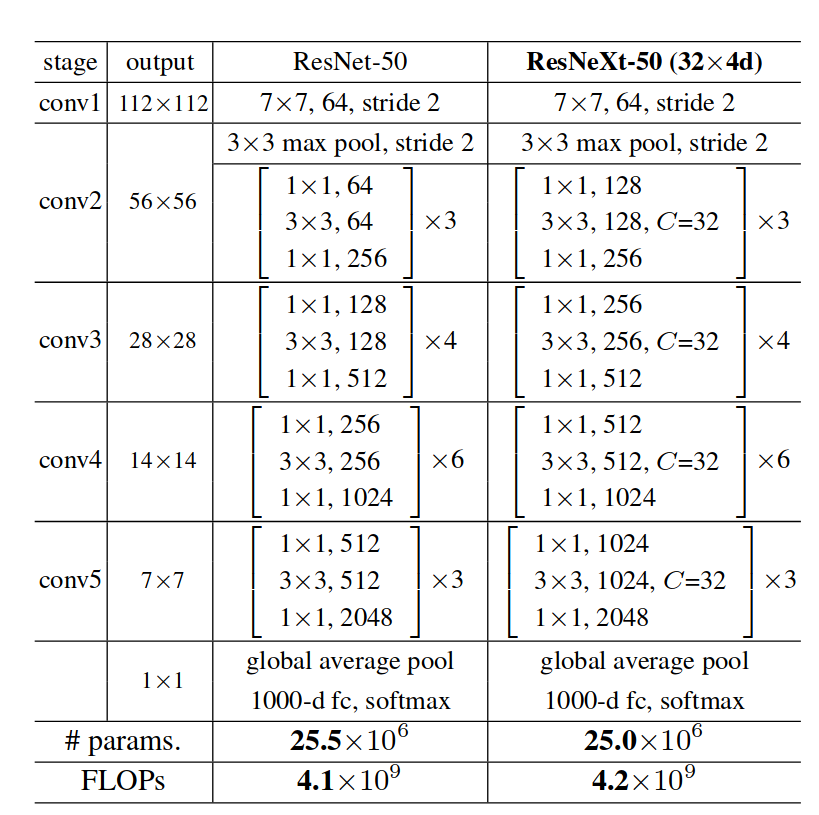

### 思路

1.改变每个算子的输出通道数

2.改变kernel大小

3.改变网络深度


### vgg16

### resnet18

1.原始结构为：




2.如何变种？

修改它的通道数	·可以

修改kernel？，不太行，主要是3x3，1，1的卷积不会让特征图的大小改变,并且各种改进网络，都是这种固定特征梯度（112x112,28x28,14x14,7x7）


问题：

1.需要结合hook特性?

回答：不用hook特性，最后一层全连接可以由上一次的输出算出来，但是保存onnx的时候，上面这种方式属于动态图保存不行，所以要单独copy一个模型出来，输出最后一层。


笔记：

1.nn中的forward执行的是linear

```
 def forward(self, input1: Tensor, input2: Tensor) -> Tensor:
       return F.bilinear(input1, input2, self.weight, self.bias)
```

2.torch.Tensor(3,4)会生成3*4的tensoer,不知道生成方式

