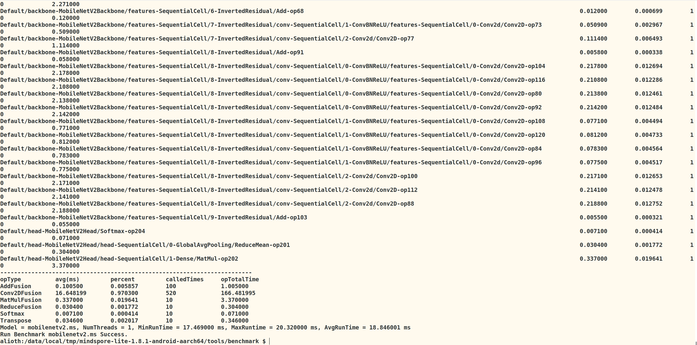

### 在上的手机上运行mindsporelite的benchmark

### 环境

上位机：

ubuntu18.04

下位机：

1.红米

2.芯片：


### 上传代码

```text
adb push mindspore-lite-1.8.1-android-aarch64 /data/local/tmp

adb push mindspore-lite-1.8.1-android-aarch64 /storage/emulated/0/test/model
```

### 转换模型将mindspore

##  benchmark

```shell
n

export LD_LIBRARY_PATH=/storage/emulated/0/test/model/mindspore-lite-1.8.1-android-aarch64/runtime/lib:$LD_LIBRARY_PATH

export LD_LIBRARY_PATH=/data/local/tmp/mindspore-lite-1.8.2-android-aarch64/runtime/lib:$LD_LIBRARY_PATH

export LD_LIBRARY_PATH=/data/local/tmp/0/runtime/lib:$LD_LIBRARY_PATH
```


### 测试

```
./benchmark --modelFile=mobilenetv2.ms --timeProfiling=true
./benchmark --modelFile=/path/to/model.ms --perfProfiling=true --numThreads=1
./benchmark --modelFile=vgg16_193.ms  --numThreads=1 --cpuBindMode=2
```

./benchmark --modelFile=mobilenetv2.ms --timeProfiling=true


mobinetv2:





<!--  Thanks for sending an issue!  Here are some tips for you:

1) If this is your first time, please read our contributor guidelines: https://gitee.com/mindspore/mindspore/blob/master/CONTRIBUTING.md

2) If you want to get the answer quickly, please add label `mindspore-assistant`
   to the issue, we will find it and answer you as soon as possible.
   -->

1. 【Document Link】/【文档链接】
   https://www.mindspore.cn/lite/docs/zh-CN/r1.8/use/benchmark_tool.html
2. 【Issues Section】/【问题文档片段】
   CPU性能测试


> Benchmark工具进行的CPU性能测试主要的测试指标为模型单次前向推理CPU性能参数(目前只支持aarch64 CPU)，包括周期数和指令数、缓存读取次数和缓存未命中次数、CPU前端和后端等待时间。在CPU性能测试任务中，不需要设置benchmarkDataFile等标杆数据参数。但是，可以设置perfProfiling与perfEvent选项参数，控制输出在某设备上模型网络层的哪些CPU性能参数，perfProfiling默认为false，perfEvent默认为CYCLE(CPU周期数和指令数)。由于多线程的读数波动较大，建议设置线程数为1。使用方法如下：
>
> ./benchmark --modelFile=/path/to/model.ms --perfProfiling=true --numThreads=1

3. 【Existing Issues】/【存在的问题】
   我在红米k40手机上测试这条命令输出的是 0 or nan，但是我能测出延迟
   
4. 【Expected Result】【预期结果】
   本来应该是如下结果


- Please fill in the expected result