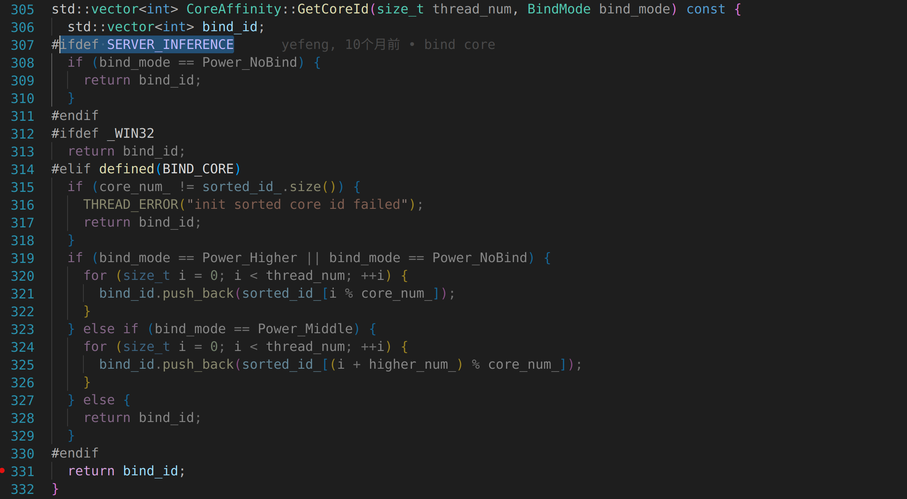
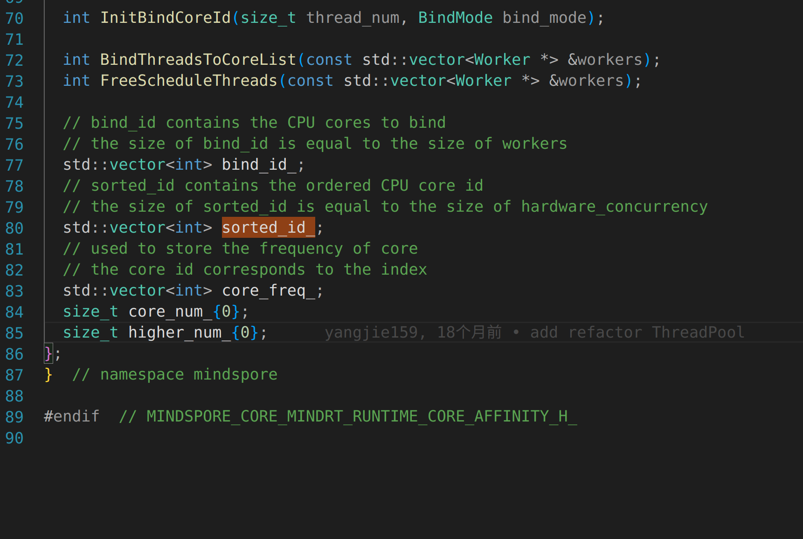
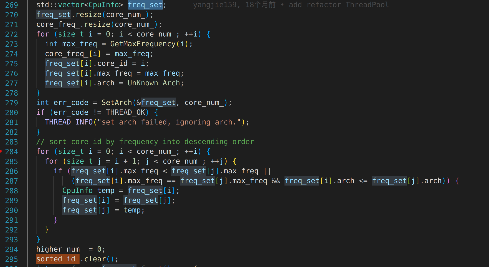
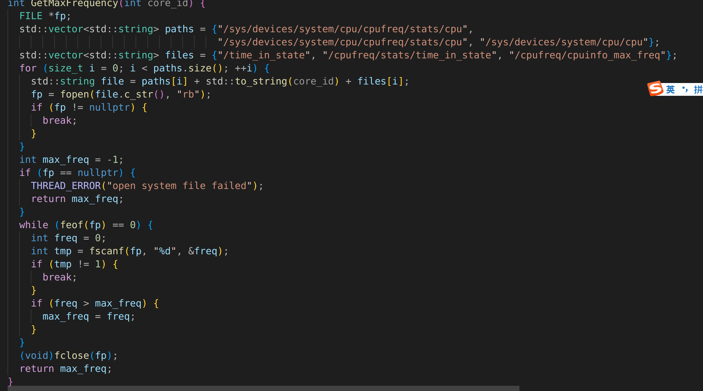
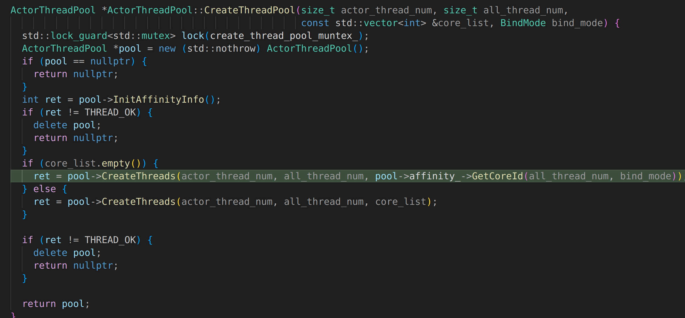

### 调试/home/data/code/mindspore/build.sh

1.调用81:  source mindspore/lite/build_lite.sh


### 编译benchmark增加调试信息

方法：build_lite.sh line775 line778,改成debug（暂时不知道DEBUG_MOD如何设置）


### 调试benchmark以及源码阅读、

#### 代码结构：

- mian.cc (入口函数)
- run_benchmark.cc (执行代码)
- benchmark_base.cc
- benchmark_unifieda.cc
- benchmark_c_api.cc
- mindspore/lite/tools/common/flag_parser.cc
- mindspore/lite/tools/common/string_util.cc


#### 调试流程：

1.首先会按照命名空间遍历

2.进入 mindspore::lite::RunBenchmark(argc, argv)函数及mindspore/lite/tools/benchmark/run_benchmark.cc

具体实现在mindspore/lite/tools/benchmark/benchmark_unified_api.cc

MarkPerformance//测性能


inputs到底怎么生成的


#### 代码逻辑暂定：

模型读取

创建配置上下文

模型创建加载和编译 compile graph

输入数据

执行推理

loadinput()

generateinputData()


获取输出

内存释放


### 如何绑定cpu核



core_affinity.h



sorted_id_：按照频率降序排列

core.affinity.cc






actor_threadpool.cc




x86查看cpu频率：cat /proc/cpuinfo


### 如何打开日志

> ## 常用的环境变量配置
>
> 除了GLOG_v外，其它的环境变量是服务侧的推理版本才支持的。
>
> - `GLOG_v`
>
>   该环境变量控制日志的级别。指定日志级别后，将会输出大于或等于该级别的日志信息，对应关系如下：0-DEBUG、1-INFO、2-WARNING、3-ERROR。
>   该环境变量默认值为2，即WARNING级别。ERROR级别表示程序执行出现报错，输出错误日志。
>
> - `GLOG_logtostderr`
>
>   该环境变量控制日志的输出方式。
>   该环境变量的值设置为1时，日志输出到屏幕；值设置为0时，日志输出到文件。默认值为1。
>
> - `GLOG_log_dir`
>
>   该环境变量指定日志输出的路径，用户须确保指定的路径真实存在。

```
export GLOG_v=1
```


