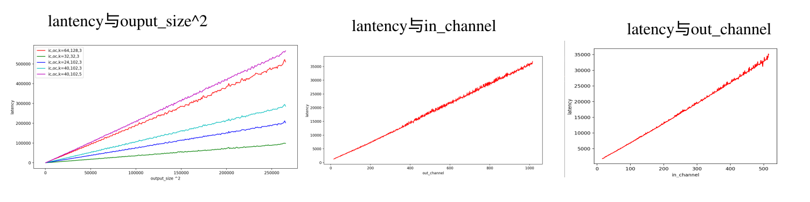
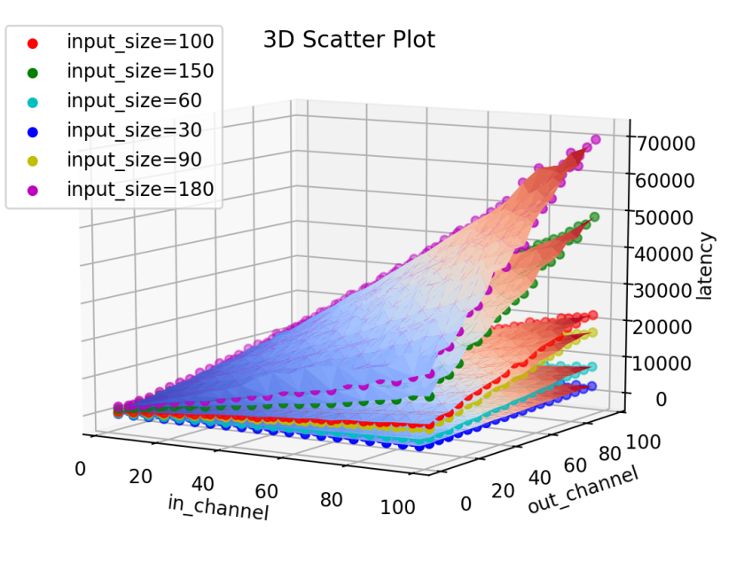

### augur文章

挑战1：剖析开销

挑战2：cnn是由各种类型的层组成，对所有类型的算子进行建模是具有挑战性

挑战3：矩阵乘法如何扩展

​    

​	relate work：尽管CNN已经被应用于不同计算平台上的各种计算机视觉应用，但只有少数作品考虑在移动设备上运行CNN，我们设想这将是未来部署深度学习应用的一个重要领域。在这些工作中，许多人专注于加速CNN的计算，例如，通过压缩参数[15]，[24]，[34]，通过云卸载[16]，[23]，以及通过将计算分布到机载异构处理器（GPU，DSP）[12]，[19]，[26]。有些人考虑减少内存的使用[13]、[20]、[30]和能源[11]，同时保持高推理精度。在移动设备上运行CNN的资源瓶颈在[27]中得到了初步的研究。在[9]中对不同的CNN进行了基准测试，但是它并没有考虑如何对CNN的计算需求进行建模。当CNN从几层发展到一千层的时候，移动设备的计算能力也在不断提高。因此，不同的移动设备在不同的CNN上有不同的表现，因此可能需要也可能不需要定制的优化和卸载，这取决于一个CNN是否可以在一个给定的移动平台上运行以及效率如何。这个问题激发了我们的工作。

摘要--卷积神经网络（ConvNets/CNNs）已经彻底改变了计算机视觉的研究，因为它们有能力捕捉复杂的模式，从而获得高推理精度。然而，这些神经网络日益复杂的性质意味着它们特别适合于具有强大GPU的服务器计算机。我们设想，深度学习的应用最终将被广泛部署在移动设备上，例如智能手机、自动驾驶汽车和无人机。因此，在本文中，我们旨在了解移动设备上的CNN在计算时间、内存和功率方面的资源需求。首先，通过在不同的移动CPU和GPU上部署几个流行的CNN，**我们测量和分析了CNN的性能和资源使用情况**，**并以层为单位。我们的发现指出了在移动设备上优化CNN管道的潜在方法**。其次，我**们对CNN的核心计算的资源需求进行了建模**。最后，在测量和建模的基础上，我们建立并评估了我们的建模工具Augur，该工具以CNN配置（描述符）为输入，估计CNN的计算时间、内存和功率需求，以深入了解CNN是否可以在给定的移动平台上运行以及效率如何。

我们的动机是，我们的系统可以提供指导方针，以决定何时需要进行性能优化、卸载等，以便在移动设备上成功运行分析任务。例如，使用我们模型的输出，人们可以决定在移动设备上运行所有的卷积层，而将完全连接的层卸载到云端，以减少移动设备上的内存需求。尽管准确地对CNN的性能和资源使用进行建模是非常困难的，但我们在实现这一目标方面取得了进展

我们需要解析一个CNN的描述符。**输入的维度（如图像和特征图**）和**网络参数（如卷积核）决定了CONV或FC层的两个矩阵大小（**要乘以的）。由于特征图的尺寸可以由其他一些层改变，例如POOL层，我们需要逐层追踪特征图的尺寸。然而，这可以通过解析每一层的参数设置，如零填充（P）、跨度（S）、输出特征图的数量（N）来轻松完成。例如，在CONV层的情况下，让I表示输入特征图的空间尺寸，O表示输出特征图的空间尺寸，K表示卷积核的三维体积

### 我的：

​	我们的动机是，我们的预测模型可以对神经网络模型在移动设备上运行性能得到精准的判断，便于做模型设备适配，通过使用我们的结果，，在大量模型调参和设备选择中提供参数   ，也包括模型调度，任务调度做前提，最终达到加速模型的目的，

我们在模型轻量化IOT设备前

### nn-meter文章

为了预测CNN模型的延迟，nn-Meter将模型图分割成内核，并将预测的内核延迟加起来作为模型延迟。

​	：不知道运行时的实现。目前的CNN设计使用高层次的API，这与运行时的实现无关。此外，大多数运行时是闭源的。因此，许多CNN延迟预测器只依赖于CNN模型的特征，而没有考虑运行时的实现。一些工作[15, 22, 23, 30]仅仅使用模型的FLOPs和MAC作为延迟的代理，或者使用这些作为回归器[28]的特征输入来预测延迟。然而，这些方法是不准确的，因为它们忽略了各种操作者的运行时间行为差异。与我们的论文类似，NeuralPower[5]和PALEO[27]预测运算符或层的延迟，并将它们汇总为模型延迟。由于忽略了运行时的模型图优化，它们比nn-Meter差。

​	

​	BRP-NAS[13]通过将运算器类型和图形作为特征编码到GCN预测模型中，可以同时学习运算器延迟和图形优化。然而，正如我们所显示的，它对具有不同数量运算符的新CNN模型的概括能力很低，而且它能学习的连接距离也很有限。

​	对运算符实现的预测。一些算子延迟预测器使用机器学习方法从低级别的实现中学习延迟。他们或者使用代码特征和简单的回归模型来预测操作员延迟[1, 16]，或者使用昂贵的DNN代码嵌入[19, 25]方法来避免特征工程。TVM[10]使用两种方法来加速其代码搜索过程。它的基于嵌入的延迟预测器递归地使用TreeGRU模型将低级AST嵌入到一个向量中，然后使用线性层将其映射到预测的延迟。另一个预测器使用代码特征，如内存访问、数据重用、矢量化和解卷，作为XGBoost模型的输入来预测延迟。然而，由于大多数边缘DNN运行时是闭源的，使用这些基于代码的方法是不可行的。

还有语言编译器（如LLVM-MCA[3]和IACA[18]）和周期精确的硬件模拟（如gem5[4]和GPGPUSim[20]）普遍使用的分析性延迟预测方法。这些方法需要对处理器的确切机制有所了解，这对于黑盒边缘人工智能硬件来说也是不可行的。

limmit：

目前的nn-Meter预测器是离线建立的，在推理阶段不会动态更新。在预测器中整合更多的动态资源影响是可能的，比如当前的CPU利用率。这也可以作为未来的研究方向。

并发执行。nn-Meter的设计是基于当前内核在边缘芯片上顺序运行的事实（参考第2.3节）。对于未来可能的推理，即内核可能在异构边缘芯片或多核上并发运行，一个潜在的解决方案是用静态分析阶段来扩展nn-Meter，首先制定内核执行计划。预测的模型延迟将是最长的内核延迟的总和

### High-Throughput CNN文章

CNN的发展正朝着更复杂的网络结构和适度的资源需求发展。从2012年AlexNet[16]的250MB开始，模型的大小已经减少到2016年SqueezeNet[13]的0.5MB以下而不失准确性。这样的进步使得CNN可以在移动平台上部署，即使其计算和内存资源有限。为了有效地在嵌入式平台上部署CNN，研究人员从不同的角度出发。网络结构被修改以适应资源受限的移动平台，如量化[32]，加速计算并减少内存使用，以及网络修剪[33]，在减少资源需求的情况下损害了准确性。此外，在NN应用中利用稀疏性[25]来减少计算量并提高边缘设备的执行性能。

加速器能够在边缘设备上高度节能地执行CNN。一些工作依靠嵌入式GPU的计算能力，使CNN在CPU和其他处理器上协同执行。DeepX[17]框架通过在多个处理器（包括GPU和低功耗处理器（LPU））上协同执行来实现边缘的NN。它首先使用运行时层压缩来控制NN工作负载的资源需求。然后，它将工作负载分解成单元块，分配给多个处理器。DeepX主要从其全连接层中获得AlexNet的性能和能源方面的巨大优势。现在，在最先进的CNN中，全连接层的使用已经很少。DeepSense[11]和DeepMon[10]提出了一个基于OpenCL的移动GPU框架。DeepSense采用了GPU内存管理技术，加速了计算量大的执行，包括在GPU上执行卷积和全连接层。DeepMon扩展了DeepSense，包括进一步的缓存优化并改进了卷积层的执行。现在正在设计专门用于神经网络处理的ASIC，如谷歌的Tensor处理单元（TPU）和华为的神经处理单元（NPU）。研究人员还结合具体应用的特点共同设计算法和架构[34], [35] 。

研究人员已经描述了CNN的资源需求[18], [22]，为设计有资源限制的CNN提供了见解。高效的库[1]、[3]、[6]、[19]被创建，以促进边缘设备上深度学习的实施。像CGOOD[14]这样的框架，通过自动生成C和GPU（CUDA或OpenCL）代码，在具有硬件规格和优化要求的各自平台上运行，来促进边缘设备上CNN的部署。

另一方面，旧的技术节点或对成本敏感的平台，缺乏有能力的GPU和加速器，仍然需要通过其CPU执行CNN。Graphi[30]提出了一个框架，通过多核上的NN内的层级并行性来加速深度学习模型。它利用了网络结构中固有的层级并行性，并将独立的层安排为并发执行。Graphi有利于诸如LSTM和GoogLeNet等具有高度层级并行性的网络。相比之下，Pipeit关注的是计算内核级的并行性。它适用于一般的网络结构，目标是在异构多核上进行CNN加速。

---

nn-meter并没有 对模型的特征进行提取这个工作，是现有的

时延推理的好处：（1）巨大的模型设计空间中搜索具有延迟约束的高效DNN模型。

​								（2）测量DNN模型的推理延迟费力且昂贵，在实际中，它需要开发人员在物理设备上执行一个部署过程来获取延迟（不用推理框架和不同边缘设备）。

这种工作只是一种相较而言的延迟

通用性强

### Abstract

​	随着物联网设备的发展，端边设备的算力日益增长，推理延迟已经成功了运行深度神经网络模型的关键指标，然而不同模型在不同真实设备部署需要耗费人工成本和能源开销，并且同一种设备由于当前资源状态不同而导致时延变化对工程师性能评估造成了麻烦，现有的方法无法对其进行快速而精准的预测。	

​	为了解决这个问题，我们提出并且开发出一种移动手机上模型推理的时延预测器，它可以在移动设备上 对于任何硬件资源动态变化的情况下,对任何神经网络模型进行高效而精确的延迟预测。这个预测器我们基于了图卷积的方式对模型的计算图进行了特征嵌入，并且对于卷积采用多元线性回归的方式快速求出，最后结合当前设备的硬件资源状态预测出精准的延迟，本预测器兼并了精确性，轻量性和泛化性，其中精确性在我们构建的不同架构以及不同硬件资源状态的25万数据集 在±10 accuracy 指标中达到了90%以上，其推理延迟在20ms ~30ms之间远远低于nn-meter。

### introdunction

（结构）（当前的基本背景+Howerver挑战+commom practice方法+我们文章的脉络+贡献）

深度卷积神经网络在过去几年备受科学家们的追捧，因为它能够快速准确的拟合出复杂的非线性数据。它深入人工智能的各个领域，特别是计算机视觉、语音处理、自然语言处理等等。然后，由于AIOT的兴起，近些年越来越多的工作转向计算内存资源受限的移动和IOT设备，**有人提出轻量级的网络**：shuffleNet，mobilenet，squezznet，**有人提出**在原来的网络上进行量化技术、剪枝技术、知识蒸馏技术降低他们的计算量和参数量。**还有的开发出**各种移动推理引擎框架，算子优化，算子融合，计算图优化等充分挖掘硬件的计算潜力来加速推理 。

​	然而，确定模型在移动设备的推理延迟却不容易，模型性能除了受到模型本身结构的影响，实际上还会受到硬件限制、系统环境、软件实现等多种不确定因素，因为将模型在不同的硬件上人工部署是有成本的。如果我们可以快速地通过预测器预测出不同模型在不同硬件资源下的推理延迟，根据其结果我们可以在NAS，调度，端侧加速等任务可以做得很好。

​	一些工作通过将模型性能量化为计算量和访存量，该方法简便，但对于延迟的刻画并不精准。事实上很多情况下模型的延迟不会和他们完全正相关，在这篇工作中，将cnn模型的特征信息提取出来以及收集边缘设备的测试数据时间，通过机器学习训练出预测器，该方法虽然精度很高，但是对于训练集没出现过的模型架构精度会大幅度折损，严重依赖训练数据。   nn-meter将模型图分割成内核，并将预测的内核延迟加起来作为模型延迟。得到较高的精度同时也保证了其泛化性。但是它的过程过于繁琐导致本身预测器时延可能比模型本身推理时延还要长，所以缺乏了实用性。以上工作都没有考虑到硬件资源不同带来延迟不同的影响。

​	在这篇论文中，我们提出一种新型的时延预测器，它兼并了精确性，轻量型和泛化性。他的核心思想依然是通过采用机器学习预测器对整个模型提出特征预测时延，相比之前的我们不会暴力的将特征放入训练，而是将特征划分为卷积时延特征，计算图特征，硬件信息特征。通过手工分拣这些特征，我们使得我们的预测兼并了精确性，轻量性，泛化性。

​	这种特征分拣的设计选择是基于三个观察。首先卷积层是所有深度学习模型中占比最多的算子，并且在时延占比中占据了95%以上的时延，因此我们通过回归模型将卷积时延特征单独提出来。然后我们也需要考虑到其他的一些算子，加之一些推理框架会对这些算子进行优化、融合，因此我们采用GCN图嵌入的方式将计算图特征嵌入，最后由于不同硬件资源下，模型的推理时延会随之改变，所以在测量时延的同时，也会提出当前硬件的相关信息，包括cpu频率，利用率，带宽等。由此我们的预测器对于兼并了精确性，轻量性，泛化性。

​	在这个工作中，我们开发出了新的深度学习模型推理延迟预测器，它可以结合硬件的不同资源情况，对模型推理延迟做出精确的预测， 我们已经在Mindspore lite上实现了各种经典网络在对小米K40u，华为P9，一加手机性能预测系统，同时，本系统也支持MNN，TFlite，NCNN移动推理引擎在设备上进行神经网络的性能预测。同时，相比其他类似工作，它兼并了精确性，轻量性，泛化性

​	我们的贡献包括如下：

​		1.我们开发出移动手机上的模型延迟推理预测器,并且该预测器结合了硬件动态资源变化。

​		2.我们剖析了模型推理延迟的各种影响因素，包括模型自身和硬件设备上的因素

​		3.我们将模型转化为计算图结构，并且利用GCN做图嵌入特征，作为预测器的一个输入

​        4.我们的预测兼并了精确性，轻量性，泛化性

​	

### background and motivation

背景：

【物联网的发展】

​	据 IoT Analytics 公布的调研数据显示，2020年最终企业用户对物联网解决方案的总支出达到1289亿美元，预计到2021年底将达到1598亿美元（约合1万亿元人民币）。随着工业3.0时代的到来，端边设备能力的改善（如算力、内存容量、能耗），以及AI技术在目标检测、目标跟踪、图像分割、场景分类、人脸识别、姿态估计、动作与行为识别等细分方向的突破，进一步加快了AIOT商业应用的扩展和行业成熟度的提升。在端边云和联邦学习的场景下，端侧部署高效轻量网络不仅可以减少云端网络传输通信量，减少边云的计算需求还能够加强隐私的保护效果。

【神经网络的发展】

​	自从alexnet网络在图像识别中卓有成效以来，陆续发布各种各样的cnn网络，如vgg，googlenet，resnet，densenet，squeezenet，mobilenet，特别在网络的参数量和精确度上取得了很好的平衡。

【推理引擎框架】

​	近年来，随着人神经网络的迅速发展，神经网络推理引擎框架成为了越来越重要的技术领域。其中，TVM、MNN、NCNN、TFLite和MindSpore Lite等是目前较为热门的神经网络推理引擎框架。这些框架为各种应用场景提供了高效、快速、可靠的神经网络推理功能，为实现神经网络广泛应用于端边提供了强有力的支持。

【arm大小核架构】	

​	目前市场上移动手机的处理器为了在功率和性能取得平衡，多采用大小核架构的八核异构cpu，这种架构可以适应高处理强度的时期，比如在移动游戏和网页浏览中看到的那些时期，而低处理强度的任务(比如短信、电子邮件和音频)的时期通常更长，在复杂的应用程序期间则处于静止状态。例如图[1]直观的展示了晓龙888u的八核异构多核，他将8个核心分为大中小三个集群，大核集群采用一枚2.84GHz的 cortex X1核心拥有1mb的L2 cache，中核集群采用的是 3枚2.4GHz Cortex A78拥有 512KB 的二级缓存，小核集群采用的是4枚1.8GHz cortex A55拥有128KB L2 缓存。CPU 还配备了 4MB 的 L3 [缓存](https://baike.baidu.com/item/缓存/100710?fromModule=lemma_inlink)和 3MB 的系统缓存。

挑战：

​	硬件环境和系统环境的复杂性：由于系统环境对性能的影响，调度器会因为模型在cpu上的占用率不足被调度到中核或者小核、内存缺页等从而带来性能损失。尽管可以通过绑定特性的核和使用内存池来有限的解决问题。但当系统中运行了其他进程时也会对当前进程造成不可避免的影响。

​	性能建模的困难：由于影响性能的因素很多，不能仅仅认为性能和flops和mac成线性关系，实际上和卷积的各种参数，设计模式如分离卷积，残差卷积都有着各种非线性关系，导致在评估性能时很难给出一些普适性的结论。所以很难快速而准确的对其性能进行建模。

​	我们的动机是：我们的预测模型可以对神经网络模型在任何已知移动设备上运行性能得到精准的预估，以便于做模型设备适配，模型优化，任务优化，端侧加速，

​		硬件复杂性：

预测复杂性络【1，2，3】根据作为模型复杂程度以及延迟的估计，通过不断降低flop和mac来优化网络结构，但是依然不能预测出神经网络模型在设备上真实的运行时延。

### relate work

> 两个方面 ，一个是智能物联网的发展，一个是cnn网络的发展

**开场白：**

​	随着智能物联网技术*的发展，数量、种类繁多的物联网设备正在渗透我们的我们，如移动手机，人脸识别摄像头，智能穿戴设备等，其中也伴随着CNN网络追求更深层，更复杂追求更高精准度如resnet，转向追求更加亲和算力资源受限的端边设备如mobilenet。为了让在常见CNN网络在移动平台成功部署，科学家一般采用蒸馏，减枝，量化压缩网络来平衡网络的参数量和精确度。进一步的通过预估cnn网络在设备上的性能来进优化网络，但是由于硬件的异构和种类繁多，如在cpu，gpu，npu结合的处理器上，科学家很难评估cnn网络在不同硬件设备上性能。这个问题激发我们的工作。

####   augur :

​	augur框架为了深入了解CNN是否可以在给定的移动平台上运行以及效率如何，测量和分析了CNN的性能和资源使用情况，该工具对CNN的核心计算的资源需求进行了建模，以CNN配置（描述符）为输入，估计CNN的计算时间、内存和功率需求。然而它仅只对神经网络的fc和conv层中的矩阵乘法建立了简单的线性模型，没有考虑更多的因素，例如，非矩阵操作（缩放、池化等）、内存操作（memcpy、im2col、col2im等）、卷积类型（纵深或通道洗牌）和CNN架构（堆叠或分支），并且仅考虑tk1和tx1特定的硬件，即没有考虑硬件动态变化，也没有现有推理引擎技术如ncnn ，mnn, tflite等 对其的优化推理加速的影响。

#### **Performances**

​	通过机器学习来提高预测性能的方法在这片文章提出了，它给出一种在边缘GPU上的预测CNN模型性能的方法。首先建立经典和先进CNN的模型数据集，提取出重要CNN特征（卷积层和全连接层的数量、输入图像的大小和神经元的数量等），以及收集边缘设备的测试数据时间，内存使用，功耗，最后通过每次从零添加新的特征到机器学习模型进行训练，直到训练得到的模型误差不下降为止，从而得到一个精度较高的结果。尽管考虑了很多模型的特征因素，但对不同硬件信息的影响依旧没有考虑到。该预测器的方法依赖模型整体的特征信息，对于训练集未涉及到的模型架构，预测的精度会大大降低。因此该方法缺乏泛化性。

#### 	nn-Meter

​    nn-meter将模型图分割成内核，并将预测的内核延迟加起来作为模型延迟。它首次在预测性能的时候结合了推理引擎的影响，所以得到了目前为止比较好的精度，但是没有联系到硬件设备的实时信息，比如cache信息，带宽，cpu利用率等等，并且整个框架预测需要分割内核，较为复杂，预测延迟没有控制，不合适实时端侧优化加速

#### high

​	对卷积层的时延预测，并以此来优化加速整个ai任务的工作，已经在这篇文章有所体现，在arm大小核架构的处理器上通过预测卷积层的时延来将卷积层跨集群分割，同时将其各自内核的并行化限制在指定的集群中。有效地利用了异构多核的所有片上内存和处理资源，从而提高了吞吐量。

​	硬件复杂性：

预测复杂性络【1，2，3】根据作为模型复杂程度以及延迟的估计，通过不断降低flop和mac来优化网络结构，但是依然不能预测出神经网络模型在设备上真实的运行时延。

### INITIAL MEASUREMENT STUDY

分析影响推理延迟变化的因素

（理论分析一波）

（从模型本身的角度）

model 

dnn模型的组成主要由卷积层，激活层，bn层池化层，全连接层等等..

对于大多数的模型算子的主要组成是卷积层，整个模型的推理时延占比99%以上的同样也是卷积时延。

如图所示：

实验结果图（主要显示出主要成员和主要卷积时延）

!img[]

在一些文章的工作中将模型的时延量化到计算量和访存量，即计算量与访存量和模型的时延的呈一个正相关的关系（有时候计算量和访存量都大的情况下，时延依然会小），在不少的一些情况下，时延不与计算量和访存量正相关，即计算量和访存量都增加的情况下，时延反而会降低。因为除了计算量和访存量，还有一些量影响着模型的推理时延，比如卷积中的输入特征图大小，输入通道，输出通道，卷积核大小。当其中的一些值比较大的时候，有影响到延迟。

（roofline）计算强度：计算量和访存量的比

（从）

Various hardware resources

#### Various hardware resources

cpu频率

（如何设置的模式的原理、测试的情况，结果+结论）

​	这里我们讨论不同硬件资源情况下的对推理延迟的影响因素，包括不同频率，不同CPU利用率，不同带宽的情形下对于推理延迟的影响，通过调节手机单核不同CPU频率，如下图所示（mobilenetv2在单核cortex-A710单线程推理）。

cpu频率

不同cpu频率是指模型在cpu推理时cpu频率导致时延的不同，我们通过进入手机系统文件更改cpu当前频率，如下图所示（Mobilenetv2在单核cortex-A710单线程推理）。频率和推理延迟呈现负相关关系

cpu利用率

不同cpu利用率影响推理时延指的是cpu上不同进程之间的抢占，在linux进程调度策略中，主要分为实时进程和非实时进程。对于实时进程，按照进程的优先级用时间片轮转（RR）或者先进先出（FIFO）；对于非实时进程，通常是完全公平调度（CFS）。这里将我们的推理进程设置为默认的非实时进程去测量，调节不同cpu利用率的方式是通过cpu负载程序去调节，使得CPU利用率在10%-90%范围内调节。结果如下图所示，随着cpu利用率百分比的增加，推理时延也会随之增加，越接近100%，推理时延就越接近无穷

内存带宽

​	不同的内存带宽是指模型在边缘平台上推理延迟受限于内存带宽，即cpu计算能力足够强大，但是需要等待内存的读写 。由于我们使用的推理硬件平台是八核异构cpu，对于内存对于八核的带宽是一定的，我们通过对不使用的CPU施加不同带宽压力从而改变当前cpu环境下的带宽。评估当前带宽的方式是单位时间顺序读写数组大小，单位Gb/s。

### The Design

#### Overall

​	图中说明了系统结构。它显示了四个核心组件，以实现CNN模型的精确延迟预测。	OUR的架构主要组成有：硬件性能解析器，**计算图生成器**  、节点特征解析器、预测模型。硬件性能解析器会提取出目标设备当前状态的信息，计算图生成器是将CNN模型文件信息提取出一张计算图，节点特征解析器是对计算图的每一个节点进行时延特征提取，预测模型是将提取出来的特征通过我们的模型建模预测出时延。

#### Dataset

​	基准数据集制作：我们的数据集分为两类数据集，一类是不同参数的卷积在空载下的时延数据集，用于求得空载时延的回归系数，一类是不同模型架构下的变种模型、不同cpu频率、cpu利用率、访存量下的负载延迟数据，用于使得我们的预测器对任意CNN模型和各种硬件资源的设备上都具有适用性，具体来说我们收集的数据来自5个基础的CNN模型，在不同CPU频率，不同CPU利用率，不同带宽约250000个数据。

#### Cnn latency

​	到目前为止，我们已经知道在Cnn的模型当中，其主要成分和延迟占比绝大多数是来自于卷积算子。所以我们的首要目标是对卷积算子的时延进行精准的建模，以便可以对所有的Cnn模型的推理时延都有通用性.我们使用Mindspore lite 通过不同配置的卷积在我们的设备上做推理时延的测量。我们分别测量延迟与卷积和各个特征的关系如下图所示。

我们发现卷积的延迟分别和输入特征图大小的平方，输入通道，输出通道数量分别成线性关系。

进一步的，我们将其设定为在特定kernel size的情况下，输入特征图大小取值为[1,224],输入通道，输出通道的大小分别为在[1,100].然后可以作出以下在特定kernel size和input size的情况下，用延迟，输入通道，输出通道形成的曲面。

我们结合此前的观察，卷积的延迟与输出通道，输出通道存在线性相关性，我们用以下等式对卷积特定input size 和 kernel size的情形下使用线性回归进行建模

​			T(cnn)=α1N +  α2M + α3N M +α4 	

其中N表示的是输入通道，M 表示的是输出通道。

因此我们只要预先得到α1-α4系数就可以通过以上公式快速的得到卷积的延迟情况。

#### Computation Graph  Feature

​	我们知道CNN模型在设备上推理延迟中，除了卷积时延，还有其他算子例如pooling、relu、和fc等各种算子，尽管它们在延迟中占比不大，但依旧有着重要影响，特别是当模型的计算图会被推理引擎优化，有着我们意想不到的加速效果，所以我们利用GCN对计算图进行嵌入特征操作。

​	OUR采用节点特征矩阵（X）对于每个节点我们包含了它的计算量和访存量两大特征，以及计算图生成器的邻接矩阵(A),如图所示，OUR必须在预测之前进行训练，它的核心思想是从X和A生成节点嵌入z,然后将z和卷积时延特征（c），硬件信息特征（h）,concat到一起。最后我们将concat的向量传递到全连接层进行预测时延。为了生成z,我们使用了Thomas N. Kipf提出的GCN（Graph Convolutional Networks），它在计算图上进行了卷积操作，在节点和边上进行了特征提取和表征。因此非常符合我们对CNN模型的计算图进行时延特征嵌入的想法。

#### Hardware Feature

​	本文中的目标不仅仅是对模型的推理延迟做出建模，进一步的，我们还要能够高效和精准地预测出模型在设备不同资源环境下的时延。具体来说，我们通过硬件信息提取器获取当前设备的l1-l3 data cache access, instructions,CPU-cycle,CPU-clock, CPU-utilization rate，Bandwidth,Frequency。我们将这部分参数作为我们预测器的硬件信息特征。

#### Latency prediction

​	如图所示，我们首先从一个模型文件读取信息，然后构造出计算图，接着计算出**计算图**中每一个结点的计算量，访存量等特征，用GCN嵌入计算，并且从计算图中提取出所有卷积，及其特征，分别用训练得到的回归系数得到空载下的时延，将卷积时延特征、计算图特征、硬件信息特征 通过全连接层预测时延。

In this section, we describe the overall of system and the benchmark dataset collection.

概述。图中说明了系统结构。它显示了两个核心组件，以实现CNN模型的精确延迟预测。它包括特征提取和时延建模部分。前者会对目标模型和目标设备提出重要的特征，后者会对提取出来的特征通过我们的模型建模预测在设备上的时延。

基准数据制作：为了评估我们的系统在任意cnn模型上都具有适用性，我们自己制作了一个基准数据集，其中包括经典模型以及它的变种模型文件本身，准备用它在不同硬件上做测试。nn-meter同样制作了数据集，但它的IR仅适用于nn-meter代码，所以我们这里制作更为通用的模型数据集。我们的数据集共有10种经典网络，其中包含了conv、pooling、relu、和fc等各种算子。

> 基准数据集制作：我们的数据集分为两类数据集，一类是不同参数的卷积在空载下的时延数据集，用于求得空载时延的回归系数，一类是不同模型架构下的变种模型、不同cpu频率、cpu利用率、访存量下的负载延迟数据，用于使得我们的预测器对任意CNN模型和各种硬件资源的设备上都具有适用性，具体来说我们收集的数据来自5个基础的CNN模型，在不同CPU频率，不同CPU利用率，不同带宽约250000个数据。

​	在这项工作中，我们考虑各种不同的网络结构，生成了一个比较大的数据集，确保我们的系统可以在任何模型结构下都保持有效性，首先，我们在imagenet2012上收集了10个最经典以及最先进的CNN模型。他们包含了不同算子类型和配置。对于每个模型如（vgg），我们通过随机改变网络深度和宽度产生1000个变体。具体来说我们会对它的输出通道数在[0.2 × Cout , 1.8 × Cout]中随机抽取，核大小在{1, 3, 5, 7, 9}中抽取，以此改变宽度。在其中随机加入点卷积来改变深度。

​	最后，我们的数据集总共包含了10000个模型，它们都是由224x224x3大小的图像输入。如表中所示，我们的数据集包含了不同水平的flops和macs的范围。

特征提取：特征提取我们分为了两个部分，模型部分和硬件部分。模型部分的主要包括计算量、放存量、参数量、conv层数、fc层数、BN层数。硬件部分通过硬件信息提取器获取当前l1-l3 data cache access, instructions,CPU-cycle,CPU-clock, CPU-utilization rate，Bandwidth,Frequency。

性能建模：为了能够精确的对性能进行建模，我们采用机器学习的方法对所提取得到的特征进行建模，具体来说我们备选了不同创建且有效的模型，如linear、MLP、SVR、RF和XGBoost模型。通过每次从零添加新的特征到机器学习模型进行训练，直到训练得到的模型误差不下降为止。最后选择最后的模型对神经网络性能进行预测。

​	OUR的架构主要组成有：硬件性能解析器，**计算图生成器**  、节点特征解析器、回归模型、

> 流程
>
> 数据集部分：
>
> 分为两类数据集，一部分是不同参数的卷积的空载时延数据集，用于求得卷积空载时延回归系数
>
> ​								一部分是不同模型架构下的变种、不用设备频率、cpu利用率、放存量下的负载延迟数据

> 1.首先从一个模型文件读取信息，然后构造出计算图
>
> 2.计算出**计算图**每一个结点的计算量，访存量等特征，用GCN嵌入计算：计算图特征
>
> 3.从计算图中提取出所有卷积，及其特征，分别用训练得到的回归系数得到空载下的时延，
>
> 4.根据卷积时延特征、计算图特征、硬件信息特征 通过全连接层预测时延

​		到目前为止，我们已经知道在Cnn的模型当中，其主要成分和延迟占比绝大多数是来自于卷积算子。所以我们的首要目标是对卷积算子的时延进行精准的建模，以便可以对所有的cnn模型的推理时延都有有效的

### implementation

​	我们已经在Mindspore lite上实现了各种经典网络在对小米K40u，华为P9，一加手机性能预测系统，同时，本系统也支持MNN，TFlite，NCNN移动推理引擎在设备上进行神经网络的性能预测。整个系统代码由3000余行python代码和cpp代码构成。它对250000个基准数据集进行了测试和特征提取，训练，并进行了有效的性能预测。

时延测量：我们的系统目前针对移动手机上的8核异构处理器如小米k40的晓龙888，华为p9的麒麟955，一加的天玑8100-MAX。分别适用不同的推理引擎框架，mindspore lite ，MNN，TFlite，NCNN。

​	我们建立了一个自动测量平台来测量延迟，首先我们需要将测量的模型文件从主机端发送到目标测量平台，并且收集返回推理的延迟，对于推理的延迟，我们warmup后，取30次时延的平均值，与此同时测量得到我们的硬件的动态信息。为了保证模型不受大小核调度的影响，我们的利用绑核的技术以及根据系统调度策略调整测试代码。

计算图生成：针对于模型文件，我们通常会采用onnx文件，它是一种开放的深度学习框架间交换格式。ONNX文件的优点是它能够实现深度学习模型的跨框架共享和部署。这意味着可以将在一个框架中训练的模型导出为ONNX文件，并在另一个框架中加载和使用该模型，而不需要重新训练模型。此外，ONNX文件也可以用于将深度学习模型部署到各种硬件设备上，如移动设备、物联网设备、云服务器等。我们利用onnx中的形状推理的工具得到模型的计算图。

特征提取：

​	我们的特征提取包含硬件特征和模型特征两个部分，其中的硬件特征是指，在测量推理时延之前，还需要测量当前硬件的一些信息，这里利用我们arm的PMU（Performance Monitoring Unit）系统，它用于跟踪、计数系统内部的一些底层硬件事件，如与CPU有关的事件（执行指令数、捕获异常数、时钟周期数等）、与cache有关的事件（data/inst./L1/L2 cache访问次数，miss次数等）以及与TLB有关的事件等。这些事件反映了程序执行期的行为，从中我们可以提取出硬件系统动态变化的信息。具体来说包含了当前设备的l1-l3 data cache access, instructions,CPU-cycle,CPU-clock, CPU-utilization rate，Bandwidth,Frequency。模型特征主要是从计算图中获得每个节点的计算量和访存量特征。这里我们通过不同算子的计算量和访存量的计算公式得出，例如卷积的计算量和访存量公式如下：

​	

建模和预测

​	我们的预测器输入的是模型的文件，首先读取信息，然后利用计算图生成器构造出计算图，接着利用节点特征解析器计算出**计算图**每一个结点的计算量，访存量特征，将其特征矩阵（X）,邻接矩阵（A）用GCN嵌入得到计算图特征，然后计算图中提取出所有卷积，及其特征，分别用训练得到的回归系数得到空载下的时延，最后将卷积时延特征、计算图特征、硬件信息特征 通过三层全连接层预测出时延。

​	对于其它的算子

​	我们收集的数据来自5个基础的CNN模型，在不同CPU频率，不同CPU利用率，不同带宽约250000个数据。

我们使用了70%的样本作为训练集，其余用于测试，我们的学习率采用的是0.1，训练周期有100个，

### Evaluation

In this section, we evaluate our system and baselines in various aspects to demonstrate the efficiency of our system.

#### Experiment Setup

​	评估分为三个方面，分别是精确性，轻量化，泛化性，其中精确性采用的±10% accuracy方式，这是预测延迟在10%误差范围内的模型的百分比在本文中，±10% 的误差边界是最大可接受的预测误差。我们使用 ±10% 的准确度作为默认指标。轻量性是指预测器的推理时延要仅可能小，我们使用11300的cpu作为预测器的推理统一平台做评估。泛化性评估针对于我们训练好的预测器，不仅仅可以预测出我们训练集所存在的模型架构的推理延迟，还能推理出训练集当中没有的模型架构。我们设计出泛化性评估标准，将其中三个模型架构加入到训练集当中，预测剩下的模型架构的推理时延。

### baselines

我们实施了2个基线比较：（1）normal，即将我们得到的所有特征包括硬件特征和模型特征都输入到机器学习模型当中去，例如Xgboost   （ 2）nn-meter

结果：

​	为了使得我们的预测器对于所有的不同架构的Cnn模型都要较高的泛化性和精准性 ，我们将卷积的时延当做特征加入到预测器当中，为了实现轻量级延迟预测器，我们对于每个卷积的预测采用多元线性回归模型，

### Eluation

（消融实验）

### Discussion

transformer的预测

​	目前火热的大语言模型主要的算子是transformer，但是目前的边缘推理后端主要支持 CNN 模型，不支持语言模型。例如，mindspore lite不支持 transformer 算子 。因此，本文只对 CNN 模型进行了评估。未来如果支持这些算子，我们的方法同样适用，首先需要剖析transformer算子，计算它的flops和macs，然后对整个计算图计算邻接矩阵和特征矩阵。

功耗预测

​	实际上模型推理的功耗主要和它的计算量相关，由于一些框架对算子做了优化使得它运行的功耗会降低，并且，由于散热取决于难以建模的外部环境。因此预测会变成更加复杂。

局限性：

​	本方法方法的局限性在于需要对现有的算子进行白盒剖析，认识到的各种参数以及在实际环境下的数据建模，随着未来推理框架添加更多的未知的算子以及优化措施，我们还需要重新进行分析。为此，我们将在今后尽量维护和解决

### conclusion

​	我们的预测器是一种结合硬件资源的动态变化，可以准确的预测出模型在移动手机上不同资源状态下的推理时延。我们的预测器首次引入了硬件资源信息，它通过图卷积的方式将模型的计算图做嵌入特征，并且兼并了轻量性，精确性和泛化性，在这三个指标上都有很好的结果。在精确性上在±10% accuracy上能够达到90%以上，而预测器推理延迟仅仅只要20ms~30ms

### 参考目录

[1] mobilenet

[2]SqueezeNet

[3]ShuffleNet

[4]augur