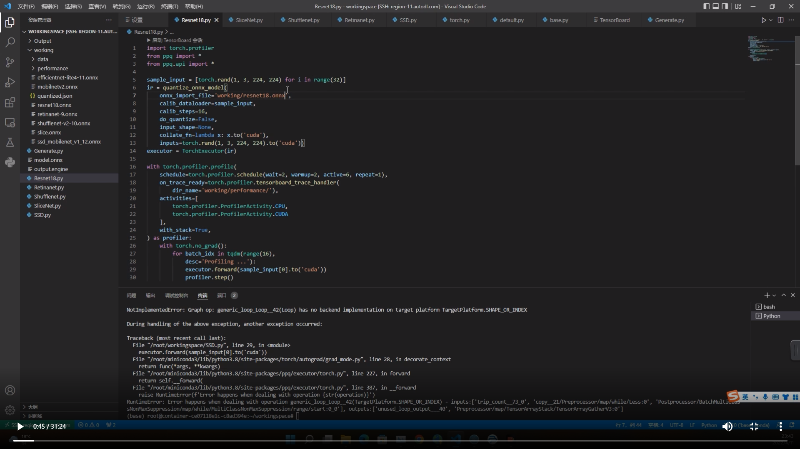
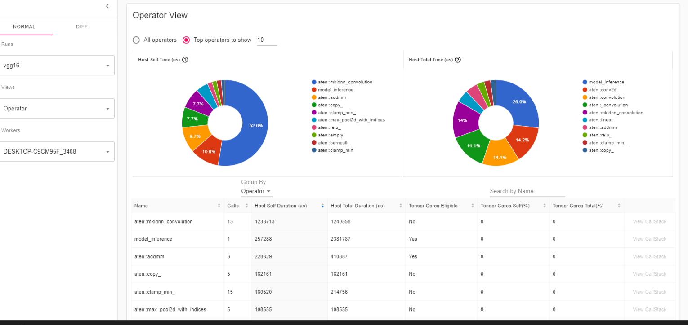
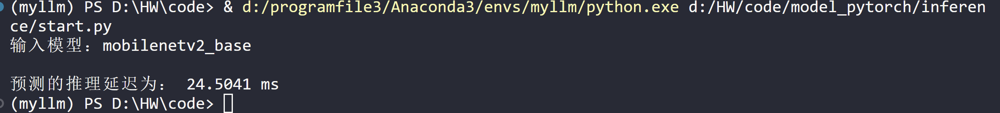

### 1、模型复杂度的衡量

参数数量（Params）：指模型含有多少参数，直接决定模型的大小，也影响推断时对内存的占用量
单位通常为 M，通常参数用 float32 表示，所以模型大小是参数数量的 4 倍左右
参数数量与模型大小转换示例：10M float32 bit = 10M × 4 Byte = 40MB
理论计算量（FLOPs）：指模型推断时需要多少计算次数
是 floating point operations 的缩写（注意 s 小写），可以用来衡量算法/模型的复杂度，这关系到算法速度，大模型的单位通常为 G（GFLOPs：10亿次浮点运算），小模型单位通常为 M
通常只考虑乘加操作(Multi-Adds)的数量，而且只考虑 CONV 和 FC 等参数层的计算量，忽略 BN 和 PReLU 等等。一般情况，CONV 和 FC 层也会 忽略仅纯加操作 的计算量，如 bias 偏置加和 shotcut 残差加等，目前有 BN 的卷积层可以不加 bias
PS：也有用 MAC（Memory Access Cost） 表示的

### 2、模型复杂度的计算公式

### **3、硬件性能的衡量**

算力：
计算平台倾尽全力每秒钟所能完成的浮点运算数（计算速度，fp32），单位一般为 TFLOPS（floating point of per second
计算公式一般为 处理器核心时钟频率 × 处理器核心数量 × 特定数据类型的指令吞吐量 × 2，后面乘以 2 是因为乘加视作两次浮点运算
eg：NVIDIA A100 GPU 频率为 1.41GHZ，处理器（ Streaming Multiprocessors， SMs）数为 108，每个处理器 FP32 的 CUDA Cores 数量为 64，那么 PeakFLOPS = 1.41*108*64*2 = 19.49TFLOPS

带宽：
计算平台倾尽全力每秒所能完成的内存（CPU 内存 or GPU 显存）交换量，单位一般为 GB/s（GByte/second）
计算公式一般为 (内存核心时钟频率 × 2) × (内存位宽 / 8) × 通道数，内存频率乘以 2 是因为一个时钟周期传输 2 bit 数据（上升沿和下降沿各传送一次）；内存位宽的单位为 bit，除以 8 转换为 Byte；现在的内存条一般通道数为 2
eg：某相机芯片带宽：(2000MHZ × 2) × (32 / 8) × 2 = 32GB/s ，NVIDIA A100 带宽：(1215MHZ × 2) × (5120 / 8) × 1 = 1555.2GB/s


##### 在评价深度学习模型的大小和计算量时，经常使用的参数有：parameters, FLOPs, MACs, MAdds。除此以外，我们还经常见到MAC, FLOPS, GFLOPS, TFLOPS，其中，后三个参数其实并非用来评价模型的计算量，而是用来评价计算机硬件的计算能力。下面分别介绍一下以上几个参数：

parameters:
这个参数表示的是模型内部总的参数数量，用来衡量模型的大小，例如一个3*3的卷积层包含10个参数，分别为卷积操作的9个参数和偏置操作的1个参数。

FLOPs:
(Floating Point Operations) 即浮点运算次数，用来衡量模型计算复杂度，常用来做神经网络模型速度的间接衡量标准（虽然最近已经有文章证明靠FLOPs间接标准评价模型的速度是不靠谱的，因为模型的计算速度还跟内存的吞吐等因素相关，但此标准依然广泛用作模型速度的参考评价标准）。对于卷积层而言，FLOPs的计算公式如下:

FLOPs = 2 * H * W * ( Cin * K * K ) * Cout

其中，Cin是指卷积层输入tensor的通道数，Cout是指卷积层输出tensor的通道数，K是指卷积核大小，其中乘以2是因为在卷积操作中，加法次数与乘法次数相同，在卷积乘法中加法次数比乘法次数少一次，但是还需要多考虑一个卷积加法，所以总的乘法次数与加法次数相同。

MACs, MAdds:
(Multiply–Accumulate Operations) 即乘加累积操作数，常常与FLOPs概念混淆，实际上1MACs包含一个乘法操作与一个加法操作，大约包含2FLOPs。通常MACs与FLOPs存在一个2倍的关系。MACs和MAdds说的是一个东西。

MAC:
(memory access cost)即内存使用量，用来评价模型在运行时的内存占用情况。1x1卷积的FLOPs为 2 * H * W * Cin * Cout。对应的MAC为H * W * (Cin + Cout) + Cin * Cout（这里假定内存足够）。

FLOPS, GFLOPS, TFLOPS:
(Floating Point Operations Per Second) 即每秒浮点运算次数，它常被用来估算电脑的执行效能，尤其是在使用到大量浮点运算的科学计算领域中。正因为FLOPS字尾的那个S，代表秒，而不是复数，所以不能省略掉。

在这里所谓的“浮点运算”，实际上包括了所有涉及小数的运算。这类运算在某类应用软件中常常出现，而它们也比整数运算更花时间。现今大部分的处理器中，都有一个专门用来处理浮点运算的“浮点运算器”（FPU）。也因此FLOPS所量测的，实际上就是FPU的执行速度。

GFLOPS 就是 Giga Floating-point Operations Per Second，即每秒10亿次的浮点运算数，常作为GPU性能参数但不一定代表GPU的实际表现，因为还要考虑具体如何拆分多边形和像素、以及纹理填充，理论上该数值越高越好。1GFlops = 1,000MFlops。

工具：
我们在构建完模型后，如何得到以上这些参数量。这里常用的工具有：

针对tensorflow
有自带工具tf.RunMetadata()， 使用例子可以参考(TensorFlow: Is there a way to measure FLOPS for a model?l)

针对torch
有第三方工具torchstat和thop

对于torchstat示例如下：
from torchstat import stat
import torchvision.models as models

model = model.densenet121()
stat(model, (3, 224, 224))
对于thop示例如下：
from torchvision.models import densenet121
from thop import profile
model = densenet121()
input = torch.randn(1, 3, 224, 224)
macs, params = profile(model, inputs=(input, ))
————————————————
版权声明：本文为CSDN博主「BIT_Legend」的原创文章，遵循CC 4.0 BY-SA版权协议，转载请附上原文出处链接及本声明。
原文链接：https://blog.csdn.net/BIT_Legend/article/details/123805898


### 算子定义

简单来说，算子是一个函数。应用于深度学习，我们可以这样理解，输入 Tensor 经过算子，能够得到输出 Tensor，而中间的计算过程通过算子隐藏了细节，使得用户更清晰简单地理解该算子的计算内容。


### 计算图相关

算图类型[1]

所有深度学习框架都依赖于创建计算图来计算梯度下降优化所需的梯度值。通常，你必须构建前向传播图，而框架将为你处理反向微分。

但是在开始PyTorch中的计算图之前，我想讨论静态和动态计算图。

#### 静态计算图 

通常包括以下两个阶段。

阶段1：定义一个架构(可以使用一些基本的流控制，比如循环和条件；

阶段2：运行一堆数据来训练模型和/或进行预测。**静态图的优点之一是它允许对图进行强大的离线优化/调度。这意味着这些通常会比动态图更快(在每个用例中差异可能并不显著，这取决于我们的图)。缺点是处理结构化或者可变大小的数据比较复杂。**

动态计算图：

在执行正向计算时，隐式地定义图(例如，使用运算符重载)。

动态图的优点是更灵活，该库侵入性较小，允许交叉构建和评估图。缺点是难以进行图的优化。

**动态图是调试友好的。查找代码中的问题要容易得多，因为它允许逐行执行代码，并且你可以访问所有变量。如果你想将深度学习应用于行业的任何实际目的，这绝对是一个非常重要的特性。**

PyTorch使用动态计算图。Tensorflow允许创建优化的静态图，还具有允许类似于动态图的内容的Eager执行。它是一个命令式的编程环境，可以立即评估操作，而无需构建图形，操作将返回具体的值，而不是构建一个稍后运行的计算图形。

### 使用torch.profiler分析神经网络

环境：torch>=1.8.1



一、安装依赖库

```text
pip install torch_tb_profiler
```

二、

```
import torch
import torchvision.models as models
from torch.profiler import profile, record_function, ProfilerActivity
model = models.vgg16()
inputs = torch.randn(5, 3, 224, 224)
with profile(
    activities=[ProfilerActivity.CPU],  profile_memory=True,record_shapes=True,
on_trace_ready=torch.profiler.tensorboard_trace_handler(dir_name='./log/vgg16'),) as prof:
    with record_function("model_inference"):
        model(inputs)
# print(prof.key_averages().table(sort_by="cpu_time_total",row_limit=10))
# print(prof.key_averages(group_by_input_shape=True).table(sort_by="cpu_time_total", row_limit=10))
# print(prof.key_averages().table(sort_by="cpu_memory_usage", row_limit=10))
# with profile(activities=[ProfilerActivity.CUDA], record_shapes=True) as prof:
#     with record_function("model_inference"):
#         model(inputs)
# print(prof.key_averages(group_by_input_shape=True).table(sort_by="cpu_time_total"))
```

三、结果

命令行输入

```
tensorboard --logdir=log
//  loddir：文件夹目录
```




