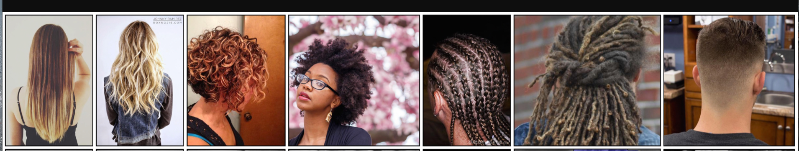
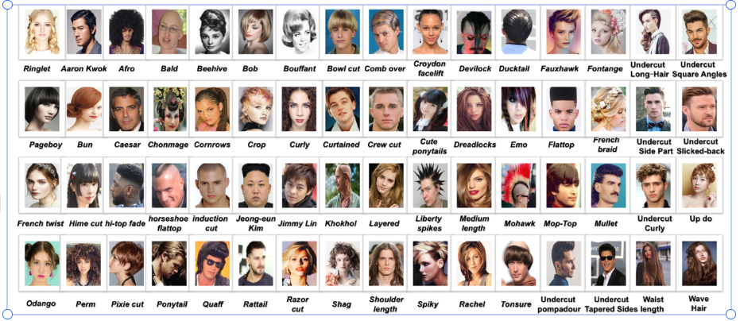
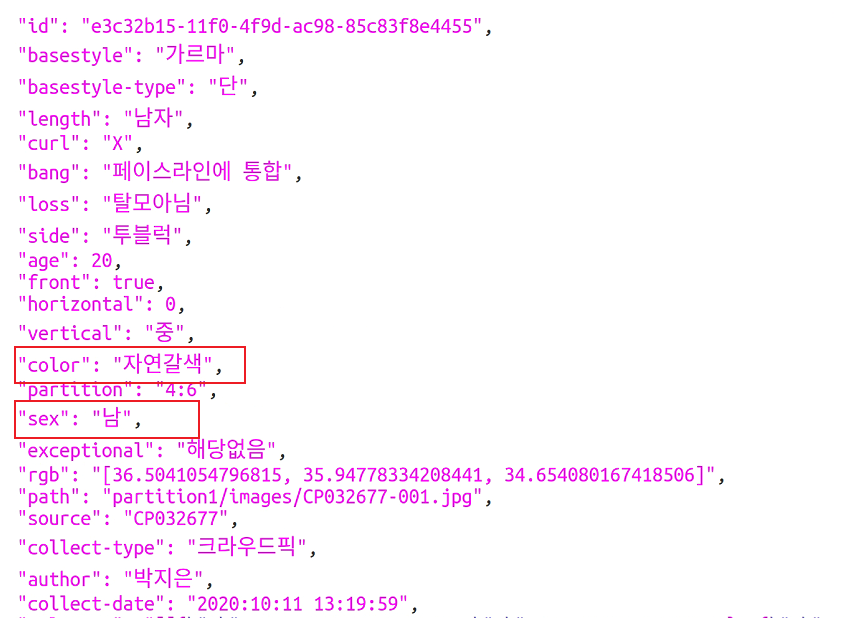
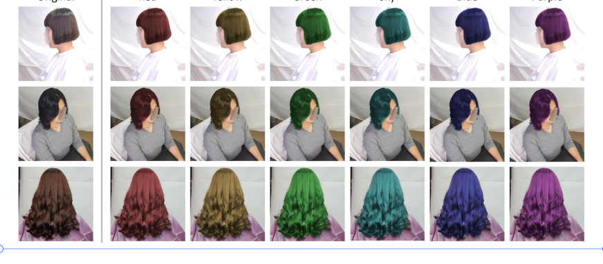
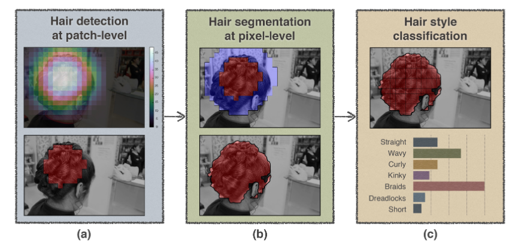

### 任务

发型分类：

按长度分：长，中，短，平，光头

按类型分：直发，卷发

| 类型     | 长           | 中                                 | 短                       | 平                         | 光         |
| -------- | ------------ | ---------------------------------- | ------------------------ | -------------------------- | ---------- |
| 特征描述 | 发长达到颈部 | 不超过颈部，过耳朵，或者眉毛，茂密 | 不超过耳朵和眉毛，稍微密 | 能隐约看见头皮，整齐不花哨 | 几乎无头发 |
| 示例     |              |                                    |                          |                            |            |
|          |              |                                    |                          |                            |            |

### 现在数据集

##### **Figaro 1K**：多视角7类别 (straight, wavy, curly, kinky, braids, dreadlocks and short）各类别包含150张图片,视角混乱

##### [Hairstyle60k](https://github.com/sarkrui/Hairstyle60k)：目前有61种类型的发型，多为正面视角，共计12015张

##### **K-Hairstyle**：一个新颖的大规模韩国发型数据集，50万张高分辨率图像提供了丰富的标注集，如发型类、发型分割掩码、各种属性等，具体如下：

- High-resolution image.。使用高端相机采集分辨率为4032 × 3024的图像。

- Large-scale dataset，我们提供了50万张图像，超过了任何其他现有的发型数据集。

- Multi-view image，该数据集包含每个人从不同相机角度拍摄的多视角图像。角度包括两个不同的垂直相机角度和大约十到六十个不同的水平角。

- Hair segmentation mask.，图像的头发区域以多边形的形式人工标注。

- **Hairstyle attributes.，发型属性。各种发型相关属性被韩国发型专家注释。具体来说，不同的发型被分为31种类型，另外63个属性，如头发颜色、长度和卷曲度也被标记出来。**

- 由于隐私问题，我们将面部区域模糊化

  

同一个人，同一个发型，不同视角都有，

### 现有工作

1.Hair detection, segmentation, and hairstyle classification in the wild

​													**检测**==>**分割**==>**分类**

### 目前工作：

1.利用[Hairstyle60k](https://github.com/sarkrui/Hairstyle60k)做单一图片发型分类61分类，12015张图片

2.网络结构：resnet50（微调全连接层）

3.输入单张图片

4.输出label

初步acc效果不佳，拟先做分割检测，再做分类

### 参考文献

[1] U. R. Muhammad, M. Svanera, R. Leonardi, and S. Benini, “Hair detection, segmentation, and hairstyle classification in the wild,” Image and Vision Computing, vol. 71, pp. 25–37, Mar. 2018, doi: 10.1016/j.imavis.2018.02.001.

[2] W. Yin, Y. Fu, Y. Ma, Y.-G. Jiang, T. Xiang, and X. Xue, “Learning to Generate and Edit Hairstyles,” p. 9, 2017.

[3]http://projects.i-ctm.eu/en/project/figaro-1k 