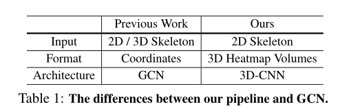

### 网络架构

优点:骨架不受背景变化和灯光变化等环境干扰的影响

### GCN的缺点

1）鲁棒性：虽然GCN直接处理人类关节的坐标，但其识别能力受到坐标分布偏移的显著影响，这在应用不同的姿势估计器获取坐标时经常发生。因此，坐标中的微小扰动通常会导致完全不同的预测[40]。

2）  互操作性：以前的工作已经表明，来自不同模式的表示，例如RGB、光流和骨架是互补的。因此，这些模式的有效组合通常可以提高动作识别的性能。然而，骨架表示的图形形式使其难以与其他模式融合，尤其是在早期或低级阶段，从而限制了组合的有效性。//不适应

3）  可伸缩性：此外，由于GCN将每个人类关节视为一个节点，因此GCN的复杂性与人数成线性关系，从而限制了其适用于涉及多人的任务，例如群体活动识别。//不适应

### 区别

3D heatmap Volumes

3D热图体积的使用降低了姿势估计技术的敏感性：我们经验发现PoseC3D可以很好地概括不同场景和以不同方式获得的人体骨骼,此外，PoseC3D依赖于基本表示的热图，允许人们利用卷积网络架构的进步，并使其更容易与多流卷积网络中的其他模式集成

在这项工作中，我们首先提出使用3D-CNN进行基于骨架的动作识别，而不是基于RGB或光流的动作识别

2D-CNN for skeleton-based action recognition// 不懂     

### 姿势提取的良好实践

### 从二维姿势到三维热图体积

32×56×56,