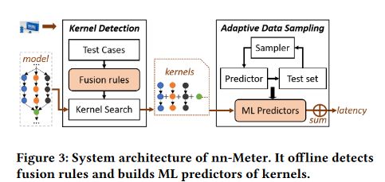
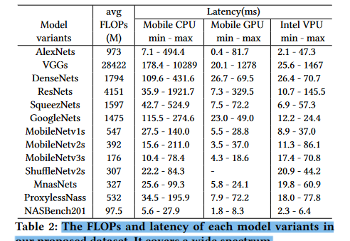
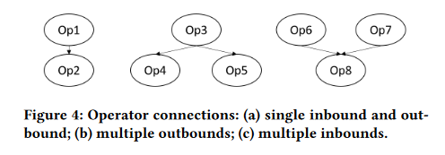
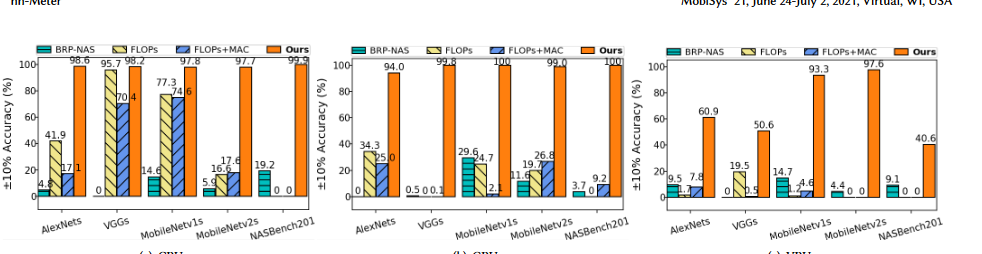

# nn-Meter:在不同的边缘设备上实现深度学习模型推理的精确延迟预测

### 摘要

​	随着最近设备上深度学习的趋势，推理延迟已经成为在各种移动和边缘设备上运行深度神经网络（DNN）模型的一个关键指标。为此，DNN模型推理的延迟预测对于许多任务来说是非常可取的，因为在这些任务中，测**量真实设备上的延迟是不可行的，或者成本太高**，比如从巨大的模型设计空间中寻找具有延迟约束的高效DNN模型。然而，**由于不同的边缘设备上的运行时间优化造成了不同的模型推理延迟，这非常具有挑战性**，现有的方法无法实现高的预测精度。

​	**在本文中，我们提出并开发了nn-Meter，这是一个新颖而高效的系统，可以准确预测不同边缘设备上的DNN模型的推理延迟**。nn-Meter的关键思想是将整个模型推理分为内核，即设备上的执行单元，并进行内核级预测。nn-Meter建立在两个关键技术之上：（i）内核检测，通过一组精心设计的测试案例自动检测模型推理的执行单元；以及（ii）自适应采样，从大空间中有效采样最有利的配置，建立准确的内核级延迟预测器。在三种流行的边缘硬件平台（**移动CPU、移动GPU和英特尔VPU**）上实施，并使用26000个模型的大型数据集进行评估，nn-Meter明显优于先前的最先进水平。

### 引言

​	深度神经网络（DNN）已被广泛用于当今的移动和边缘应用中[33]。在许多应用中，如设备上的视频分析、人脸识别、AR/VR等，DNN模型受到效率的限制（如延迟）。为了设计一个既有高精确度又有高效率的模型，模型压缩[6, 14, 15, 24]和最近的神经结构搜索（NAS）[7, 29, 32, 34]将DNN模型的推理延迟作为硬设计约束。然而，测量DNN模型的推理延迟是很费力和昂贵的。在实践中，它要求开发者在物理设备上执行部署过程以获得延迟。对于不同的边缘设备（如移动CPU/GPU和各种人工智能加速器）和不同的推理框架（如TFLite和OpenVINO），工程努力是巨大的。即使在单个设备上，在NAS任务中测量大量的模型也可能非常耗时（例如，ProxylessNas[7]仅在一轮搜索中就探索了∼0.3百万的模型）。这样的高成本会阻碍可扩展性，并使基于测量的方法实际上无法支持快速增长的边缘设备的数量。因此，人们提出了预测推理延迟的方法。

​	例如，基于FLOPs 1的方法已被广泛用于评估效率[15, 22, 23, 30]，这很简单，但不是延迟的直接指标。为了预测模型的延迟，许多NAS的工作[6, 7, 32]建立了算子级的查找表。这种运算符级别的方法总结了所有运算符的延迟。然而，他们没有考虑由模型图的运行时优化引起的模型延迟差异。例如，许多框架将多个算子合并为一个融合的算子以加速推理，这对推理的延迟有很大影响。最近，最先进的BRP-NAS[13]使用图卷积网络（GCN）来预测不同设备上NASBench201[12]数据集的延迟。它通过学习模型图的表示方法和相应的延迟来捕捉运行时的优化。然而，这种基于模型图的方法在很大程度上依赖于测试的模型结构，对许多未见过的模型结构可能不起作用。

​	在这项工作中，我们提出并开发了一个名为nn-Meter 2的新系统，旨在准确预测不同边缘设备上任意DNN模型的延迟。nn-Meter的关键思想是是将整个模型推理分为多个内核，这些内核是模型推理在设备上的独立执行单元。一个内核可以是一个单一的原始运算符，也可以是多个运算符的融合，这取决于运行时间和硬件。 nnMeter为内核建立了延迟预测器，并通过模型的所有内核的延迟总和来预测模型的总延迟。这种对内核级预测的设计选择是基于两个观察。首先，内核是深度学习框架中的基本调度和执行单元（例如，GPU内核），特别是在边缘设备上。因此，内核的概念自然而然地捕捉到了不同的运行时优化，包括运算器融合，这是最重要的优化，可以在很大程度上影响延迟。其次，尽管有非常多的DNN模型，但运算符和内核的种类是稳定的，相对较小的集合。任何模型都只是算子/内核的不同组合。因此，内核级预测是通用的，足以支持未见过的新模型。第一个挑战是如何在各种边缘设备上将一个模型分割成适当的内核集。由于多样化的运行时优化，在不同的设备上执行的内核是不同的。例如，Conv-add在移动GPU上是一个融合运算器，但在移动CPU和英特尔VPU上不是。此外，许多推理框架都没有开源。即使是那些开源的框架，也需要硬件专业知识来确定内核。第二，为内核建立准确的预测器是不容易的。正如我们在第5.1节中所显示的，这些内核在延迟和预测特征之间显示出非线性。此外，内核的多个可配置维度导致了一个巨大的可能的延迟预测搜索空间，大到数十亿。对整个十亿规模的配置空间进行采样以获得标记的训练数据是不可行的。因此，如何在保证高预测精度的同时进行有效的采样仍然是一个很大的挑战。为了应对上述挑战，我们提出了两种技术，即自动内核检测和自适应数据采样。为了将一个模型分割成内核，nn-Meter采用了一个内核检测器，该检测器在黑箱中自动检测各种边缘设备上的可能内核。我们设计了一套测试案例来检测两个运算符是否可以融合。设计了一个基于DFS的规则匹配算法来搜索模型中的最大融合单元（即内核）。为了降低数据采样成本，nn-Meter使用了一种自适应数据采样算法，该算法同时利用了模型设计和硬件延迟特性。它首先修剪了DNN模型中很少考虑的内核配置。然后，执行一个迭代采样过程，自动检测最有利的配置来采样，而不是随机选择。最后，我们建立机器学习回归器，以学习采样数据的非线性。为了证明nn-Meter的有效性，我们进一步提出并创建了一个大型基准数据集，其中包含26000个有代表性的卷积神经网络（CNN）模型3。与之前使用预测范围较小的数据集，即NASBench201数据集的工作不同，我们的数据集中的模型具有各种运算符、配置、图形和延迟范围。我们相信，我们的数据集为延迟预测设定了一个新的标准o款模型,也可以用于其他任务,比如NAS和频道搜索。我们实施和评估nn-Meter三流行平台边缘设备:移动CPU、移动GPU和英特尔VPU(代表AI加速器为边缘设备)。值得注意的是,nnMeter达到预测精度4 99.0%,99.1%,83.4% CPU、GPU, VPU,分别显著优于最先进的方法。我们也进行综合实验评估的有效性内核级预测和自适应数据抽样,并报告nn-Meter系统开销。虽然我们已获得可喜的成果nn-Meter三个平台,它需要整个社会共同努力,应用nn-Meter到许多其他类型的边缘设备。为此,我们将开源5集,测试用例,和代码为其他研究人员和开发人员可以构建延迟预测自己的设备。集体,我们希望社区能共同努力,实现精确的延时预测模型对各种边缘设备款

我们将我们的主要贡献总结如下。

- 我们提出并设计了nn-Meter，这是一个新颖高效的系统，可以准确预测CNN模型在不同边缘设备上的推理延迟。
- 我们为nn-Meter设计了两个关键技术，包括自动内核检测以捕捉边缘设备上的不同操作者融合行为，以及自适应数据采样以降低构建内核级延迟预测器的成本。
- 我们创建了一个新的大型延迟预测基准数据集，其中包含26000个具有代表性的CNN模型，具有不同的模型图、配置和延迟范围。
- -我们在移动CPU、移动GPU和英特尔VPU上实现并评估了nn-Meter，并证明与现有的方法相比，nn-Meter在不同的设备和模型上实现了明显更好的预测精度。

### 背景和动机

​	推理框架通常会进行一系列的模型图转换，以优化模型并减少推理延迟。图1显示了框架的优化过程。大多数优化是独立于后端的，比如常数折叠（例如，添加（c1，添加（x，c2））->添加（x，c1 c2））和普通表达式消除。无论目标后端是什么，都应该进行这些优化。

​	还有一些优化取决于目标后端实现。最主要的是图2中说明的运算符融合。它可以将满足某些规则（例如，特定的操作符类型和连接）的操作符融合在一起。这种优化可以避免将中间结果存储到内存中，以减少内存访问成本。例如，在图2中，融合后的内核不是计算卷积内核中的所有元素然后执行激活，而是在计算完每个元素后执行激活。算子融合需要后端实现融合算子的相应内核。

​	因此，融合规则在不同的后端是不同的。为此，nn-Meter使用一个开源框架（如Tensorflow），通过与后端无关的优化对设计的CNN模型进行预处理。输出的模型被用作预测过程的输入。不同后端的运算器融合规则将由nn-Meter的测试案例来检测。

##### 内核级预测的理由

​	为了预测CNN模型的延迟，nn-Meter将模型图分割成内核，并将预测的内核延迟汇总为模型延迟。这种方法是基于这样的假设：内核在每个设备上都是按顺序运行的，即使是那些没有数据流依赖性的内核。这个假设在目前的边缘人工智能平台（而不是服务器平台）上是有效的，主要有两个原因。首先，边缘芯片的计算资源通常是有限的。平行运行多个内核并不那么有利。例如，服务器CPU可以有几十个内核。一次运行一个内核不能利用所有的内核。然而，边缘CPU只有几个核心，不太可能有多余的core来同时运行多个kernel。其次，即使一些人工智能芯片有很高的计算带宽，但由于功率和芯片面积的限制，没有复杂的硬件支持（例如CUDA GPU的多流）来并行运行多个内核。很可能，这个假设对未来的边缘人工智能设备也是有效的。据我们验证，在目前的边缘人工智能平台上，如TFLite、SNPE、MNN、NCNN和MACE，内核都是按顺序运行。之前也有很多工作使用运算符的延迟之和作为模型延迟，也是基于这个假设[5, 7, 11, 19, 32]。

### nn-meter设计

​	本节将介绍nn-Meter的整体架构和基准数据集的收集情况。概述。图3说明了系统结构。它显示了两个核心组件，以实现DNN模型的准确延迟预测。**核心检测和自适应数据采样**。在概念上前者自动将目标模型划分为一组kernel，后者从一个大的空间中抽取最有利的配置，以建立精确的内核级延迟预测器。然后，对于每个内核，我们提取特征并预测延迟。nn-Meter将预测的内核延迟汇总为模型延迟。

​	内核检测。它包括精心设计的测试案例来检测两个运算符之间的融合规则，以及搜索模型中所有内核的算法。我们离线收集所有的融合规则。对于在线模型预测，内核搜索算法将这些规则递归地应用于目标模型以找到所有的内核。我们在第四节介绍技术细节

​	自适应数据采样。它为目标设备上的所有内核离线建立了机器学习预测器。对于每个内核，它通过一个迭代的采样过程对最有利的配置进行采样。采样器从先验可能性分布中采样，该分布描述了CNN模型设计中考虑的内核配置。我们设计了一个测试集来评估采样数据的质量。在每个迭代中，一个新的机器学习预测器用测试集评估性能。对于具有较大预测误差的数据，我们在其周围进行细粒度的通道数采样。我们在第5节中描述细节。

​	**基准数据集收集。为了评估 nn-Meter 在任意 DNN 模型上的有效性，我们需要一个覆盖大范围预测的代表性数据集。我们考虑两种情况。首先，DNN模型可以由任何类型的原始运算符和它们之间的各种边缘连接组成。第二，模型图中的每种运算符都可以有许多可能的配置。例如，Conv的通道号可以配置为任何正整数。现有的工作[5, 13, 28]在一个小的数据集或NASBench201上评估。预测范围很小，因此它们不能满足我们的目的。例如，NASBench201模型中的运算符是Conv、Pooling、add和FC，这些运算符很少（在我们的数据集中有14种）。此外，运算符的配置（例如，通道数和跨度）是用固定的数字配置的。**

​	在这项工作中，我们考虑了大的预测范围，并产生了一个适用于频道搜索和NAS场景的大型数据集。首先，我们在ImageNet2012上收集了12个最先进的CNN模型。它们来自人工设计的和NAS搜索的模型，具有完全不同的操作者类型和配置。对于每个模型（如AlexNet），我们通过重新取样每层的输出通道数和核大小来生成2000个变体。

​	具体来说，新的输出通道数从[0.2 × Cout , 1.8 × Cout]中随机抽取，核大小从{1, 3, 5, 7, 9}中抽取。此外，我们增加了2,000个模型在NASBench201的CIFAR10上具有最高的测试精度，每个模型都有一组不同的边缘连接。

我们的数据集总共包含26000个模型，有各种运算符（14种类型）、配置（144,217个独特的点）和边缘。它有2,012个不同的模型图，而其余的24000个模型有不同的配置。它同时支持224×224×3和32×32×3的输入图像尺寸。如表2所示，该数据集涵盖了不同水平的FLOPs和延迟的广泛范围。

### 内核检测

​	正如第2.2节所讨论的，nn-Meter的高预测精度的一个关键原因是纳入了框架的图形优化知识。在这些优化中，运算符融合是对延迟影响最大的依赖于后台的一种优化。本节将介绍nn-Meter的测试案例是如何设计的，以检测目标后台的融合规则并找到CNN模型的所有内核

设计测试样例

​	寻找融合规则和内核有两个主要挑战。首先是许多边缘平台的推理后端是闭源的。它无法从源代码中获得内核。第二是有任意的CNN模型。为了支持所有模型的预测，检测融合规则的方法应该独立于具体的模型图。为了解决这个问题，我们首先分析了影响融合实现的基本特征，然后根据这些特征设计测试用例，以反映后端融合规则，最后将这些规则递归应用于模型图，找到其所有的组成内核。

​	设计原则。我们的测试案例设计是由影响融合规则的CNN模型的两个特征驱动的，即运算符类型和运算符连接。(我们在此将每个运算符视为一种类型。融合运算符的类型将在第4.2节讨论）。操作符类型会影响融合规则，因为不同操作符的融合需要不同的实现成本。例如，图2中的激活函数等注入式算子的内核代码（更确切地说，它的循环体）可以直接与其他算子的代码连接，并自动生成一个新的内核。因此，这种融合被后端广泛实现。对于某些非注射运算符（例如合并），它们的代码不能轻易连接到其他算子，因此融合得到了较少的支持

​	除操作员类型外，操作员连接还影响融合规则。这是因为不当融合不仅会导致额外的时间成本，还会导致循环操作员的依赖。尽管模型图是任意的，但它们均由三种基本连接类型组成，如图4所示：单个内外，多输出和多进口

​	假设图中的前任和后任对的运算符融合都被后端支持。对于单入站/出站连接，Op1和Op2将被融合。然而，对于多出站连接（图4(b)），如果(O3,Op4)和(O3,Op5)都被融合，O3将被不必要地计算两次。即使只有(O3,Op4)被融合，融合时也需要同时保留O3和Op4的输出张量，这会增加内存成本。更重要的是，如果有一条从Op5到Op4的边，(O3,Op4)的融合会导致图中的依赖循环，这打破了模型图的非循环要求。对于多入连接（图4（c）），（Op6,Op8）或（Op7,Op8）的融合不会引起不必要的费用。此外，多出站规则的不融合确保了这种融合不会引起循环依赖。特别是，从节省时间的角度来看，不应该优先考虑(Op6,Op8)或(Op7,Op8)的融合，因为两者都避免了Op8输入的写和读。那么，有可能第一个访问的入站会被融合。总而言之，运算符连接会影响融合规则，这也需要测试用例来检测它们。

​	当OUT/Inbounds的数量大于两个时，适用相同的原则。因此，没有专门为其设计的NN米测试用例。

​	测试案例基于上述分析，测试案例既涵盖了操作员的类型和连接，以检测不同后端的融合规则。对于操作员类型，我们的测试用例包括每两个可能的操作员的单个/出站连接置换置换，以检测是否可以融合。然后，选择四个可易熔的操作员组成多英寸/出站连接，如图4，以检测是否仍然可以融合。

​	连接和分离的运算符的运行时间差被用作判断融合是否发生的指标，因为融合通过将同一元素上的计算连接在一起来减少延迟。也就是说，对于像图4（a）的单个中/出站连接，如果运算符的时间遵循不公式1，则将它们视为融合为OP1 + + OP2。

𝑇𝑂𝑝1 + 𝑇𝑂𝑝2 − 𝑇(𝑂𝑝1,𝑂𝑝2) > 𝛼 ∗ 𝑚𝑖𝑛(𝑇𝑂𝑝1, 𝑇𝑂𝑝2)

### 延迟推理

本节介绍了为内核和模型构建延迟预测指标的方法。我们首先要解决非线性延迟模式和昂贵的抽样成本的挑战。

Conv和DWConv主导了一个模型的延时。通过对目标模型应用内核检测，我们得到一组内核。然而，并不是所有的内核对延迟的影响都一样。图6显示了按内核类型划分的模型延时百分比。我们做了以下观察：（1）在大多数模型中，Conv（Conv+ +bn+ +relu）和DWConv（DWConv+ +bn+ +relu）占主要延迟百分比。平均而言，Conv和DWConv在CPU、GPU和VPU上分别占模型延迟的94.2%、91.91%、75.5%。(2) FC和element-wise运算符（即图6中的Others）的延迟在VPU上相对较大。为了准确预测，也有必要对这些小核进行估计。例如，FC可以占用AlexNet的47.4%的延迟。在所有检测到的内核中，由于样本空间大，Conv是最具挑战性的一个。我们在下面的讨论中主要以Conv为例。

### nn-meter的实施

​	整个nn-Meter由18,093行Python代码组成(loc)测试案例：2,025 loc, 自适应数据采样和内核延迟预测器。8,052 loc, 模型延时预测。1,291 loc, 基准数据集。2,630 loc, 延迟测量。4,095 loc.

**延迟测量。** nn-Meter目前支持三种广泛使用的边缘设备，如表7所示。与移动CPU、移动GPU不同，英特尔NCS2 VPU是一个专门的AI加速器。

我们建立了一个自动测量平台来测量延迟。给定一个模型/内核配置，我们以Tensorflow protobuf和tflite格式生成图，边缘推理框架通常支持这两种格式。我们将目标模型发送到测量平台，并收集返回的推理延迟。为了测量CPU上的延迟，我们将CPU频率设置为最高的2.42GHz。CPU上的延迟是由TFLite基准工具测量的。由于TFLite目前不支持GPU的运算器级分析，我们在TFLite中为GPU后端实现了一个运算器分析器。对于VPU延迟的测量，我们将protobuf格式转换为OpenVINO IR，并通过OpenVINOTM工具箱测量延迟。**延迟的数字是50次推理运行的平均值**。

这里延迟推理的假设前提是，内核运行是单核，串行运行的

（1）这里不同的是我们基准测试工具

（2）cpu GPU 的运算级别的工具

**内核检测**。nn-Meter的测试案例涵盖了三个设备中每个设备的所有可能的双操作器组合。CNN运算器的数量为26（CPU）、21（GPU）和27（VPU）。检测到的融合规则分别为668条（CPU）、434条（GPU）和720条（VPU）。从我们的数据集中发现的内核总数为22（CPU），26（GPU）和22（VPU）。在GPU上发现的内核更多，因为TFLite GPU后端支持更多的融合规则。例如，有一个Conv bn add add内核在GPU上被发现，因为这些运算符的融合都被支持。相比之下，CPU和VPU支持的融合规则仅限于Conv、bn和relu运算符，导致内核较少（真实模型的例子也请参考表4）。检测到的融合规则和发现的内核与我们的CPU和GPU后端上的框架报告结果相同。VPU后端不是开源的，因此不能直接验证规则或内核。然而，正如第7.3节将显示的，在VPU上基于内核的预测准确率比基于运算符的预测要高得多（83.4% vs 8.5%）。因此，融合检测和内核搜索算法在黑盒VPU上也是有效的。

（1）融合规则 个数     算子个数   VPU后端是用的

**延迟预测**。在我们的实验中，我们观察到Conv和它的融合运算符（例如Conv和relu/relu6、bn、add）之间的延迟差异可以忽略不计（与DWConv相同）。例如，Conv、Conv bn、Conv bn relu的配置（56、3、1、32、32）在GPU上的延迟分别为0.404ms、0.404ms、0,405ms。因此，对于Conv和DWConv融合算子，我们只建立Conv bn relu和DWConv bn relu的预测器。为了收集回归数据，我们手动设置误差阈值并运行自适应数据采样。我们将收集到的数据（表6）按7:1:2分成训练、验证和测试，其中我们使用验证数据进行超参数调整。超参数是由流行的NNI[26]来调整的。表9列出了主要内核的性能。

### 评估对比

我们在CPU、GPU和VPU（表7）的基准数据集（表2）上评估nn-Meter。比较基线。我们实现了3个基线进行比较：（1）FLOPs，（2）FLOPs MAC，（3）BRP-NAS。基线（1）和（2）是广泛使用的延时预测器。基线（3）是BRP-NAS中的延迟预测器，是GCN在NASBench201数据集上的最先进的基于模型-图形的预测器之一。对于基线（1）和（2），我们使用FLOPs和内存访问成本6（即MAC）来估计模型延时。我们通过线性回归来训练预测器。对于基线（3），我们直接运行BRP-NAS源代码[2]。由于BRP-NAS目前实现的是基于细胞的模型，它不能直接适用于我们数据集中的非基于细胞的模型。因此，我们对图的表示方法做了如下修改。

### 讨论

### 相关工作（relate work）

> ​	强化学习模型自动压缩
>
> Yihui He, Ji Lin, Zhijian Liu, Hanrui Wang, Li-Jia Li, and Song Han. 2018. AMC: AutoML for Model Compression and Acceleration on Mobile Devices. In European Conference on Computer Vision (ECCV).
>

### 结论

​	我们提出了nn-Meter，这是一个基于内核的预测系统，可以准确预测DNN模型在不同边缘设备上的延迟。 nn-Meter引入了内核检测，可以捕捉到各种算子的融合行为。通过对最有利的数据进行采样，nn-Meter有效地建立了内核的延迟预测器。我们通过在一个大型数据集和三种类型的边缘设备上的实验证明了nn-Meter的有效性。

华为交流ppt

 Conv相关的运算器的延迟主导了模型延迟

NNI是微软开发的automl

每个后端都由推理框架和一个硬件组成。

# nn-Meter Builder的使用

nn-Meter builder is an open source tool for users to build latency predictor on their own devices. There are three main parts in nn-Meter builder:

- **backend**: the module of connecting backends;
- **backend_meta**: the meta tools related to backend, such as fusion rule tester to detect fusion rules for users' backend;
- **kernel_predictor_builder**: the tool to build different kernel latency predictors.

端设备资源建模和性能预测

### 工作描述

端边模型性能建模主要分为硬件资源建模和模型性能评估，本月主要通过对模型本身性能的评估做一个研究。通过对模型性能参数进行量化、建模建立其模型时延预测的基本模型。主要流程为通过设计mindpore计算量参数量访存量的插件，提取各个模型正向推理时的参数特征，并利用roofline模型建立其模型性能上限的初步预测，与实际的运行时间做对比。下一步计划是利用nn-meter预测模型扩展到mindspore-lite等后端设备，建立完整的benchmark以及baseline。为后面子图

讨论：

1.模型的各个算子根据其参数和后端的不同需要对比研究。

2.延迟和功耗都是我们的研究对象

3.主要应用在手机端的异构场景中

